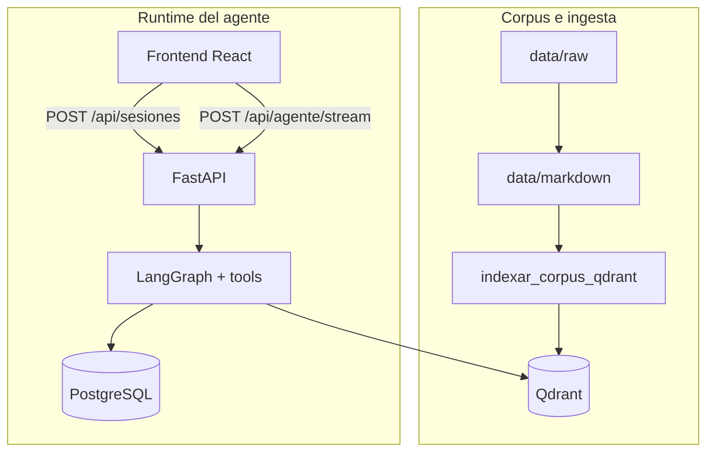

# Asistente sobre la Fundación Valle del Lili — Módulo 2 (agente conversacional)

El **producto actual** es un agente conversacional con **memoria en PostgreSQL**, recuperación **densa en Qdrant** (embeddings + similitud vectorial; **sin BM25 en inferencia** del Módulo 2) y orquestación **LangGraph** (router), **LangChain** (tools y `langchain-postgres`) y **LlamaIndex** (ingesta y consulta sobre Qdrant). El corpus textual canónico permanece en `data/markdown/` con **front matter YAML**; alimenta la **ingesta** hacia Qdrant mediante `scripts/indexar_corpus_qdrant.py` y **no** sustituye al vector store en cada petición del agente.

La interfaz identifica al usuario con **`POST /api/sesiones`** y el chat consume **`POST /api/agente/stream`** (SSE con eventos extendidos: `pensamiento`, `herramienta`, `token`, `fuentes`, `final`, `error`, entre otros). **No** sustituye canales oficiales ni garantiza vigencia de datos.

**Documentación de arquitectura:** [doc-003 — Arquitectura operativa del agente (Módulo 2)](backlog/docs/doc-003%20-%20Arquitectura-Agente-Modulo-2.md) y [decision-3 — Agente, memoria PostgreSQL y RAG denso en Qdrant](backlog/decisions/decision-3%20-%20Arquitectura-Agente-Memoria-RAG-Qdrant-M2.md).

## Flujo principal (Módulo 2)



## Stack del Módulo 2

| Capa | Tecnología |
| --- | --- |
| Router y control de flujo | **LangGraph** |
| Tools y memoria conversacional | **LangChain** (`StructuredTool`, `PostgresChatMessageHistory` vía **langchain-postgres**) |
| RAG denso | **LlamaIndex** + **qdrant-client** |
| OLTP (usuarios e historial) | **PostgreSQL**, **SQLAlchemy 2** async, **Alembic**, **asyncpg** |
| Vectores del corpus | **Qdrant** |
| API HTTP | **FastAPI**, **Uvicorn**, **sse-starlette**, **pydantic-settings** |
| Interfaz | **React 19** + **Vite 8** + **TypeScript 6** (estricto), **Tailwind CSS v4**, **shadcn/ui**, **Vercel AI SDK** (transporte SSE), **@tanstack/react-query** |

Herramientas expuestas al modelo (identificador `name` en inglés por contrato de tool-calling): **`faq_estructurada`** (sobre `data/structured/faqs.json` validado con schema) y **`rag_denso`** (recuperación por similitud en Qdrant).

## Variables de entorno (agrupadas)

Defina valores en **`.env`** (plantilla **`.env.example`** en la raíz; no commitear secretos).

| Grupo | Variables representativas | Notas |
| --- | --- | --- |
| API y CORS | `ALLOWED_ORIGINS`, `API_PORT` | Con cookies de sesión, orígenes explícitos (no `*` con credenciales). |
| LLM del router / OpenAI | `OPENAI_API_KEY`, `ROUTER_LLM_MODEL` | Router y composición; ver `src/api/configuracion.py`. |
| PostgreSQL | `POSTGRES_HOST`, `POSTGRES_PORT`, `POSTGRES_DB`, `POSTGRES_USER`, `POSTGRES_PASSWORD` o `DATABASE_URL` | Con **Docker Compose**, desde el host suele usarse `localhost` y el puerto publicado (p. ej. **15432** → 5432 interno). |
| Qdrant | `QDRANT_URL`, `QDRANT_COLLECTION`, `QDRANT_API_KEY` (opcional), `QDRANT_DISTANCE` | En la red de Compose la API usa `http://qdrant:6333`. |
| Embeddings e ingesta | `EMBEDDING_PROVIDER`, `EMBEDDING_MODEL`, `EMBEDDING_DIMS` | Deben alinearse con la colección creada en Qdrant. |
| Chunking (ingesta) | `CHUNK_SIZE`, `CHUNK_OVERLAP`, `CHUNK_STRATEGY` | Fragmentación previa a embeddings. |
| RAG en runtime | `RAG_TOP_K`, `RAG_SCORE_MINIMO` | Umbral y top-k del recuperador denso. |
| Memoria inyectada | `HISTORIAL_DIAS_MAX`, `HISTORIAL_TURNOS_MAX` | Ventana temporal y tope de turnos cargados para el grafo. |
| FAQ | `FAQ_JSON_RELATIVO_RAIZ`, `FAQ_UMBRAL_MATCH` | Ruta al JSON estructurado y umbral de coincidencia. |
| Meta-prompt del router | `ROUTER_META_PROMPT_PATH` | JSON de configuración sin secretos. |
| Laboratorio / E2E | `MOCK_LLM` (`0` o `1`) | Modo determinista sin llamadas reales al LLM del router; ver `GET /api/salud` (`agente_mock_llm`). |
| Ollama (legacy u otros usos) | `OLLAMA_BASE_URL`, `MODELO_LLM_DEFECTO` | Pueden aplicar al pipeline M1 si sigue habilitado. |

Los nombres exactos en entorno siguen el mapeo de **pydantic-settings** sobre los campos de `Configuracion` en `src/api/configuracion.py` (típicamente `MAYUSCULAS_CON_GUIONES`).

## Preparación de los datos

| Ubicación | Contenido |
| --- | --- |
| `data/raw/valledellili-org/` | HTML descargado del dominio `valledellili.org`, con registro en `data/raw/_log.jsonl`. |
| `data/markdown/valledellili-org/` | Un `.md` por página, con front matter YAML (fuente de verdad textual e **ingesta** hacia Qdrant). |
| `data/structured/faqs.json` | FAQs institucionales fijas (Módulo 2), validadas con `data/structured/faqs.schema.json`. |

**Actualizar FAQs estructuradas:** edite `data/structured/faqs.json` (campo raíz `faqs`: lista de objetos con `id`, `intent`, `keywords`, `pregunta_canonica`, `respuesta`, `actualizado_el` y opcionalmente `source_url`). Ejecute `uv run pytest tests/structured/test_faqs_json_schema.py` para comprobar el esquema.

Comandos típicos de adquisición y exportación (desde la raíz):

```bash
uv run python -m scripts.scrape --max-paginas 200
uv run python -m scripts.export_markdown
```

Ayuda: `uv run python -m scripts.scrape --help` y `uv run python -m scripts.export_markdown --help`. Más detalle en [scripts/README.md](scripts/README.md).

## Indexar el corpus en Qdrant

Con Qdrant accesible y credenciales de embeddings según `EMBEDDING_PROVIDER` (p. ej. `OPENAI_API_KEY` si usa OpenAI):

```bash
export QDRANT_URL=http://127.0.0.1:6333
export OPENAI_API_KEY=sk-reemplazar
uv run python -m scripts.indexar_corpus_qdrant --markdown-dir data/markdown/valledellili-org --glob "**/*.md"
```

Alternativa equivalente: `uv run python scripts/indexar_corpus_qdrant.py` con los mismos argumentos. Opciones adicionales y modo de pruebas: [scripts/README.md](scripts/README.md) (ingesta y **E2E del Módulo 2**).

## Cómo correr la aplicación

### Requisitos

- Python **3.12.12** y [uv](https://docs.astral.sh/uv/)
- Node **22 LTS** y **pnpm 10.x**
- **PostgreSQL** y **Qdrant** accesibles (local o vía Docker Compose)
- Para inferencia real del agente: **`OPENAI_API_KEY`** (o laboratorio con **`MOCK_LLM=1`**)

### Docker Compose (recomendado)

El archivo `docker-compose.yml` levanta **PostgreSQL 16** (`postgres:16-alpine`), **Qdrant** (`qdrant/qdrant:v1.12.5`, compatible con `qdrant-client` del lockfile), **Ollama** (según perfil del compose), el job **`db-init`** (`alembic upgrade head` cuando Postgres está saludable) y el servicio **`api`**. Los datos persisten en volúmenes nombrados `postgres-data` y `qdrant-storage`.

- **PostgreSQL en el host:** puerto publicado por defecto **15432** → 5432 interno (`POSTGRES_PUBLISH_PORT` para cambiarlo). Variables: `POSTGRES_USER`, `POSTGRES_PASSWORD`, `POSTGRES_DB` (alineadas con `src/api/configuracion.py`).
- **Qdrant:** REST **6333** y gRPC **6334** en el host (`QDRANT_REST_PORT`, `QDRANT_GRPC_PORT`). En la red interna de Compose la API usa `QDRANT_URL=http://qdrant:6333`.
- **Solo infraestructura:** `docker compose up -d postgres qdrant`.

```bash
docker compose config
docker compose up --build -d
curl -sS "http://127.0.0.1:${API_PORT:-8000}/api/salud"
```

El build multi-stage construye el frontend y lo sirve como estáticos desde FastAPI. Tras el primer arranque, ejecute la **ingesta** a Qdrant (sección anterior) si la colección está vacía.

Las migraciones **Alembic** (`alembic/`) crean el esquema de aplicación (p. ej. tabla **`usuarios`**). La tabla **`chat_history`** usada por la memoria LangChain **no** se versiona con Alembic: se crea en runtime (`PostgresChatMessageHistory.create_tables` en el lifespan de la API).

### Desarrollo local (API + frontend en dos terminales)

**Terminal 1 — Backend** (con Postgres y Qdrant ya levantados y migraciones aplicadas):

```bash
uv python install 3.12.12
uv sync
uv run alembic upgrade head
export QDRANT_URL=http://127.0.0.1:6333
uv run uvicorn src.api.main:app --reload --host 0.0.0.0 --port 8000
```

**Terminal 2 — Frontend:**

```bash
pnpm --dir frontend install
pnpm --dir frontend dev
```

El frontend queda en `http://localhost:5173/`. El proxy de Vite reenvía `/api/*` al backend en `http://localhost:8000`.

Pruebas del frontend (opcional):

```bash
pnpm --dir frontend test
pnpm --dir frontend test:e2e
```

### API HTTP (rutas principales del producto)

- **`POST /api/sesiones`:** cuerpo JSON con `documento_identidad` y `nombre`. Respuesta: `usuario_id`, `session_id` (p. ej. `user:{uuid}`), `nombre`, `ya_existia`, `ultimo_mensaje_at` (opcional). Cookie HTTP-only **`fvl_session_id`** con ese `session_id`.
- **Credenciales en peticiones posteriores** (orden de precedencia): cabecera **`X-Session-Id`**, query **`session_id`**, cookie **`fvl_session_id`**.
- **`GET /api/sesiones/actual/historial`:** historial cronológico (`rol`, `contenido`, `creado_en` opcional).
- **`POST /api/sesiones/cerrar`:** confirma cierre y pide borrar la cookie; no elimina filas en base de datos.
- **`POST /api/agente/stream`:** SSE del agente (eventos extendidos). Requiere sesión válida.
- **`GET /api/salud`:** incluye señales de dependencias y, cuando aplica, **`agente_mock_llm`** si el servidor arrancó con `MOCK_LLM=1`.

**CORS y cookies:** `allow_credentials=True`; en `.env`, `ALLOWED_ORIGINS` debe listar orígenes explícitos.

### Pruebas E2E del Módulo 2 (TASK-61)

Suite **`tests/e2e/test_escenarios_modulo2.py`**: cuatro escenarios alineados con la actividad del curso (RAG denso, memoria multi-turno, FAQ estructurada y diálogo mixto). Requiere API alcanzable y `EJECUTAR_E2E_MODULO2=1`. Las aserciones estrictas de herramienta usan tokens `e2e7001` / `e2e7002` / `e2e7003` con **`MOCK_LLM=1`** en el servidor. Comandos y variables: [scripts/README.md](scripts/README.md). Playwright: `frontend/tests/e2e/`.

## Experiencia en la UI (React + shadcn/ui)

- **Autenticación liviana** antes del chat (documento de identidad y nombre).
- **Streaming** de la respuesta del agente vía SSE (`/api/agente/stream`).
- **Eventos de trazabilidad** (`pensamiento`, `herramienta`, `fuentes` con chunks de Qdrant cuando aplica).
- **Panel de configuración**, modo claro/oscuro, accesibilidad y atajos de teclado (ver código en `frontend/src`).

## Resultados (evaluaciones del pipeline BM25 — legado)

Los informes automáticos del script **`scripts/evaluar_qa.py`** (dataset ≥20 preguntas, recuperación **BM25** del Módulo 1) se generan bajo **`data/processed/evaluaciones/`**. Cada corrida produce un Markdown por modelo. Para regenerarlos (Ollama y modelos instalados):

```bash
uv run python -m scripts.evaluar_qa --modelos llama3.1:8b
```

## Solución de problemas

| Síntoma | Qué revisar |
| --- | --- |
| El texto del agente aparece **de golpe** | Proxies que bufferizan SSE (`proxy_buffering off` en Nginx; sin transformaciones agresivas en CDN). |
| **CORS** o cookies bloqueadas | `ALLOWED_ORIGINS` con el origen exacto del frontend; credenciales y `X-Session-Id` coherentes con la sesión creada. |
| **`POST /api/agente/stream` en 503** | Sin `OPENAI_API_KEY` y sin `MOCK_LLM=1`; revise `GET /api/salud`. |
| **RAG vacío** | Colección Qdrant sin ingesta o umbral `RAG_SCORE_MINIMO` demasiado alto; vuelva a indexar y verifique `QDRANT_COLLECTION`. |
| **Postgres no listo** en Compose | `docker compose ps`, healthchecks y puerto `POSTGRES_PUBLISH_PORT` vs variables del `.env`. |

## Historial de versiones — Módulo 1 (BM25 y `/api/qa`)

La primera fase del proyecto implementó un **pipeline Q&A** con recuperación **BM25 a nivel archivo** (`rank-bm25`), selección **top-k** de documentos Markdown completos y generación con **Ollama** u **OpenAI** opcional. Los endpoints **`POST /api/qa`**, **`POST /api/qa/stream`** y el modo dual **`POST /api/qa/dual/stream`** pueden seguir disponibles para laboratorio o referencia académica; **no** constituyen el camino principal del **agente M2**, que recupera contexto solo por **similitud densa en Qdrant** según [decision-3](backlog/decisions/decision-3%20-%20Arquitectura-Agente-Memoria-RAG-Qdrant-M2.md). Detalle del MVP léxico: [ADR-001](backlog/decisions/decision-1%20-%20MVP-BM25-Archivo-Completo.md) y [ADR-002](backlog/decisions/decision-2%20-%20Migracion-Frontend-React-Vite-Backend-FastAPI-SSE.md).

## Limitaciones conocidas

- **Coste y dependencia de API:** embeddings e inferencia del router suelen depender de proveedor externo salvo configuración local explícita.
- **Sincronización corpus–vectores:** cambios en `data/markdown/` requieren **reindexación** para reflejarse en Qdrant.
- **Concurrencia y operación:** más servicios en desarrollo (Postgres + Qdrant + API) que el MVP monolítico.
- Las limitaciones del **Módulo 1** (truncamiento con varios `.md` largos en un solo prompt BM25, ambigüedad léxica) aplican solo si se usa ese pipeline legacy en laboratorio.
