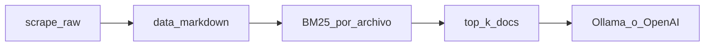

# Sistema Q&A sobre la Fundación Valle del Lili — MVP fase 1

Asistente de preguntas y respuestas que responde **solo** con texto público ya descargado del sitio `valledellili.org`, usando recuperación BM25 sobre archivos Markdown completos (cada `.md` es una unidad de índice), selección **top-k** de documentos para armar el contexto enviado al modelo (por defecto hasta **3**; constante `K_TOP_DOCUMENTOS` en `src/qa/pipeline.py`) y generación principalmente con **Ollama** local. De forma opcional se puede usar la **API de OpenAI** (por ejemplo en el modo dual de la interfaz) configurando `OPENAI_API_KEY`. **No** sustituye canales oficiales ni garantiza vigencia de datos; **no** incluye chunking interno dentro de cada archivo, embeddings ni base vectorial en esta fase.

## Descripción del problema

Hay necesidad de un canal de comunicación automatizado y preciso para la Fundación Valle del Lili: responder dudas frecuentes con trazabilidad a la fuente, reduciendo alucinaciones y manteniendo un stack reproducible para el curso.

## Planteamiento de la solución

Pipeline local: **scraping** (respetando `robots.txt`) → **Markdown** con front matter en `data/markdown/` → **BM25 a nivel archivo** (`rank-bm25`) → **top-k** de documentos completos (sin trocear el contenido de cada `.md`) → composición multi-contexto en el prompt → **Ollama** y, opcionalmente, **OpenAI**.

Decisiones explícitas de esta fase:

- Sin chunking interno: cada unidad indexada es un `.md` completo.
- Recuperación **top-k** (por defecto tres documentos) con filtro por umbral relativo en el recuperador; el modelo puede recibir varios archivos completos en un solo turno; en la UI, las fuentes BM25 listan los documentos recuperados cuando aplica.
- Sin embeddings ni base vectorial.
- Interfaz: **React 19 + Vite 8 + TypeScript 6 + shadcn/ui** (`frontend/`); streaming vía **SSE** con cliente propio (no Vercel AI SDK). Backend **FastAPI + SSE** (`src/api/`). La interfaz Gradio original fue migrada y vive en `src/app/legacy/app_gradio.py` como referencia histórica.

El detalle arquitectónico queda registrado en [ADR-001](backlog/decisions/decision-1%20-%20MVP-BM25-Archivo-Completo.md) y [ADR-002](backlog/decisions/decision-2%20-%20Migracion-Frontend-React-Vite-Backend-FastAPI-SSE.md). **Nota:** ADR-001 describe el MVP con un solo archivo en contexto; la implementación vigente usa **top-k** de archivos completos. Este README y el código reflejan el comportamiento actual hasta que el ADR se actualice.



## Preparación de los datos

| Ubicación | Contenido |
| --- | --- |
| `data/raw/valledellili-org/` | HTML descargado del dominio `valledellili.org`, con registro en `data/raw/_log.jsonl`. |
| `data/markdown/valledellili-org/` | Un `.md` por página, con front matter YAML. |

Variables opcionales: `.env` (plantilla en `.env.example`), p. ej. `URL_BASE_SITIO`, `USER_AGENT`.

Comandos típicos (desde la raíz del repositorio):

```bash
uv run python -m scripts.scrape --max-paginas 200
uv run python -m scripts.export_markdown
```

Ayuda y opciones adicionales:

```bash
uv run python -m scripts.scrape --help
uv run python -m scripts.export_markdown --help
```

Referencia detallada de flags y orden del pipeline: [scripts/README.md](scripts/README.md).

## Modelado

- **Recuperación:** BM25 sobre el texto completo de cada archivo en `data/markdown/valledellili-org/`; cada archivo completo recibe un score y se seleccionan los **k** mejores (por defecto 3), descartando candidatos por debajo de un umbral relativo al mejor score (ver `src/retrieval/recuperador.py`).
- **Generación:** principalmente modelos **Ollama** locales; la API y la UI permiten además **OpenAI** si hay clave (`OPENAI_API_KEY`), incluido modo dual con una sola pasada BM25 compartida. En la app se ofrecen entre otros `llama3.1:8b` y `gemma4:e2b` (este último puede no existir en el catálogo público de Ollama; ver limitaciones).
- **Prompt:** instrucciones zero-shot anti-alucinación en `src/qa/prompt.py`: la asistente institucional «Lili» usa solo la información de los contextos aportados; tono formal, cordial e institucional; respuesta literal *«No tengo información suficiente»* cuando la información no está en esos contextos.

## Cómo correr la app

### Modo desarrollo (2 terminales)

Requisitos: Python **3.12.12**, [uv](https://docs.astral.sh/uv/), Node 22 LTS, pnpm 10.x, **React 19**, **Vite 8**, **TypeScript 6** y Ollama en ejecución (API de OpenAI opcional con `OPENAI_API_KEY`).

**Terminal 1 — Backend FastAPI:**

```bash
uv python install 3.12.12
uv sync
ollama pull llama3.1:8b
uv run uvicorn src.api.main:app --reload --port 8000
```

**Terminal 2 — Frontend React:**

```bash
pnpm --dir frontend install
pnpm --dir frontend dev
```

El frontend queda disponible en `http://localhost:5173/`. El proxy de Vite reenvía `/api/*` al backend en `http://localhost:8000`.

Pruebas del frontend (opcional):

```bash
pnpm --dir frontend test
pnpm --dir frontend test:e2e
```

**Nota:** si `gemma4:e2b` no está disponible en tu instalación de Ollama, omite ese `pull` y usa solo `llama3.1:8b` en la interfaz.

Variables opcionales: `OLLAMA_BASE_URL`, `MODELO_LLM_DEFECTO`, `OPENAI_API_KEY`, `ALLOWED_ORIGINS` (ver `.env.example`).

### Modo producción (Docker)

El archivo `docker-compose.yml` levanta **PostgreSQL 16** (`postgres:16-alpine`), **Qdrant** (`qdrant/qdrant:v1.12.5`, compatible con `qdrant-client` del lockfile), **Ollama**, el job **`db-init`** (`alembic upgrade head` cuando Postgres está saludable) y el servicio **`api`**. Los datos persisten en volúmenes nombrados `postgres-data` y `qdrant-storage`.

Las migraciones **Alembic** (`alembic/`) crean el esquema de aplicación; la tabla **`usuarios`** forma parte de esa cadena. La tabla **`chat_history`** usada por la memoria conversacional de LangChain **no** se versiona con Alembic: se crea en runtime mediante `PostgresChatMessageHistory.create_tables` en el lifespan de la API (ver task-48).

- **PostgreSQL en el host**: puerto publicado por defecto **15432** → 5432 interno (`POSTGRES_PUBLISH_PORT` para cambiarlo). Variables: `POSTGRES_USER`, `POSTGRES_PASSWORD`, `POSTGRES_DB` (valores por defecto acordes con `src/api/configuracion.py`).
- **Qdrant**: REST **6333** y gRPC **6334** en el host (`QDRANT_REST_PORT`, `QDRANT_GRPC_PORT`). En la red de Compose la API usa `QDRANT_URL=http://qdrant:6333` (solo HTTP; el cliente no requiere gRPC en el contenedor `api`).
- **Solo infra** (sin Ollama ni API): `docker compose up -d postgres qdrant`.

```bash
docker compose config
docker compose down -v
docker compose up --build -d
curl -sS "http://127.0.0.1:${API_PORT:-8000}/api/salud"
```

El build multi-stage construye el frontend y lo sirve como estáticos desde FastAPI. Ver `Dockerfile` y `docker-compose.yml`.

### API de sesión (Módulo 2)

Tras levantar PostgreSQL y la API, el frontend puede autenticarse de forma ligera (sin JWT) y recuperar el historial conversacional:

- **`POST /api/sesiones`**: cuerpo JSON con `documento_identidad` y `nombre`. Respuesta: `usuario_id`, `session_id` en forma `user:{uuid}`, `nombre`, `ya_existia` y `ultimo_mensaje_at` (opcional). Además se envía la cookie HTTP-only **`fvl_session_id`** con ese `session_id`.
- **Credenciales en peticiones posteriores** (orden de precedencia): cabecera **`X-Session-Id`**, parámetro de consulta **`session_id`**, cookie **`fvl_session_id`**.
- **`GET /api/sesiones/actual/historial`**: requiere credencial válida; devuelve `mensajes` en orden cronológico con campos `rol` (`human`, `ai`, `system`, `tool`), `contenido` y `creado_en` (opcional).
- **`POST /api/sesiones/cerrar`**: responde confirmando la intención de cierre y pide al navegador borrar la cookie; no elimina filas de usuario ni de historial en base de datos.
- **CORS y cookies**: el backend usa `allow_credentials=True`; en `.env`, `ALLOWED_ORIGINS` debe ser una lista de orígenes explícitos (no se admite `*` junto con credenciales).

### Experiencia en la UI (React + shadcn/ui)

- **Streaming token a token**: la respuesta del modelo aparece progresivamente en el área de chat mientras llega del backend vía Server-Sent Events (SSE).
- **Modo dual Ollama + OpenAI**: dos columnas side-by-side con una sola pasada BM25 compartida; aviso de coste dual visible.
- **Fuentes BM25**: panel de cards con archivo, score y URL clickable de los documentos recuperados.
- **Panel de configuración**: sidebar colapsable con selección de modelo, slider de `num_ctx`, editor del prompt del sistema y botón de recarga del corpus.
- **Modo oscuro**: toggle persistente entre tema claro y oscuro con paleta institucional Valle del Lili.
- **Accesibilidad**: ARIA labels en español; atajos `Cmd/Ctrl+Enter` (enviar), `Cmd/Ctrl+K` (foco en el campo de pregunta), `Cmd/Ctrl+B` (abrir/cerrar panel lateral).
- **Borrador y parámetros**: el borrador del input se recupera en la misma sesión; modelo, `num_ctx` y prompt se guardan en el navegador.

## Resultados

Los informes de evaluación automática (tarea de dataset ≥20 preguntas) se generan bajo:

**`data/processed/evaluaciones/`**

Cada corrida produce un Markdown por modelo, p. ej. `data/processed/evaluaciones/<slug-modelo>__YYYY-MM-DD.md`. El directorio conserva `.gitkeep`; los informes de ejecuciones locales suelen ignorarse en git salvo que se versionen a propósito.

Para regenerarlos (requiere Ollama y modelos instalados):

```bash
uv run python -m scripts.evaluar_qa --modelos llama3.1:8b gemma4:e2b
```

El dataset por defecto es `tests/qa/preguntas_evaluacion.yml` (23 ítems con categoría y, cuando aplica, `archivo_esperado`). Cada informe agrega, entre otros:

| Métrica (por modelo) | Origen en el informe |
| --- | --- |
| Número de preguntas ejecutadas | Tabla resumen |
| Aciertos en archivo recuperado | Comparación con `archivo_esperado` |
| Respuestas con «No tengo información suficiente» | Conteo en resumen |
| Latencia promedio | Estadística de ms por pregunta |

## Solución de problemas (streaming, CORS, Ollama)

| Síntoma | Qué revisar |
| --- | --- |
| El texto aparece **de golpe** en lugar de en streaming | Proxies/CDN pueden bufferizar SSE: en Nginx usar `proxy_buffering off`; con Cloudflare evita transformaciones en la respuesta (`Cache-Control: no-transform`). Verifica que ningún intermediario agrupe líneas SSE. |
| **CORS bloqueado** en el navegador | Configura `ALLOWED_ORIGINS` en `.env` con el origen exacto del frontend (p. ej. `http://localhost:5173`) y reinicia el backend. Con cookies de sesión (`fvl_session_id`) el backend envía `Access-Control-Allow-Credentials: true`; el origen debe coincidir literalmente con el de la petición. |
| **Ollama no responde** | Ejecuta `ollama serve`, revisa `OLLAMA_BASE_URL` y ejecuta `ollama pull llama3.1:8b` (u otro modelo que uses). Con Docker Compose, el job `ollama-init` ejecuta `ollama pull` cuando el demonio está saludable. |
| Difícil rastrear un fallo intermitente | Las respuestas incluyen cabecera `X-Request-ID`; búscala en los logs del API (middleware de peticiones). |

## Limitaciones conocidas

- Combinar **varios** `.md` completos en el prompt (top-k) puede acercar o superar `num_ctx` (p. ej. 8192): el motor puede **truncar** el contexto y afectar la respuesta más que con un solo documento corto.
- Páginas muy largas aisladas también pueden superar `num_ctx`: Ollama puede **truncar** el contexto y afectar la respuesta.
- BM25 a nivel archivo puede recuperar la **página equivocada** cuando varias comparten mucho vocabulario.
- El tag `gemma4:e2b` puede no existir en el registro oficial de Ollama; si falla el `pull` o la inferencia, usar solo `llama3.1:8b` y documentar la limitación en la sustentación.
