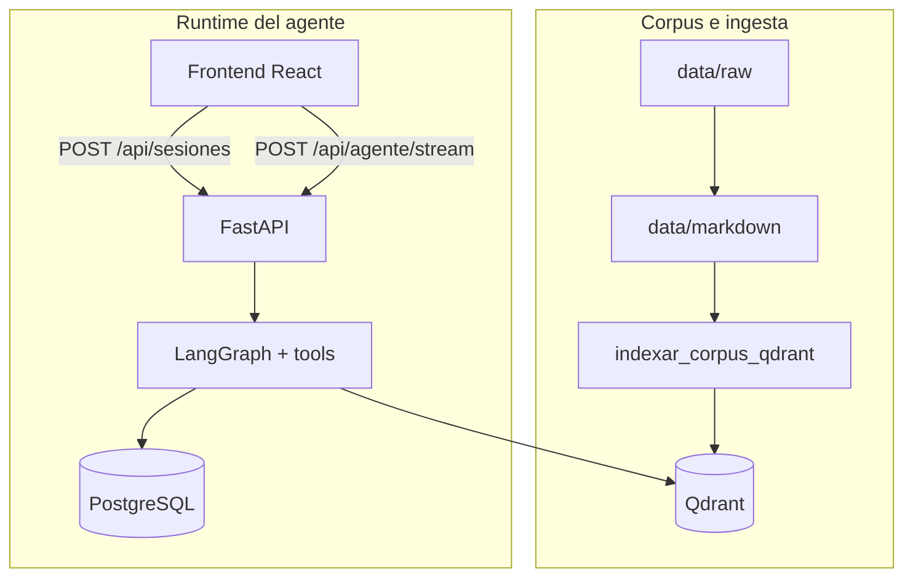
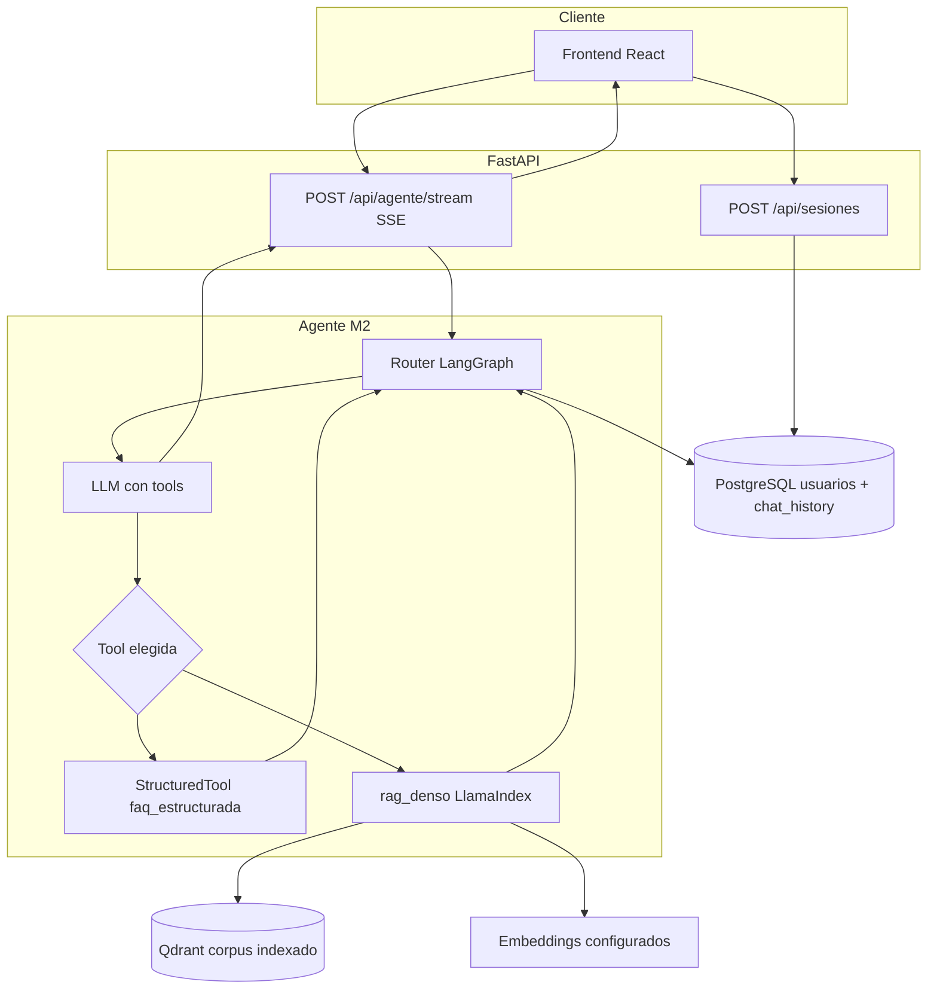
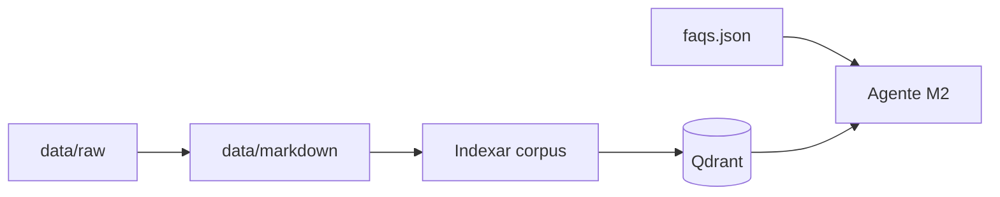

# Asistente sobre la Fundación Valle del Lili — Módulo 2 (agente conversacional)

Proyecto del curso **Técnicas avanzadas de IA** (Universidad Autónoma de Occidente, UAO): asistente conversacional sobre contenido público de la **Fundación Valle del Lili**. El **Módulo 1** del curso cubrió corpus, scraping y un pipeline Q&A con BM25 (retirado del código; ver [Historial — Módulo 1 (BM25)](#historial-de-versiones--módulo-1-bm25)). El **Módulo 2** es el **producto actual**: agente con memoria en PostgreSQL, RAG denso en Qdrant y orquestación LangGraph + LangChain + LlamaIndex.

El **producto actual** es un agente conversacional con **memoria en PostgreSQL**, recuperación **densa en Qdrant** (embeddings + similitud vectorial; **sin BM25 en inferencia** del Módulo 2) y orquestación **LangGraph** (router), **LangChain** (tools y `langchain-postgres`) y **LlamaIndex** (ingesta y consulta sobre Qdrant). El corpus textual canónico permanece en `data/markdown/` con **front matter YAML**; alimenta la **ingesta** hacia Qdrant mediante `scripts/indexar_corpus_qdrant.py` y **no** sustituye al vector store en cada petición del agente.

La interfaz identifica al usuario con **`POST /api/sesiones`** y el chat consume **`POST /api/agente/stream`** (SSE con eventos extendidos: `pensamiento`, `herramienta`, `token`, `fuentes`, `final`, `error`, entre otros). **No** sustituye canales oficiales ni garantiza vigencia de datos.

**Documentación de arquitectura:** [doc-003 — Arquitectura operativa del agente (Módulo 2)](backlog/docs/doc-003%20-%20Arquitectura-Agente-Modulo-2.md) y [decision-3 — Agente, memoria PostgreSQL y RAG denso en Qdrant](backlog/decisions/decision-3%20-%20Arquitectura-Agente-Memoria-RAG-Qdrant-M2.md).

**Colaboración y tareas:** el flujo con Backlog.md (MCP) y convenciones del repo están en [AGENTS.md](AGENTS.md).

## Índice

- [Flujo principal (Módulo 2)](#flujo-principal-módulo-2)
- [Arquitectura del agente (detalle)](#arquitectura-del-agente-detalle)
- [Pipeline de datos](#pipeline-de-datos)
- [Estructura del repositorio](#estructura-del-repositorio)
- [Stack del Módulo 2](#stack-del-módulo-2)
- [Patrones de diseño en el código](#patrones-de-diseño-en-el-código)
- [Variables de entorno (agrupadas)](#variables-de-entorno-agrupadas)
- [Panel administrativo (Admin M2)](#panel-administrativo-admin-m2)
- [Preparación de los datos](#preparación-de-los-datos)
- [Indexar el corpus en Qdrant](#indexar-el-corpus-en-qdrant)
- [Cómo correr la aplicación](#cómo-correr-la-aplicación)
- [API HTTP (rutas principales del producto)](#api-http-rutas-principales-del-producto)
- [Pruebas](#pruebas)
- [Experiencia en la UI (React + shadcn/ui)](#experiencia-en-la-ui-react-shadcnui)
- [Dataset de preguntas (referencia de laboratorio)](#dataset-de-preguntas-referencia-de-laboratorio)
- [Solución de problemas](#solución-de-problemas)
- [Historial de versiones — Módulo 1 (BM25)](#historial-de-versiones--módulo-1-bm25)
- [Limitaciones conocidas](#limitaciones-conocidas)
- [Autores y manifiesto](#autores-y-manifiesto)

## Flujo principal (Módulo 2)



## Arquitectura del agente (detalle)

Vista ampliada del camino de inferencia (memoria, tool-calling y almacenes). Diagrama alineado con [doc-003 §1](backlog/docs/doc-003%20-%20Arquitectura-Agente-Modulo-2.md); allí hay matices operativos adicionales.



## Pipeline de datos

1. **Adquisición:** `scripts.scrape` (u otras fuentes) → artefactos en `data/raw/`.
2. **Canon textual:** `scripts.export_markdown` → `data/markdown/` con front matter YAML.
3. **Vectores:** `scripts.indexar_corpus_qdrant` (o módulo equivalente) → embeddings y puntos en **Qdrant** (alineados con `EMBEDDING_*` y chunking).
4. **FAQs fijas:** `data/structured/faqs.json` validado contra schema; consumo por la tool `faq_estructurada` sin pasar por Qdrant.
5. **Producto:** el usuario abre sesión (`POST /api/sesiones`); cada mensaje va a `POST /api/agente/stream`, que ejecuta el grafo y puede invocar **Postgres** (memoria), **Qdrant** (`rag_denso`) y el JSON de FAQs.



## Estructura del repositorio

| Ubicación | Responsabilidad |
| --- | --- |
| [`src/api/`](src/api/) | FastAPI (`main`, lifespan), routers (`sesiones`, `agente`, `salud`, `admin`), SSE, esquemas Pydantic, configuración (`configuracion.py`), dependencias. |
| [`src/agentes/`](src/agentes/) | Grafo LangGraph, estado, meta-prompt, herramientas LangChain, memoria, runtime del agente. |
| [`src/rag/`](src/rag/) | Embeddings, cliente Qdrant, recuperador denso para la tool `rag_denso`. |
| [`src/persistencia/`](src/persistencia/) | Motor SQLAlchemy async, modelos y repositorios (usuarios, sesiones, `config_admin_m2`). |
| [`src/scraping/`](src/scraping/) | Descarga ética y registro de adquisición hacia `data/raw/`. |
| [`src/markdown_export/`](src/markdown_export/) | Conversión de crudo a Markdown con front matter. |
| [`src/qa/`](src/qa/) | Clientes Ollama/OpenAI y utilidades de prompts para laboratorio o piezas reutilizables. |
| [`frontend/src/`](frontend/src/) | App Vite: `features/` (auth, chat, settings), `components/ui/`, `lib/` (API, SSE, Zod). |
| [`scripts/`](scripts/) | Scrape, export Markdown, indexación Qdrant; detalle en [scripts/README.md](scripts/README.md). |
| [`data/raw/`](data/raw/), [`data/markdown/`](data/markdown/), [`data/structured/`](data/structured/) | Crudo, corpus canónico, FAQs JSON. |
| [`tests/`](tests/) | Pytest: API, agentes, RAG, e2e, QA, structured. |
| [`alembic/`](alembic/) | Migraciones del esquema OLTP versionado (p. ej. `usuarios`, `config_admin_m2`). |
| [`config/`](config/) | Meta-prompt del router (`router_meta_prompt.json`) sin secretos. |

## Stack del Módulo 2

| Capa | Tecnología |
| --- | --- |
| Router y control de flujo | **LangGraph** |
| Tools y memoria conversacional | **LangChain** (`StructuredTool`, `PostgresChatMessageHistory` vía **langchain-postgres**) |
| RAG denso | **LlamaIndex** + **qdrant-client** |
| OLTP (usuarios e historial) | **PostgreSQL**, **SQLAlchemy 2** async, **Alembic**, **asyncpg** |
| Vectores del corpus | **Qdrant** |
| API HTTP | **FastAPI**, **Uvicorn**, **sse-starlette**, **pydantic-settings** |
| Interfaz | **React 19** + **Vite 8** + **TypeScript 6** (estricto), **Tailwind CSS v4**, **shadcn/ui** (Radix), **@tanstack/react-query**, **next-themes**, **sonner**, **react-markdown** + **remark-gfm** + **shiki** |
| Streaming al chat | Cliente propio en [`frontend/src/lib/sseClient.ts`](frontend/src/lib/sseClient.ts): **`fetch`** + **`ReadableStream`** / **`TextDecoderStream`** + validación con **Zod** (POST con cuerpo JSON; el `EventSource` del navegador no lo permite). |
| Pruebas frontend | **Vitest** (`pnpm --dir frontend test`), **Playwright** (`pnpm --dir frontend test:e2e`). |

Herramientas expuestas al modelo (identificador `name` en inglés por contrato de tool-calling): **`faq_estructurada`** (sobre `data/structured/faqs.json` validado con schema) y **`rag_denso`** (recuperación por similitud en Qdrant).

## Patrones de diseño en el código

- **Estado de aplicación e inicialización en `lifespan`:** el grafo del agente, el motor async de PostgreSQL, el pool `psycopg` y la creación del esquema de memoria se montan al arrancar la API en [`src/api/main.py`](src/api/main.py); los handlers no instancian esos recursos por petición.
- **Inyección de dependencias (FastAPI):** acceso al grafo, sesión de base de datos y configuración vía `Depends` y `app.state` en [`src/api/dependencias.py`](src/api/dependencias.py).
- **Factory del grafo:** construcción y opciones del grafo LangGraph en [`src/api/factoria_grafo_agente.py`](src/api/factoria_grafo_agente.py).
- **Repositorio:** acceso a tablas OLTP encapsulado en [`src/persistencia/repositorios/`](src/persistencia/repositorios/) (usuarios, sesiones, configuración admin).
- **Strategy / configuración por proveedor:** selección de embeddings (OpenAI, HuggingFace, etc.) en [`src/rag/embeddings.py`](src/rag/embeddings.py) según variables `EMBEDDING_*`.
- **Tool-calling (LangChain):** el router obliga las dos `StructuredTool` (`faq_estructurada`, `rag_denso`) en [`src/agentes/router.py`](src/agentes/router.py).
- **Hot reload de parámetros admin:** tras `PATCH /api/admin/config`, el siguiente stream usa un snapshot actualizado del bundle en [`src/agentes/runtime_agente.py`](src/agentes/runtime_agente.py), orquestado por [`src/api/servicios/agente_m2_config.py`](src/api/servicios/agente_m2_config.py) (ver [Panel administrativo](#panel-administrativo-admin-m2)).

## Variables de entorno (agrupadas)

Defina valores en **`.env`** (plantilla **`.env.example`** en la raíz; no commitear secretos).

| Grupo | Variables representativas | Notas |
| --- | --- | --- |
| API y CORS | `ALLOWED_ORIGINS`, `API_PORT` | Con cookies de sesión, orígenes explícitos (no `*` con credenciales). |
| LLM del router / OpenAI | `OPENAI_API_KEY`, `ROUTER_LLM_MODEL`, `COMPOSITOR_LLM_MODEL` (opcional) | Router y composición; ver `src/api/configuracion.py`. |
| PostgreSQL | `POSTGRES_HOST`, `POSTGRES_PORT`, `POSTGRES_DB`, `POSTGRES_USER`, `POSTGRES_PASSWORD` o `DATABASE_URL` | Con **Docker Compose**, desde el host suele usarse `localhost` y el puerto publicado (p. ej. **15432** → 5432 interno). |
| Qdrant | `QDRANT_URL`, `QDRANT_COLLECTION`, `QDRANT_API_KEY` (opcional), `QDRANT_DISTANCE` | En la red de Compose la API usa `http://qdrant:6333`. |
| Embeddings e ingesta | `EMBEDDING_PROVIDER`, `EMBEDDING_MODEL`, `EMBEDDING_DIMS` | Deben alinearse con la colección creada en Qdrant. |
| Chunking (ingesta) | `CHUNK_SIZE`, `CHUNK_OVERLAP`, `CHUNK_STRATEGY` | Por defecto 1024 y 128 en `Configuracion`; `CHUNK_STRATEGY` queda reservado (la ingesta usa `SentenceSplitter`). Reiniciar el proceso tras editar `.env` (`obtener_configuracion` en cache). |
| RAG en runtime | `RAG_TOP_K`, `RAG_SCORE_MINIMO` | Umbral y top-k del recuperador denso; si el panel admin guardó valores en `config_admin_m2`, esos overrides tienen prioridad sobre el `.env`. |
| Memoria inyectada | `HISTORIAL_DIAS_MAX`, `HISTORIAL_TURNOS_MAX` | Ventana temporal y tope de turnos cargados para el grafo. |
| FAQ | `FAQ_JSON_RELATIVO_RAIZ`, `FAQ_UMBRAL_MATCH` | Ruta al JSON estructurado y umbral de coincidencia. |
| Meta-prompt del router | `ROUTER_META_PROMPT_PATH` | JSON de configuración sin secretos. |
| Laboratorio / E2E | `MOCK_LLM` (`0` o `1`) | Modo determinista sin llamadas reales al LLM del router; ver `GET /api/salud` (`agente_mock_llm`). |
| Ollama (laboratorio local) | `OLLAMA_BASE_URL`, `MODELO_LLM_DEFECTO` | Cliente Ollama en `src/qa` para pruebas; no requerido para el agente M2 en `docker compose up` sin servicio Ollama. |

Los nombres exactos en entorno siguen el mapeo de **pydantic-settings** sobre los campos de `Configuracion` en `src/api/configuracion.py` (típicamente `MAYUSCULAS_CON_GUIONES`).

## Panel administrativo (Admin M2)

El frontend expone rutas bajo **`/admin`** (por ejemplo **`/admin/modelo`** para «Modelo y sampling»). El servidor debe definir **`ADMIN_API_KEY`**; el cliente envía la misma clave en la cabecera **`X-Admin-Key`**. Si `ADMIN_API_KEY` no está definida, las rutas administrativas responden **503** (administración deshabilitada).

**API HTTP administrativa** (router montado con prefijo `/api`; todas requieren `X-Admin-Key`):

- **`GET /api/admin/config`:** configuración efectiva del agente M2 ya fusionada (PostgreSQL → JSON del router → `.env` → constantes), incluye `version` para parches optimistas.
- **`PATCH /api/admin/config`:** actualización parcial con control de versión; **409** si otro proceso modificó la fila; el siguiente `POST /api/agente/stream` usa el nuevo snapshot (streams ya abiertos no se alteran).
- **`GET /api/admin/usuarios`:** listado paginado de usuarios con documento de identidad enmascarado.
- **`GET /api/admin/metricas/resumen`:** agregados ligeros (conteos sobre `usuarios`) para panel.

Parámetros que pueden persistirse en PostgreSQL (tabla `config_admin_m2`, control optimista con `GET` / `PATCH /api/admin/config`) y aplicarse en la **siguiente** conversación del agente (hot reload del `RuntimeAgenteBundle`), entre otros:

| Área | Campos relevantes en el API | Notas |
| --- | --- | --- |
| Modelo y sampling | `modelo_llm_router`, `modelo_llm_compositor`, `temperatura_*`, `top_p_*`, `model_kwargs_*` | Precedencia: columnas no nulas en `config_admin_m2` sobre archivo `config/router_meta_prompt.json`, variables de entorno y constantes de código (ver `nota_precedencia` en la respuesta JSON del admin). |
| Recuperación RAG | `rag_top_k`, `rag_score_minimo`, MMR, reranker | Solo afectan a la tool **`rag_denso`** (similitud densa en Qdrant). La tool **`listar_estructurado`** hace scroll por payload (`tipo_pagina`, `especialidad`, …) y **no** usa esos umbrales. |
| Prompts | Meta-prompt e institucional | Pantalla **Prompts** (`/admin/prompts`). |

Tras añadir columnas nuevas, ejecute **`alembic upgrade head`** (incluido en el flujo Docker `db-init`) para aplicar migraciones como la de `rag_top_k` / `rag_score_minimo`.

## Preparación de los datos

| Ubicación | Contenido |
| --- | --- |
| `data/raw/valledellili-org/` | HTML descargado del dominio `valledellili.org`, con registro en `data/raw/_log.jsonl`. |
| `data/markdown/valledellili-org/` | Un `.md` por página, con front matter YAML (fuente de verdad textual e **ingesta** hacia Qdrant). |
| `data/structured/faqs.json` | FAQs institucionales fijas (Módulo 2), validadas con `data/structured/faqs.schema.json`. |

**Actualizar FAQs estructuradas:** edite `data/structured/faqs.json` (campo raíz `faqs`: lista de objetos con `id`, `intent`, `keywords`, `pregunta_canonica`, `respuesta`, `actualizado_el` y opcionalmente `source_url`). Ejecute `uv run pytest tests/structured/test_faqs_json_schema.py` para comprobar el esquema.

Comandos típicos de adquisición y exportación (desde la raíz):

```bash
uv run python -m scripts.scrape --max-paginas 200
uv run python -m scripts.export_markdown
```

Ayuda: `uv run python -m scripts.scrape --help` y `uv run python -m scripts.export_markdown --help`. Más detalle en [scripts/README.md](scripts/README.md).

## Indexar el corpus en Qdrant

Con Qdrant accesible y credenciales de embeddings según `EMBEDDING_PROVIDER` (p. ej. `OPENAI_API_KEY` si usa OpenAI):

```bash
export QDRANT_URL=http://127.0.0.1:6333
export OPENAI_API_KEY=sk-reemplazar
uv run python -m scripts.indexar_corpus_qdrant --markdown-dir data/markdown/valledellili-org --glob "**/*.md"
```

Alternativa equivalente: `uv run python scripts/indexar_corpus_qdrant.py` con los mismos argumentos. Opciones adicionales y modo de pruebas: [scripts/README.md](scripts/README.md) (ingesta y **E2E del Módulo 2**).

## Cómo correr la aplicación

### Requisitos

- Python **3.12.12** y [uv](https://docs.astral.sh/uv/)
- Node **22 LTS** y **pnpm 11.1.1** (pin en `frontend/package.json` → `packageManager`)
- **PostgreSQL** y **Qdrant** accesibles (local o vía Docker Compose)
- Para inferencia real del agente: **`OPENAI_API_KEY`** (o laboratorio con **`MOCK_LLM=1`**)

### Docker Compose (recomendado)

El archivo `docker-compose.yml` levanta **PostgreSQL 17.9** (`postgres:17.9-alpine`), **Qdrant** (`qdrant/qdrant:v1.18.0`, compatible con `qdrant-client` del lockfile), el job **`db-init`** (`alembic upgrade head` cuando Postgres está saludable), el servicio **`api`** (healthcheck HTTP a `/api/salud`) y **`pgweb`** (interfaz web liviana para inspeccionar Postgres; imagen `sosedoff/pgweb:0.16.2`). **Ollama** y la precarga de modelos van en el **perfil `legacy`** (`docker compose --profile legacy up`); el arranque por defecto del agente M2 **no** depende de Ollama. Los datos persisten en volúmenes nombrados `postgres-data` y `qdrant-storage`.

Si **cambia la versión mayor** de la imagen de Postgres respecto a datos ya guardados en `postgres-data`, el contenedor puede rechazar el directorio de datos: en desarrollo suele bastar con eliminar el volumen `postgres-data` y volver a levantar el stack para que `db-init` reaplique Alembic (o use `pg_upgrade` / volcado lógico si necesita conservar datos).

- **CORS en Compose:** variable `ALLOWED_ORIGINS` (lista JSON); puede definirse en `.env` en la raíz del proyecto (plantilla [`.env.example`](.env.example)). El `docker-compose.yml` aplica un valor por defecto local si no está definida.

- **PostgreSQL en el host:** puerto publicado por defecto **15432** → 5432 interno (`POSTGRES_PUBLISH_PORT` para cambiarlo). Variables: `POSTGRES_USER`, `POSTGRES_PASSWORD`, `POSTGRES_DB` (alineadas con `src/api/configuracion.py`).
- **pgweb (explorar la base en el navegador):** por defecto **http://127.0.0.1:8081** (solo interfaz loopback del host; puerto con `PGWEB_PUBLISH_PORT`). Usa las mismas credenciales que `POSTGRES_*` del `.env`.
- **Qdrant:** REST **6333** y gRPC **6334** en el host (`QDRANT_REST_PORT`, `QDRANT_GRPC_PORT`). En la red interna de Compose la API usa `QDRANT_URL=http://qdrant:6333`.
- **Solo infraestructura:** `docker compose up -d postgres qdrant` (añada `pgweb` si quiere la UI sin levantar la API).

```bash
docker compose config
docker compose up --build -d
# Opcional (M1 / laboratorio con Ollama en el mismo compose):
# docker compose --profile legacy up --build -d
curl -fsS "http://127.0.0.1:${API_PORT:-8000}/api/salud"
```

El build multi-stage construye el frontend y lo sirve como estáticos desde FastAPI. Tras el primer arranque, ejecute la **ingesta** a Qdrant (sección anterior) si la colección está vacía.

Las migraciones **Alembic** (`alembic/`) crean el esquema de aplicación (p. ej. tabla **`usuarios`**). La tabla **`chat_history`** usada por la memoria LangChain **no** se versiona con Alembic: se crea en runtime (`PostgresChatMessageHistory.create_tables` en el lifespan de la API).

### Desarrollo local (API + frontend en dos terminales)

**Terminal 1 — Backend** (con Postgres y Qdrant ya levantados y migraciones aplicadas):

```bash
uv python install 3.12.12
uv sync
uv run alembic upgrade head
export QDRANT_URL=http://127.0.0.1:6333
uv run uvicorn src.api.main:app --reload --host 0.0.0.0 --port 8000
```

**Terminal 2 — Frontend:**

```bash
pnpm --dir frontend install
pnpm --dir frontend dev
```

El frontend queda en `http://localhost:5173/`. El proxy de Vite reenvía `/api/*` al backend en `http://localhost:8000`.

Comandos de **Vitest** y **Playwright** están en la sección [Pruebas](#pruebas).

### API HTTP (rutas principales del producto)

- **`POST /api/sesiones`:** cuerpo JSON con `documento_identidad` y `nombre`. Respuesta: `usuario_id`, `session_id` (p. ej. `user:{uuid}`), `nombre`, `ya_existia`, `ultimo_mensaje_at` (opcional). Cookie HTTP-only **`fvl_session_id`** con ese `session_id`.
- **Credenciales en peticiones posteriores** (orden de precedencia): cabecera **`X-Session-Id`**, query **`session_id`**, cookie **`fvl_session_id`**.
- **`GET /api/sesiones/actual/historial`:** historial cronológico (`rol`, `contenido`, `creado_en` opcional).
- **`POST /api/sesiones/cerrar`:** confirma cierre y pide borrar la cookie; no elimina filas en base de datos.
- **`POST /api/agente/stream`:** SSE del agente (eventos extendidos). Requiere sesión válida.
- **`GET /api/salud`:** incluye señales de dependencias y, cuando aplica, **`agente_mock_llm`** si el servidor arrancó con `MOCK_LLM=1`.

**CORS y cookies:** `allow_credentials=True`; en `.env`, `ALLOWED_ORIGINS` debe listar orígenes explícitos.

## Pruebas

### Backend (pytest)

Desde la raíz del repositorio:

```bash
uv run pytest
```

Los **markers** opcionales (activar con variables de entorno o flags) están definidos en [`pyproject.toml`](pyproject.toml) y documentados en [`tests/conftest.py`](tests/conftest.py):

| Marker / modo | Cuándo usarlo |
| --- | --- |
| `network` | Pruebas que llaman a un origen público; requiere `EJECUTAR_TESTS_CON_RED=1`. |
| `integration_postgres` | Contra PostgreSQL real; `EJECUTAR_INTEGRACION_POSTGRES=1`. |
| `integration_qdrant` | Contra Qdrant en red; `EJECUTAR_INTEGRACION_QDRANT=1`. |
| `e2e_modulo2` | Suite E2E contra API levantada; `EJECUTAR_E2E_MODULO2=1`. |

Ejemplos:

```bash
EJECUTAR_INTEGRACION_POSTGRES=1 uv run pytest -m integration_postgres
EJECUTAR_E2E_MODULO2=1 uv run pytest -m e2e_modulo2
```

### E2E del Módulo 2 (TASK-61)

Suite **`tests/e2e/test_escenarios_modulo2.py`**: cuatro escenarios alineados con la actividad del curso (RAG denso, memoria multi-turno, FAQ estructurada y diálogo mixto). Requiere API alcanzable y `EJECUTAR_E2E_MODULO2=1`. Las aserciones estrictas de herramienta usan tokens `e2e7001` / `e2e7002` / `e2e7003` con **`MOCK_LLM=1`** en el servidor. Comandos y variables: [scripts/README.md](scripts/README.md).

### Frontend

```bash
pnpm --dir frontend test
pnpm --dir frontend test:e2e
```

E2E del navegador: `frontend/tests/e2e/`.

## Experiencia en la UI (React + shadcn/ui)

- **Autenticación liviana** antes del chat (documento de identidad y nombre).
- **Streaming** de la respuesta del agente vía SSE (`/api/agente/stream`).
- **Eventos de trazabilidad** (`pensamiento`, `herramienta`, `fuentes` con chunks de Qdrant cuando aplica).
- **Panel de configuración**, modo claro/oscuro, accesibilidad y atajos de teclado (ver código en `frontend/src`).

## Dataset de preguntas (referencia de laboratorio)

El archivo **`tests/qa/preguntas_evaluacion.yml`** (≥20 ítems) sigue versionado como **referencia de contenido** y cobertura de esquema en `tests/qa/test_preguntas_evaluacion_dataset.py`. No hay script batch en el repo que ejecute esas preguntas contra un pipeline retirado.

## Solución de problemas

| Síntoma | Qué revisar |
| --- | --- |
| El texto del agente aparece **de golpe** | Proxies que bufferizan SSE (`proxy_buffering off` en Nginx; sin transformaciones agresivas en CDN). |
| **CORS** o cookies bloqueadas | `ALLOWED_ORIGINS` con el origen exacto del frontend; credenciales y `X-Session-Id` coherentes con la sesión creada. |
| **`POST /api/agente/stream` en 503** | Sin `OPENAI_API_KEY` y sin `MOCK_LLM=1`; revise `GET /api/salud`. |
| **RAG vacío** | Colección Qdrant sin ingesta o umbral `RAG_SCORE_MINIMO` demasiado alto; vuelva a indexar y verifique `QDRANT_COLLECTION`. |
| **Postgres no listo** en Compose | `docker compose ps`, healthchecks y puerto `POSTGRES_PUBLISH_PORT` vs variables del `.env`. Tras subir de versión mayor de Postgres, puede hacer falta **recrear el volumen** `postgres-data` (ver sección Docker Compose arriba). |

## Historial de versiones — Módulo 1 (BM25)

La primera fase del curso documentó un pipeline Q&A con recuperación léxica **BM25** a nivel archivo (`rank-bm25`), top-k de Markdown completos y generación con **Ollama** u **OpenAI**. Ese camino **se retiró del código** (sin `src/legacy/`, sin Gradio en el árbol, sin `scripts/evaluar_qa.py`). El agente M2 recupera contexto solo por **similitud densa en Qdrant** según [decision-3](backlog/decisions/decision-3%20-%20Arquitectura-Agente-Memoria-RAG-Qdrant-M2.md). Contexto histórico del MVP léxico: [ADR-001](backlog/decisions/decision-1%20-%20MVP-BM25-Archivo-Completo.md) y [ADR-002](backlog/decisions/decision-2%20-%20Migracion-Frontend-React-Vite-Backend-FastAPI-SSE.md).

## Limitaciones conocidas

- **Coste y dependencia de API:** embeddings e inferencia del router suelen depender de proveedor externo salvo configuración local explícita.
- **Sincronización corpus–vectores:** cambios en `data/markdown/` requieren **reindexación** para reflejarse en Qdrant.
- **Concurrencia y operación:** más servicios en desarrollo (Postgres + Qdrant + API) que un monolito de solo lectura de archivos locales.

## Autores y manifiesto

- Paquete Python: **`uao-ia-cd-tecnicas-avanzadas-ia`** ([`pyproject.toml`](pyproject.toml)).
- Autores declarados en el manifiesto: **Frank Edward Daza Gonzalez**, **Alvaro Julián Barco Ocampo** (correos en `pyproject.toml`).
- No hay archivo `LICENSE` en la raíz del repositorio; reutilización sujeta a políticas del curso o acuerdos del equipo.
