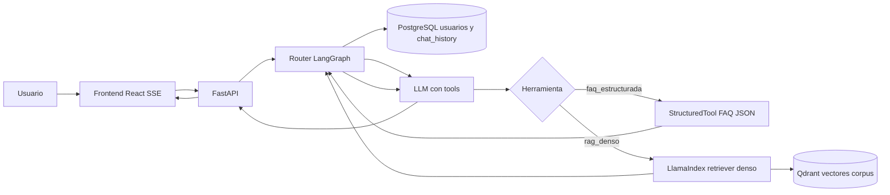

## Contexto

El Módulo 2 evoluciona el asistente hacia un sistema multi-capacidad: identificación de usuario, conversación con memoria persistente, herramienta determinista de preguntas frecuentes (FAQs) y recuperación semántica sobre el corpus institucional.

La [decision-1 — MVP BM25 a nivel archivo](decision-1%20-%20MVP-BM25-Archivo-Completo.md) documentó la fase 1 con `rank-bm25` sobre archivos Markdown completos. La [decision-2 — Migración a React + Vite + FastAPI + SSE](decision-2%20-%20Migracion-Frontend-React-Vite-Backend-FastAPI-SSE.md) fijó la capa de UI y API HTTP, necesaria para autenticación liviana, streaming SSE extendido y separación cliente-servidor.

Para el **runtime productivo del Módulo 2** el equipo prioriza:

- **Un solo camino de recuperación** sobre el corpus: **similitud densa** (embeddings + búsqueda vectorial), sin BM25 en inferencia, sin fusión híbrida ni RRF que obligue a tunear pesos ni a mantener `rank-bm25` / `nltk` en producción.
- **Memoria conversacional multiusuario** con durabilidad y buena concurrencia.
- **Separación clara** entre almacén transaccional (OLTP) de mensajes y usuarios, y almacén vectorial del corpus.
- **Composición de frameworks** alineada al ecosistema LangChain: grafo de enrutamiento, tools y memoria oficial sobre Postgres; RAG con LlamaIndex y cliente maduro hacia Qdrant.

El corpus canónico sigue en `data/markdown/` con front matter YAML; alimenta **ingesta** hacia Qdrant (`scripts/indexar_corpus_qdrant.py`), no sustituye al vector store en cada consulta del agente.

La sesión de chat es **continua por usuario** (misma línea conversacional mientras use el producto), identificado en la aplicación por documento de identidad y nombre. Los mensajes históricos inyectados al contexto del router se acotan con una ventana temporal configurable **`HISTORIAL_DIAS_MAX`** (valor por defecto recomendado: **7 días**), de forma coherente con límites operativos y privacidad. Complementariamente puede aplicarse un tope de turnos (`HISTORIAL_TURNOS_MAX`) en configuración, sin sustituir la semántica de ventana por días.

Los embeddings deben ser **parametrizables por variables de entorno** (por ejemplo proveedor y modelo de embedding), con camino por defecto razonable para el curso (p. ej. OpenAI `text-embedding-3-small`) y opción documentada de embeddings locales vía HuggingFace cuando el equipo lo habilite.

## Decisión

### Persistencia OLTP: PostgreSQL (no SQLite)

Se adopta **PostgreSQL** para:

- **Durabilidad y operación**: motor apto para servicios concurrentes y despliegue en contenedor (p. ej. `docker-compose`), copias y prácticas estándar de backup.
- **Integración con memoria LangChain**: uso de **`langchain-postgres`** (`PostgresChatMessageHistory`) y tablas de historial alineadas al ecosistema documentado.
- **Modelo de dominio**: usuarios, sesiones lógicas y metadatos de aplicación con **SQLAlchemy 2 async**, **`asyncpg`** y migraciones **Alembic**; driver sync **`psycopg[binary]`** solo donde una ruta de librería lo exija de forma acotada.

SQLite queda descartado como motor principal del módulo 2 por límites de escritura concurrente, menor afinidad con despliegue multi-instancia y menor encaje con `langchain-postgres` en escenarios de producción del proyecto.

### Almacén vectorial: Qdrant

Se adopta **Qdrant** como único vector database del runtime M2, accesible con **`qdrant-client`** y desplegable en Docker junto al resto del stack.

**Motivos frente a alternativas:**

- **Chroma**: útil en prototipos; para el curso se prefiere Qdrant por madurez del cliente, operación en servidor dedicado y separación explícita del OLTP.
- **pgvector en PostgreSQL**: concentra vectores y OLTP en el mismo motor; aquí se prioriza **separación de concerns** (Postgres para transacciones y chat; Qdrant para índice ANN del corpus) y escalado independiente del vector store.
- **FAISS embebido**: excelente en proceso único; complica despliegue compartido, servicio aparte y políticas de ingesta idempotente centralizadas frente a un servidor Qdrant.

### RAG: solo recuperación densa (sin BM25 ni híbrido en producto)

En **inferencia del agente M2** no se usa BM25, ni fusión híbrida con sparse, ni RRF. El recuperador es **denso**: embedding de la consulta, búsqueda por similitud en Qdrant, top-k y umbrales configurables.

El retiro de BM25 en runtime reduce superficie operativa (una sola tubería de recuperación, sin ajuste de pesos sparse/denso) y elimina dependencias de ranking léxico en el camino productivo. El código legacy del Módulo 1 puede conservar BM25 como referencia académica; el **camino de recuperación del producto M2** queda definido por este documento y **supersede** el alcance de recuperación en runtime descrito en la [decision-1](decision-1%20-%20MVP-BM25-Archivo-Completo.md) (véase estado `superseded` en el front matter de esa decisión y la nota de alcance en su cuerpo).

### Composición de frameworks

| Rol | Elección |
| --- | --- |
| Router y flujo de control | **LangGraph** (`StateGraph`): nodos para memoria, decisión de tool, ejecución y composición de respuesta; aristas condicionales según `tool_calls`. |
| Tools y memoria | **LangChain**: `StructuredTool` para FAQ y RAG; memoria con **`PostgresChatMessageHistory`** (`langchain-postgres`). |
| RAG denso | **LlamaIndex**: vector store Qdrant, pipeline de consulta y chunking de ingesta acorde a la guía del repositorio. |
| LLM y embeddings | Cliente compatible (p. ej. **OpenAI** vía `langchain-openai` / integraciones LlamaIndex), parametrizado por `.env`. |

### Sesión continua y ventana `HISTORIAL_DIAS_MAX`

- **`session_id`** estable por usuario (convención documentada en código, p. ej. prefijo `user:` + identificador interno).
- Al construir el contexto para el router, los mensajes persistidos se filtran por antigüedad máxima **`HISTORIAL_DIAS_MAX`** (default **7**), de modo que la conversación sea continua pero acotada en el tiempo.
- La UI y la API de sesiones siguen el marco de la [decision-2](decision-2%20-%20Migracion-Frontend-React-Vite-Backend-FastAPI-SSE.md) (login, `POST /api/sesiones`, `POST /api/agente/stream` con SSE multi-evento).

### Diagrama de flujo (Mermaid)

En el diagrama, **PostgreSQL** concentra la persistencia de identidad y memoria conversacional; **Qdrant** aloja los vectores del corpus tras la ingesta desde Markdown. El **router** orquesta llamadas a herramientas y la composición de la respuesta final hacia el cliente por SSE.

## Consecuencias

### Positivas

- Arquitectura alineada con el ecosistema LangChain/LangGraph y documentación oficial de LlamaIndex + Qdrant.
- Recuperación homogénea (solo densa), más simple de explicar en sustentación y de operar en CI/CD.
- Escalado y copias de seguridad diferenciados entre OLTP y vectores.
- Memoria persistente coherente con multiusuario y sesión continua acotada por `HISTORIAL_DIAS_MAX`.

### Negativas / riesgos

- Mayor número de servicios en desarrollo (Postgres + Qdrant + API) frente al MVP monolítico.
- Coste de embeddings e inferencia en API cerrada si no se usa modelo local; depende de configuración en `.env`.
- Sincronización ingesta-corpus: cambios en `data/markdown/` requieren reindexación para reflejarse en Qdrant.
- Posible fricción async/sync entre SQLAlchemy async y rutas sync de LangChain; exige diseño cuidadoso (helpers o `asyncio.to_thread` acotado) para no bloquear el event loop.

### Mitigación

- Contenedores declarados en `docker-compose.yml` y variables documentadas en `.env.example` sin secretos.
- Script de ingesta idempotente y pruebas con Qdrant en memoria o contenedor; mocks de embeddings en CI cuando no haya clave.
- Guía operativa detallada (comandos, troubleshooting) en `backlog/docs/doc-003 - Arquitectura-Agente-Modulo-2.md` cuando la tarea correspondiente esté cerrada; este ADR no sustituye esa guía.

## Alternativas consideradas

| Alternativa | Razón de rechazo |
| --- | --- |
| **SQLite** como memoria principal | Concurrencia y despliegue multi-instancia limitados; menor encaje con `langchain-postgres` en el objetivo productivo. |
| **Chroma / LanceDB** como vector store | Menor alineación con la decisión de servidor Qdrant ya adoptada en plan M2 y documentación del curso. |
| **pgvector** unificado en Postgres | Mezcla vectores del corpus con OLTP; el equipo prefiere separar responsabilidades y escalar el ANN de forma independiente. |
| **FAISS** en proceso | Dificulta servicio compartido y operación homogénea con Docker para todos los integrantes. |
| **RAG híbrido BM25 + denso (RRF)** | Complejidad operativa y de ajuste; duplica dependencias y no aporta requisito explícito del módulo 2. |
| **Un solo framework** (solo LangChain o solo LlamaIndex) | LangGraph brinda router explícito; LlamaIndex optimiza el camino RAG-Qdrant; LangChain formaliza tools y memoria Postgres con integraciones maduras. |
| **Mantener BM25 en runtime M2** | Contradice el objetivo de una sola tubería de recuperación y el retiro de sparse en producción. |

## Referencias

- [doc-003 — Arquitectura operativa del agente (Módulo 2)](../docs/doc-003%20-%20Arquitectura-Agente-Modulo-2.md) (guía: comandos, troubleshooting, escenarios E2E y migración M1→M2).
- [decision-1 — MVP BM25 a nivel archivo](decision-1%20-%20MVP-BM25-Archivo-Completo.md) (estado `superseded` para el runtime de recuperación del producto; texto histórico conservado en el archivo).
- [decision-2 — Migración React + Vite + FastAPI + SSE](decision-2%20-%20Migracion-Frontend-React-Vite-Backend-FastAPI-SSE.md) (contexto de UI, API y streaming).
- Skills: `.cursor/skills/agente-modulo-2/SKILL.md`, `.cursor/skills/backlog-decisions/SKILL.md`, `.cursor/skills/fastapi-sse-api/SKILL.md`, `.cursor/skills/llm-backend/SKILL.md`.
- Reglas: `.cursor/rules/project-stack.mdc`, `.cursor/rules/agente-modulo-2.mdc`, `.cursor/rules/language-conventions.mdc`.
- Actividad académica M2 (PDF bajo `backlog/docs/actividades/`, sin volcar contenido privativo en este ADR).
