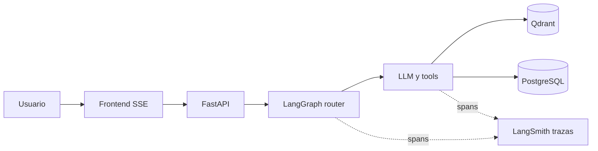

## Contexto

El runtime del Modulo 2 combina **LangGraph** (router y flujo), **LangChain** (tools y memoria sobre PostgreSQL) y **LlamaIndex** con **Qdrant** para RAG denso, expuesto por **FastAPI** y streaming **SSE**, segun la [decision-3 — Arquitectura del agente M2](decision-3%20-%20Arquitectura-Agente-Memoria-RAG-Qdrant-M2.md).

Esa composicion implica varias llamadas encadenadas (modelo, enrutamiento, herramientas, recuperacion vectorial). Sin observabilidad externa, depurar fallos de routing, latencias o calidad de recuperacion suele apoyarse solo en logs locales y reproduccion manual. **LangSmith** es la plataforma oficial del ecosistema LangChain para trazas, evaluacion y flujo de trabajo alrededor de aplicaciones con LLM.

Este documento **no impone** codigo ni variables en el repositorio: registra que es LangSmith, para que sirve, como podria integrarse en este proyecto y que aporta, para que el equipo decida alcance (dev, staging, produccion) y mitigaciones de privacidad.

## Que es LangSmith

Segun la documentacion de LangChain, [LangSmith](https://docs.langchain.com/langsmith/home) es una plataforma **agnostica al framework** orientada a construir, depurar y desplegar aplicaciones con agentes y LLM. Centraliza **observabilidad** (trazas), **evaluacion** de salidas, **despliegue** y practicas asociadas (datasets, experimentos, colaboracion), con un flujo pensado desde desarrollo hasta operacion.

LangSmith **no sustituye** a PostgreSQL (historial conversacional ni modelo de dominio) ni a Qdrant (indice del corpus). Es una capa de **telemetria y mejora continua** sobre las ejecuciones del stack LangChain/LangGraph (y, donde aplique, integraciones adicionales).

## Para que sirve

- **Trazas**: secuencia de pasos con latencias, tokens, errores y jerarquia (p. ej. nodos del grafo, invocaciones a tools, llamadas al modelo).
- **Depuracion**: inspeccionar entradas y salidas por run, comparar versiones del grafo o del prompt y localizar en que nodo o tool se desvia el comportamiento.
- **Evaluacion**: datasets, corridas repetibles y seguimiento de metricas en el tiempo; complementa tests automatizados del repo sin reemplazarlos.
- **Colaboracion**: compartir enlaces a runs con el equipo (revision de incidentes o de calidad en el curso).

## Decision

### Postura

Se **propone** adoptar LangSmith de forma **opcional y por entorno**, empezando por **desarrollo y staging**, con variables de entorno y API keys fuera del control de versiones (`.env`). El uso en **produccion** queda sujeto a decision explicita del equipo, politicas de datos institucionales y revision de cumplimiento (p. ej. [Trust Center de LangChain](https://trust.langchain.com/)).

### Fases sugeridas (sin obligar implementacion en este ADR)

1. **Fase 0 — Documentacion**: este ADR y, cuando se implemente, entradas en `.env.example` con placeholders (sin valores reales) para las variables de tracing.
2. **Fase 1 — Trazas en dev/staging**: habilitar el runtime de tracing compatible con LangChain/LangGraph para el camino principal del agente (`src/agentes/`, invocaciones desde `src/api/`).
3. **Fase 2 — Metadatos y correlacion**: etiquetar runs con identificadores internos (p. ej. id de usuario interno, `session_id`) evitando PII innecesaria en texto libre; opcionalmente correlacionar con `request_id` o identificador de flujo SSE en logs del servidor.
4. **Fase 3 — Evaluacion**: datasets de preguntas alineados a la guia de prompts del proyecto; experimentos sobre cambios de router o de recuperacion RAG.

### Integracion posible en este proyecto

| Capa | Enfoque |
| --- | --- |
| **LangChain / LangGraph** | Variables de entorno tipicas del ecosistema: `LANGCHAIN_TRACING_V2=true`, `LANGCHAIN_API_KEY`, `LANGCHAIN_PROJECT`; opcional `LANGCHAIN_ENDPOINT` si aplica region o despliegue self-hosted. Los clientes de chat y los grafos compilados suelen emitir trazas al runtime global cuando estas variables estan definidas. |
| **Metadatos de sesion** | Propagar identificadores **no sensibles** (id interno de usuario, id de sesion logica) como metadata o tags del run para filtrar en LangSmith sin exponer documento de identidad u otros datos personales en campos de texto si la politica lo restringe. |
| **LlamaIndex** | El detalle de integracion con LangSmith puede variar segun version y wrappers; el ADR asume prioridad de observabilidad en el **camino LangGraph/LangChain** del agente. Para RAG con LlamaIndex, valorar spans manuales o documentacion de la version en uso si se requiere el mismo nivel de detalle que en el router. |
| **FastAPI / SSE** | Opcional: generar o propagar un id de peticion y asociarlo al trace root (p. ej. via metadata) para enlazar logs de aplicacion con el run en LangSmith. |

### Diagrama (telemetria lateral)

## Consecuencias

### Positivas

- Menor tiempo para diagnosticar problemas en el router y en las tools (FAQ, RAG denso).
- Visibilidad de **coste y latencia** por turno (tokens, modelo) util para el curso y para ajustes operativos.
- Base para **evaluaciones** repetibles cuando el equipo defina datasets y umbrales de calidad.

### Negativas / riesgos

- **Exfiltracion inadvertida**: las trazas pueden incluir texto de usuario, fragmentos recuperados del corpus y mensajes del modelo; el envio a LangSmith implica confiar en el proveedor y en la configuracion del proyecto (retencion, region, self-hosting).
- **Coste y cuotas**: uso de plataforma cloud segun plan y volumen de runs.
- **Dependencia de red**: fallos o latencia en el export de trazas no deben tumbar el camino critico del chat; la practica recomendada es tracing **no bloqueante** y tolerante a fallos segun documentacion vigente del SDK.
- **Ruido operativo**: sin convenciones de `LANGCHAIN_PROJECT` por entorno, mezclar dev y staging complica el analisis.

### Mitigacion

- Activar tracing solo donde el equipo lo autorice; separar proyectos por entorno (`dev`, `staging`, `prod` si aplica).
- Revisar politicas institucionales y materiales de cumplimiento del proveedor antes de enviar datos reales de usuarios o corpus sensible.
- Mantener **API keys** unicamente en `.env` o secretos del orquestador; no commitear credenciales en `backlog/` ni en codigo.
- Documentar que LangSmith es **observabilidad**, no almacen de historial: el historial de negocio sigue en PostgreSQL segun la decision-3.

## Referencias

- [LangSmith — documentacion principal](https://docs.langchain.com/langsmith/home)
- [LangSmith — inicio rapido de observabilidad](https://docs.langchain.com/langsmith/observability-quickstart)
- [Trust Center — LangChain](https://trust.langchain.com/)
- [decision-3 — Arquitectura del agente M2](decision-3%20-%20Arquitectura-Agente-Memoria-RAG-Qdrant-M2.md)
