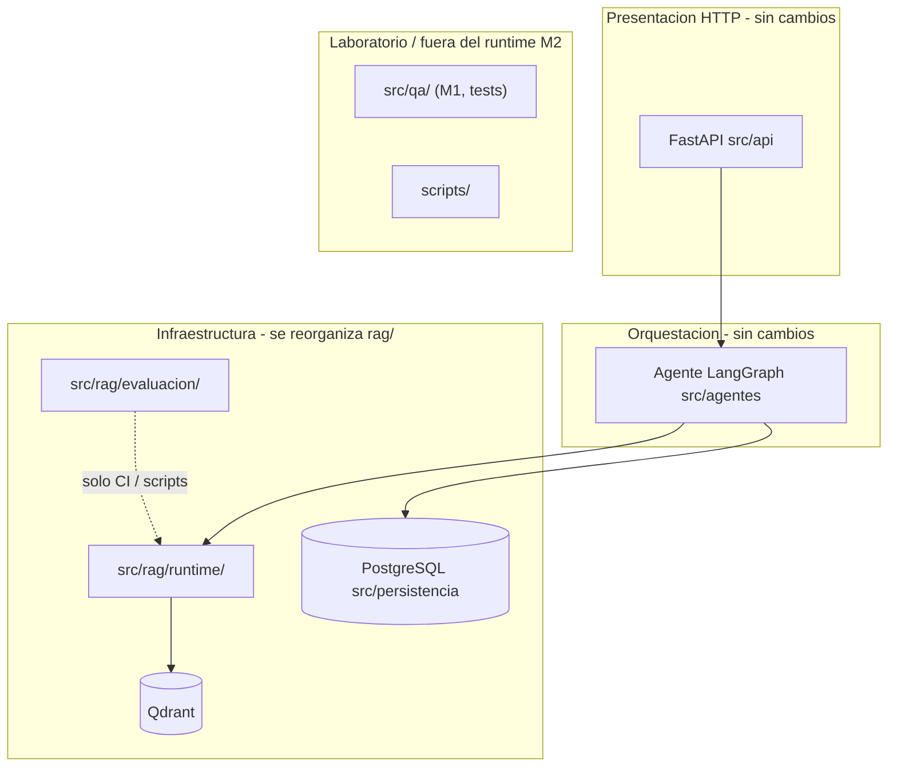

## Contexto

El [doc-004 — Estudio de migración hacia una arquitectura en capas tipo Clean Architecture](../docs/doc-004%20-%20Estudio-Migracion-Clean-Architecture.md) analiza si conviene reorganizar el árbol `src/` hacia capas formales tipo Clean Architecture o hexagonal, frente a mantener la separación actual por carpetas (`src/api/`, `src/agentes/`, `src/rag/`, `src/persistencia/`).

El **runtime productivo del Módulo 2** queda fijado por la [decision-3 — Arquitectura del agente M2](decision-3%20-%20Arquitectura-Agente-Memoria-RAG-Qdrant-M2.md) (LangGraph + LangChain + LlamaIndex + Qdrant + PostgreSQL) y se describe operativamente en [doc-003 — Arquitectura operativa del agente (Módulo 2)](../docs/doc-003%20-%20Arquitectura-Agente-Modulo-2.md).

La pregunta a decidir es: ¿reorganizar `src/` hacia paquetes rígidos de Clean Architecture (Opción B del estudio), **no migrar** estructuralmente, o adoptar una **migración incremental** (Opción A: “clean enough”)?

Restricciones reales del proyecto: un único entrypoint HTTP (FastAPI), acoplamiento natural con LangGraph, LangChain y LlamaIndex, suite de pruebas viva contra el grafo y SSE, y coste de regresión alto si se reescribe el montaje del lifespan o el orden de inicialización.

## Decisión

**Se acepta la migración en modo incremental (“clean enough”, Opción A de doc-004) y se rechaza la Opción B completa** (rediseño total en `dominio/`, `aplicacion/`, `puertos/`, `infraestructura/`, `presentacion/`).

### Sub-decisiones explícitas

1. **Mantener** sin reescribir la organización base de `src/api/`, `src/agentes/` y `src/persistencia/`. LangGraph y `StructuredTool` se tratan como **motor de aplicación en la periferia**; no se fuerzan al “dominio puro” como entidades desacopladas de esos frameworks.
2. **Subdividir `src/rag/` por intención de uso** cuando exista una tarea de implementación dedicada:
   - `src/rag/runtime/` — módulos importados por el agente o la factoría del grafo en cada consulta: `qdrant_store.py`, `embeddings.py`, `recuperador_denso.py`, `recuperador_listados.py`, `intencion.py`, `diversificador_mmr.py`, `reranker_cross_encoder.py`, `filtros_listado_heuristica.py`, `extractor_metadata.py`.
   - `src/rag/evaluacion/` — `metricas_eval.py` y utilidades compartidas con scripts o laboratorio.
3. **Aclarar el rol de `src/qa/`**: documentar en el README del repositorio que **no forma parte del runtime M2** en producción (flujo Módulo 1 / pruebas), o renombrar en una tarea futura a algo como `src/laboratorio/qa_legacy/` y actualizar imports. **No** eliminar el paquete sin tarea dedicada, búsqueda de referencias y suite verde (`uv run pytest`).
4. **Retirar `src/app/` y `src/app/legacy/`** (paquetes prácticamente vacíos, solo `__init__.py`) en una **tarea dedicada**, dejando en el README una nota sobre la UI Gradio retirada (historial en git o documentación legacy).
5. **Puertos explícitos solo donde haya reglas estables reutilizables** (por ejemplo normalización de `session_id`, límites de recuperación, ventana `HISTORIAL_DIAS_MAX` expresada como reglas de negocio). No crear interfaces “por si acaso” con una sola implementación.
6. **Capa de servicio delgada** entre el router HTTP y el grafo LangGraph **solo** si `src/api/routers/agente.py` empieza a acumular lógica de negocio; mientras no ocurra, el router puede invocar la factoría del grafo directamente.

### Diagrama de límites adoptados

## Lo que NO cambia (invariantes respetadas)

- Stack del agente fijado por la [decision-3](decision-3%20-%20Arquitectura-Agente-Memoria-RAG-Qdrant-M2.md): LangGraph + LangChain + LlamaIndex + Qdrant + Postgres.
- Contrato HTTP/SSE de la [decision-2](decision-2%20-%20Migracion-Frontend-React-Vite-Backend-FastAPI-SSE.md): `POST /api/sesiones`, `POST /api/agente/stream`, eventos SSE.
- Payload Qdrant y chunking de la [decision-4](decision-4%20-%20Payload-Qdrant-enriquecido-y-chunking-Markdown.md).
- Observabilidad LangSmith de la [decision-5](decision-5%20-%20LangSmith-Observabilidad-y-Evaluacion-M2.md).
- Convenciones de identificadores ASCII en español en Python (`.cursor/rules/language-conventions.mdc`).

## Consecuencias

### Positivas

- Mejor navegabilidad y narrativa para auditoría académica sin rediseñar el núcleo del agente.
- Distinción explícita entre **núcleo productivo** y **laboratorio** (scripts, evaluación, `src/qa/` documentado como fuera del camino M2).
- Coste de migración acotado frente a la Opción B: principalmente reorganización de imports bajo `src/rag/` y documentación.

### Negativas / riesgos

- Esta decisión **no** introduce por sí sola un “dominio rico” de entidades puras; el centro testeable sin red sigue siendo delgado en un sistema agéntico.
- Riesgo de reorganización a medias si no se cierra la tarea `rag/runtime` vs `rag/evaluacion` con pruebas verdes.

### Mitigación

- Ejecutar cada sub-decisión como **tarea en `backlog/tasks/`** con búsqueda previa de imports y `uv run pytest` antes y después.
- Actualizar [doc-003](../docs/doc-003%20-%20Arquitectura-Agente-Modulo-2.md) con la tabla “núcleo vs laboratorio” cuando se complete la reorganización de `src/rag/`.

## Criterio de cierre (regla de stop)

Para evitar abstracción prematura en futuras propuestas de profundizar capas:

> Si no hay un segundo consumidor del mismo caso de uso fuera de FastAPI, no crear un paquete `aplicacion/` genérico con más de una docena de archivos vacíos o triviales.

(Texto alineado a la recomendación prudente del doc-004, sección 7.)

## Alternativas consideradas

| Alternativa | Resultado |
| --- | --- |
| **Opción B completa** (`dominio/`, `aplicacion/`, `puertos/`, `infraestructura/`, `presentacion/`) | **Rechazada**: alto coste de migración, riesgo en SSE y lifespan, muchas líneas de pegamento si se fuerza LangGraph al “dominio puro”, beneficio marginal con un solo entrypoint HTTP. |
| **No migrar nada** (congelar estructura y solo texto en README) | **Rechazada** como política única: deja sin respaldo formal mejoras baratas de navegabilidad y claridad “núcleo vs laboratorio” que sí aportan valor en sustentación. |
| **Migración solo en submódulo crítico** (p. ej. solo `rag/`) | **Incluida** dentro de la Opción A adoptada; se prioriza explícitamente la subdivisión de `src/rag/`. |

## Referencias

- [doc-004 — Estudio de migración hacia una arquitectura en capas tipo Clean Architecture](../docs/doc-004%20-%20Estudio-Migracion-Clean-Architecture.md)
- [decision-3 — Arquitectura del agente M2](decision-3%20-%20Arquitectura-Agente-Memoria-RAG-Qdrant-M2.md)
- [decision-2 — Migración React + Vite + FastAPI + SSE](decision-2%20-%20Migracion-Frontend-React-Vite-Backend-FastAPI-SSE.md)
- [decision-4 — Payload Qdrant y chunking Markdown](decision-4%20-%20Payload-Qdrant-enriquecido-y-chunking-Markdown.md)
- [decision-5 — Observabilidad LangSmith](decision-5%20-%20LangSmith-Observabilidad-y-Evaluacion-M2.md)
- [doc-003 — Arquitectura operativa del agente M2](../docs/doc-003%20-%20Arquitectura-Agente-Modulo-2.md)
- Robert C. Martin — *Clean Architecture* (regla de dependencia; contexto citado en doc-004 §3).

## Alcance explícito de este ADR

- **No** mueve ni renombra archivos por sí mismo; la ejecución queda en tareas posteriores.
- **No** reabre el stack de la decision-3.
- **No** supersede ninguna decisión previa.
