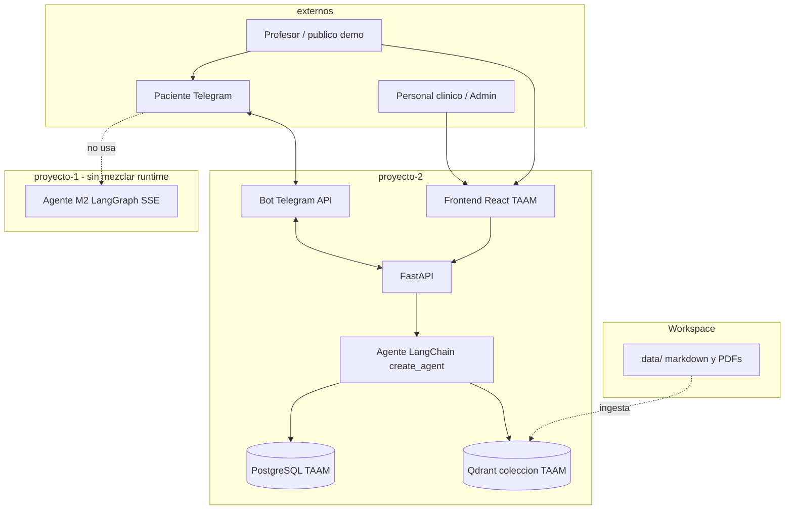
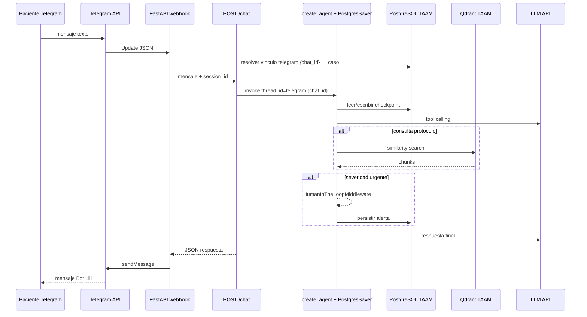
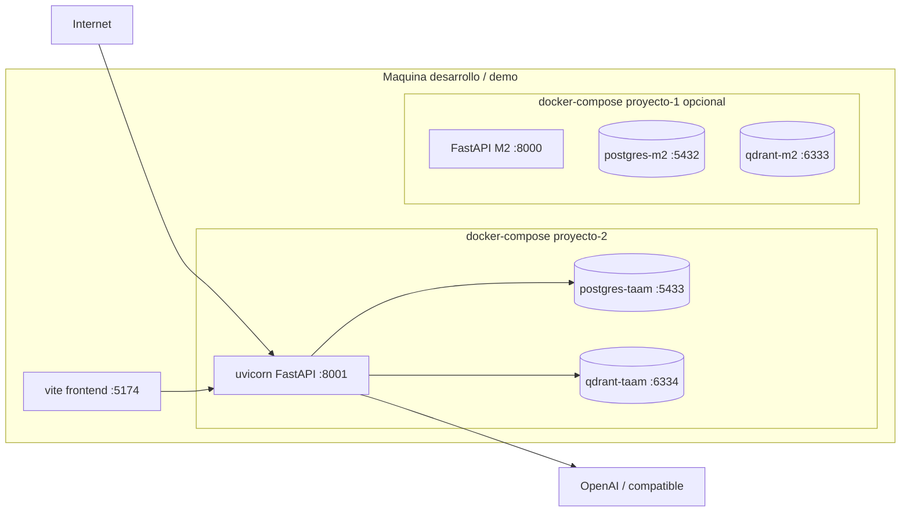

## Contexto

El MVP **Bot posoperatorio TAAM** (Fundación Valle del Lili) atiende el seguimiento postoperatorio de pacientes a traves de **Bot Lili**. El canal de demostracion del curso es **Telegram**; el caso de uso completo del cliente incluye actores clinicos, catalogo de procedimientos con PDF y panel de seguimiento ([Caso de Uso TAAM](../docs/usecases/Caso%20de%20Uso%20TAAM%20-%20Bot%20Posoperatorio.md)).

El **Modulo 3** exige **Ruta A**: agente con **function calling estricto** (LangChain), API REST en **FastAPI** e integracion con mensajeria. El equipo elige **via 2** (webhook y envio de mensajes en el mismo servicio FastAPI, **sin N8N** ni WhatsApp en el MVP).

El producto **M2** sigue en `proyecto-1/` con router **LangGraph**, memoria `langchain-postgres`, RAG LlamaIndex+Qdrant y UI React con SSE ([decision-3](decision-3%20-%20Arquitectura-Agente-Memoria-RAG-Qdrant-M2.md)). Mezclar el runtime M2 con el stack obligatorio de M3 (`create_agent`, `PostgresSaver`, `HumanInTheLoopMiddleware`) aumentaria deuda y romperia la verificacion de la rubrica.

> **Numeracion:** el identificador `decision-4` ya esta asignado a [Payload Qdrant y chunking Markdown](decision-4%20-%20Payload-Qdrant-enriquecido-y-chunking-Markdown.md) (M2). La arquitectura M3 TAAM se registra como **decision-7**. Las tareas M3 deben enlazar este archivo, no reutilizar el `id` decision-4.

## Problema

1. Pacientes necesitan orientacion postoperatoria continua (medicacion, terapias, senales de alarma) sin depender de una visita presencial inmediata.
2. El personal clinico debe poder registrar casos, revisar interacciones y validar triage sin mezclar datos con el asistente institucional M2.
3. La sustentacion exige un flujo **end-to-end** visible: mensaje en Telegram → API → agente con memoria y RAG → respuesta en el canal, con panel web para staff.

## Decision

### Alcance arquitectonico

| Tema | Decision |
| --- | --- |
| Codigo ejecutable TAAM | Carpeta **`proyecto-2/`** (aplicacion independiente; Python 3.12.12 + `uv`, FastAPI, Docker propio). |
| Codigo M2 productivo | Permanece en **`proyecto-1/`** sin portar el grafo LangGraph. |
| Ruta del curso | **Ruta A** (LangChain function calling + FastAPI). |
| Canal MVP | **Telegram** con **via 2** (integracion en FastAPI). |
| API conversacional | **`POST /chat`** (JSON: mensaje + identificador de sesion; respuesta JSON del agente). |
| Webhook Telegram | **`POST /api/integracion/telegram/webhook`** en el mismo proceso FastAPI. |
| OLTP | **PostgreSQL** dedicado TAAM (`DATABASE_URL` distinto al de M2). |
| Vectores | **Qdrant** con **coleccion dedicada** (p. ej. `taam_protocolos`); no compartir coleccion `corpus_*` de M2. |
| Corpus compartido | `data/` en raiz del workspace (`UAO_WORKSPACE_ROOT` / `src/rutas_workspace.py` en ambos proyectos). |
| Frontend | **React 19 + Vite 8** nuevo en `proyecto-2/frontend/` (implementacion nueva; **misma linea visual** que M2: tokens institucionales, Tailwind v4, shadcn/ui). |

### Relacion con M2: reutilizar vs no portar

| Reutilizar (patrones / infra compartida) | No portar a proyecto-2 |
| --- | --- |
| Resolucion de rutas `data/*` via workspace root | Grafo LangGraph `proyecto-1/src/agentes/router.py` y nodos asociados |
| Convencion Markdown + front matter en `data/markdown/` (si aplica ingesta cruzada) | Endpoints M2: `POST /api/agente/stream`, sesiones DocId del frontend M2 |
| Separacion OLTP (Postgres) vs vectores (Qdrant) | `PostgresChatMessageHistory` / tablas `chat_history` de M2 sin prefijo TAAM |
| Payload enriquecido e indices Qdrant ([decision-4](decision-4%20-%20Payload-Qdrant-enriquecido-y-chunking-Markdown.md)) en **ingesta TAAM** de PDFs | LlamaIndex como runtime del agente M3 (RAG via **LangChain vector stores**) |
| Docker compose en paralelo (puertos documentados: M2 ~8000, TAAM ~8001) | Checkpointer M2 en las mismas tablas que TAAM |

### Sesiones e identidad Telegram

- **`session_id` canonico** para el checkpointer LangChain: `telegram:{chat_id}` (`chat_id` entero de Telegram).
- **Vinculo paciente ↔ chat**: tabla OLTP aparte (p. ej. `vinculos_telegram`: `caso_postoperatorio_id`, `telegram_chat_id`, `codigo_emparejamiento`, timestamps). El agente resuelve el caso activo a partir de ese vinculo; el `session_id` solo agrupa el hilo conversacional.
- Staff y administracion de catalogo usan **JWT o API key** (tarea de autenticacion); no reutilizar cookie de sesion M2.

### Stack LangChain exigido (Ruta A) y verificacion en repo

La rubrica del Modulo 3 exige componentes concretos. Implementacion prevista bajo `proyecto-2/src/` y verificacion automatizable:

| Componente | Uso en TAAM | Ruta prevista | Verificacion (local / CI) |
| --- | --- | --- | --- |
| `init_chat_model` | LLM del agente y clasificadores auxiliares | `proyecto-2/src/agentes/modelo.py` | `rg -l 'init_chat_model' proyecto-2/src` |
| `create_agent` | Orquestacion del agente con tools estrictas | `proyecto-2/src/agentes/agente_taam.py` | `rg -l 'create_agent' proyecto-2/src` |
| `HumanInTheLoopMiddleware` | Pausa en severidad **urgente** / red flags (UC-MVP-03) | `proyecto-2/src/agentes/agente_taam.py` | `rg 'HumanInTheLoopMiddleware' proyecto-2` |
| `RecursiveCharacterTextSplitter` | Chunking de PDFs de protocolo en ingesta | `proyecto-2/scripts/ingestar_protocolo_pdf.py` | `rg 'RecursiveCharacterTextSplitter' proyecto-2` |
| `langchain_core.vectorstores` + embeddings | RAG denso sobre coleccion TAAM | `proyecto-2/src/rag/vector_store.py` | `rg 'vectorstores|VectorStore' proyecto-2/src/rag` |
| `dynamic_prompt` | Inyectar contexto RAG + notas del caso en el prompt | `proyecto-2/src/agentes/prompts.py` | `rg 'dynamic_prompt' proyecto-2/src` |
| `PostgresSaver` | Memoria persistente / checkpointer (`thread_id` = `session_id`) | `proyecto-2/src/agentes/checkpointer.py` | `rg 'PostgresSaver' proyecto-2` |
| Esquemas **Pydantic** por tool | Function calling estricto (sin texto libre para elegir tool) | `proyecto-2/src/agentes/tools/` | `rg 'BaseModel|@tool' proyecto-2/src/agentes/tools` |

Script sugerido para CI: `proyecto-2/scripts/verificar_stack_m3.sh` (exit 1 si falta alguna cadena obligatoria).

### Fuera del MVP (explicito)

- RBAC completo por rol clinico (solo auth staff minima + rutas protegidas).
- Recordatorios por **email** de citas agendadas.
- Evidencias multimedia (foto, audio, video) en Telegram.
- Intervencion en vivo del cirujano dentro del hilo de Telegram.
- Extraccion perfecta de horarios/cantidades desde PDF (ver riesgos).
- WhatsApp, N8N u OpenFang (Ruta B).

### Riesgos aceptados

| Riesgo | Mitigacion MVP |
| --- | --- |
| PDF de protocolo no garantiza extraccion fiel de horarios y dosis | Recordatorios basados en **plantilla** + **fecha de cirugia** + campos estructurados del caso; RAG como apoyo, no como unica fuente de cronograma. |
| Latencia Telegram + LLM en demo en vivo | Timeouts acotados, respuestas cortas, datos de prueba pre-sembrados (`sembrar_demo_taam.py`). |
| Dos stacks Postgres/Qdrant en paralelo con M2 | Puertos y nombres de coleccion distintos en `docker-compose` de proyecto-2; variables en `.env.example`. |

## Diagramas

### Contexto (actores)

### Secuencia: Telegram → webhook → `/chat` → agente → Postgres / Qdrant

### Despliegue (Docker)

## Tabla de componentes y rutas de codigo previstas

| Componente | Responsabilidad | Ruta prevista |
| --- | --- | --- |
| App FastAPI | Lifespan, CORS, montaje routers | `proyecto-2/src/main.py` |
| Configuracion | `pydantic-settings`, secretos Telegram/DB | `proyecto-2/src/configuracion.py` |
| Rutas salud | `GET /api/salud` | `proyecto-2/src/api/routers/salud.py` |
| Chat API | `POST /chat` (contrato rubrica M3) | `proyecto-2/src/api/routers/chat.py` |
| Webhook Telegram | Recepcion updates, llamada interna a `/chat`, envio | `proyecto-2/src/integracion/telegram/webhook.py` |
| Cliente Telegram | `sendMessage`, validacion token | `proyecto-2/src/integracion/telegram/cliente.py` |
| Agente | `create_agent`, tools, HITL, `dynamic_prompt` | `proyecto-2/src/agentes/agente_taam.py` |
| Checkpointer | `PostgresSaver`, `thread_id` | `proyecto-2/src/agentes/checkpointer.py` |
| Tools | RAG, FAQs, triage, recordatorios (Pydantic) | `proyecto-2/src/agentes/tools/` |
| RAG | Vector store LangChain + Qdrant TAAM | `proyecto-2/src/rag/vector_store.py` |
| Persistencia | Modelos SQLAlchemy, vinculos, casos, alertas | `proyecto-2/src/persistencia/` |
| Migraciones | Esquema inicial TAAM | `proyecto-2/alembic/versions/` |
| Ingesta PDF | `RecursiveCharacterTextSplitter` → Qdrant | `proyecto-2/scripts/ingestar_protocolo_pdf.py` |
| Semilla demo | Usuarios, procedimiento, casos | `proyecto-2/scripts/sembrar_demo_taam.py` |
| Frontend staff/paciente | Panel UC-MVP-01..05 | `proyecto-2/frontend/src/features/` |
| Workspace paths | `data/`, `UAO_WORKSPACE_ROOT` | `proyecto-2/src/rutas_workspace.py` |
| Compose / env | Servicios y puertos | `proyecto-2/docker-compose.yml`, `proyecto-2/.env.example` |

## Consecuencias

### Positivas

- Frontera clara entre demo institucional M2 y producto TAAM evaluable en rubrica M3.
- Un solo servicio FastAPI para API, agente y Telegram (via 2) simplifica la sustentacion en vivo.
- Coleccion y base TAAM aisladas evitan regresiones en M2.

### Negativas / riesgos

- Duplicacion de scaffolding (dos `pyproject.toml`, dos frontends, dos composes).
- Equipo debe mantener coherencia visual M2 sin copiar codigo del router LangGraph.

### Mitigacion

- Milestone **m-0** y tareas TASK-98+ con orden de implementacion; ADR [decision-4](decision-4%20-%20Payload-Qdrant-enriquecido-y-chunking-Markdown.md) solo para ingesta/chunking, no para arquitectura M3.
- Documento de casos de uso y [doc-004 — Arquitectura TAAM](../docs/doc-004%20-%20Arquitectura-M3-Bot-Posoperatorio-TAAM.md) enlazan **decision-7**.

## Referencias

- [Actividad Modulo 3](../docs/actividades/Actividad%20del%20M%C3%B3dulo%203_%20Productizaci%C3%B3n,%20Despliegue%20Avanzado%20y%20Sistemas%20Ag%C3%A9nticos.md)
- [Caso de Uso TAAM — Bot Posoperatorio](../docs/usecases/Caso%20de%20Uso%20TAAM%20-%20Bot%20Posoperatorio.md)
- [decision-3 — Arquitectura agente M2](decision-3%20-%20Arquitectura-Agente-Memoria-RAG-Qdrant-M2.md)
- [decision-4 — Payload Qdrant M2](decision-4%20-%20Payload-Qdrant-enriquecido-y-chunking-Markdown.md)
- [milestone m-0 — Agentic Final Project](../milestones/m-0%20-%20agentic-final-project.md)
- Tareas de implementacion: TASK-98 (scaffold), TASK-103 (agente), TASK-106 (Telegram), TASK-97 (casos de uso)
