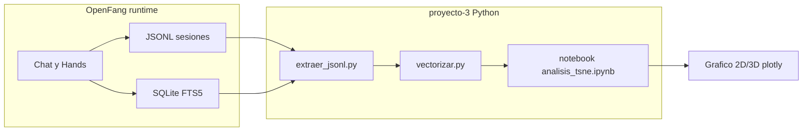
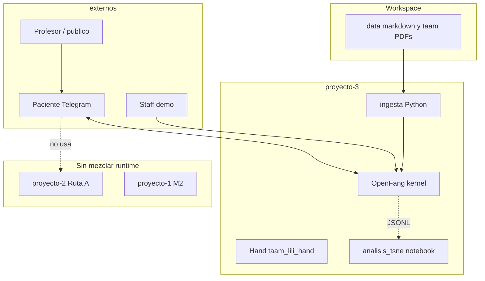
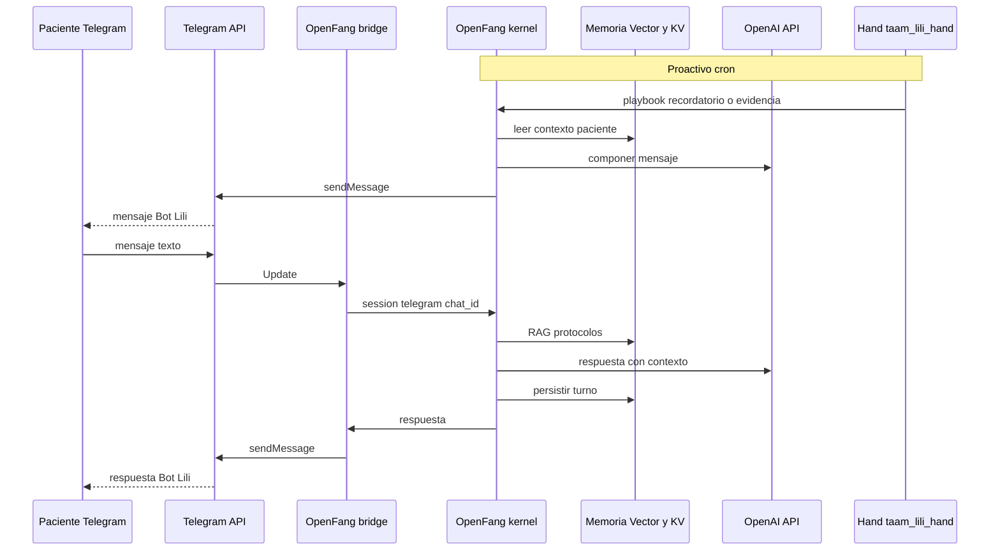
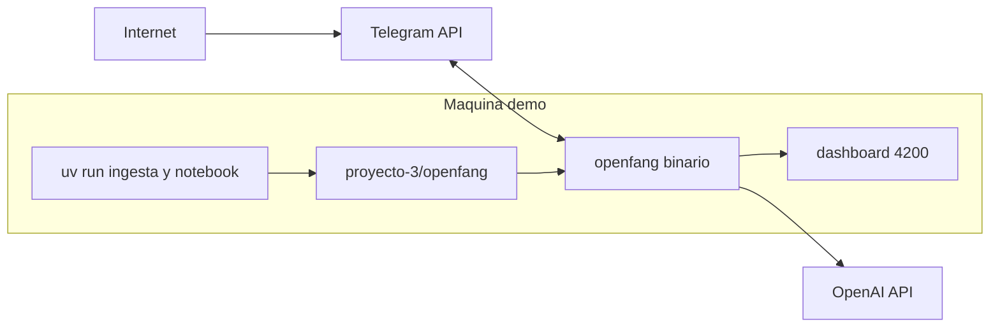

## Contexto

El **Bot posoperatorio TAAM** (Fundacion Valle del Lili — Bot Lili) atiende seguimiento postoperatorio de pacientes. El caso de uso completo del cliente define actores clinicos, catalogo de procedimientos con PDF, recordatorios, evidencias y panel de seguimiento ([Caso de Uso TAAM](../docs/usecases/Caso%20de%20Uso%20TAAM%20-%20Bot%20Posoperatorio.md)).

El **Modulo 3** del curso permite elegir **Ruta A** (LangChain + FastAPI + mensajeria) o **Ruta B** ([OpenFang](https://www.openfang.sh/) como Agent OS). El equipo ya adopto **Ruta A** en [`proyecto-2/`](../../proyecto-2/) ([decision-7](decision-7%20-%20Arquitectura-M3-TAAM-Proyecto-2-Telegram-Ruta-A.md), `accepted`). Este ADR registra la **implementacion paralela de Ruta B** en **`proyecto-3/`**, sin sustituir `proyecto-1/` (M2) ni `proyecto-2/` (M3 Ruta A).

La evaluacion de viabilidad OpenFang frente al dominio clinico completo esta en [doc-007](../docs/doc-007%20-%20Evaluacion-OpenFang-Proyecto-2-TAAM.md). Para `proyecto-3` se acota el alcance a **OpenFang puro** (chat reactivo + Hands + memoria del OS), alineado con lo que la rubrica Ruta B exige de forma explicita, mas la **Ruta Transversal B** opcional (t-SNE sobre historial del OS).

Definiciones acordadas para este ADR:

| Tema | Eleccion |
| --- | --- |
| Alcance clinico | OpenFang puro: sin PostgreSQL OLTP, sin panel React, sin emparejamiento estructurado de casos |
| LLM | **OpenAI** / API compatible (mismo proveedor que `proyecto-2/` para comparacion entre rutas) |
| Canal | **Telegram** via bridge nativo de OpenFang (token BotFather) |
| Hand | **Opcion C personalizada** (`taam_lili_hand`): recordatorios postoperatorio + solicitud de evidencias en **texto** |
| Analitica | Notebook **t-SNE** (bonus transversal B) sobre JSONL / SQLite FTS5 del OS |

## Problema

1. Demostrar en sustentacion la **Ruta B** del Modulo 3 (Agent OS, ingesta de conocimiento corporativo, Hand autonomo, canal Telegram) sin desmontar el MVP Ruta A ya en `proyecto-2/`.
2. Mapear los casos de uso TAAM a capacidades reales de OpenFang, dejando **explicitos** los gaps frente al producto clinico completo.
3. Preparar un arbol `proyecto-3/` listo para implementacion incremental (config, Hand, ingesta, analisis t-SNE).

## Decision

### Alcance arquitectonico

| Tema | Decision |
| --- | --- |
| Codigo ejecutable Ruta B | Carpeta **`proyecto-3/`** en raiz del workspace (config OpenFang, Hand, scripts Python auxiliares para ingesta y t-SNE). |
| Runtime conversacional | **Binario OpenFang** (instalacion externa; no empaquetado en el repo). |
| Codigo M3 Ruta A | Permanece en **`proyecto-2/`** ([decision-7](decision-7%20-%20Arquitectura-M3-TAAM-Proyecto-2-Telegram-Ruta-A.md)). |
| Codigo M2 | Permanece en **`proyecto-1/`** ([decision-3](decision-3%20-%20Arquitectura-Agente-Memoria-RAG-Qdrant-M2.md)). |
| Ruta del curso (este proyecto) | **Ruta B** (OpenFang + memoria 6 capas + HAND.toml + Telegram bridge). |
| Bonus curso | **Ruta Transversal B** (t-SNE / UMAP en notebook Python anexo). |
| Corpus compartido | `data/markdown/` y PDFs bajo `data/taam/` en raiz del workspace (`UAO_WORKSPACE_ROOT`). |
| Persistencia dominio clinico | **No** en MVP de `proyecto-3` (sin tablas `casos_postoperatorio`, `alertas_triage`, panel staff React). |
| Dashboard operativo | Dashboard local OpenFang (`http://127.0.0.1:4200`) para demo y monitoreo de Hands. |

### Relacion entre proyectos del workspace

| Proyecto | Rol | Ruta / stack |
| --- | --- | --- |
| `proyecto-1/` | Asistente institucional M2 | LangGraph + Postgres + Qdrant + React SSE |
| `proyecto-2/` | TAAM MVP evaluable Ruta A | LangChain `create_agent` + FastAPI via 2 + Telegram webhook |
| `proyecto-3/` | TAAM demo Ruta B + t-SNE | OpenFang + Hand `taam_lili_hand` + ingesta Python auxiliar |

Los tres pueden coexistir en la misma maquina de demo con **tokens Telegram distintos** (bots BotFather separados para `proyecto-2` y `proyecto-3`).

### Mapeo casos de uso TAAM ↔ Ruta B (`proyecto-3`)

Referencia: tabla de actores y casos en [Caso de Uso TAAM](../docs/usecases/Caso%20de%20Uso%20TAAM%20-%20Bot%20Posoperatorio.md).

| # | Caso de uso (actor) | Cobertura en `proyecto-3` | Mecanismo |
| --- | --- | --- | --- |
| 1 | Registrar procedimiento + PDF (admin) | **Parcial** | Ingesta de PDFs/protocolos hacia **Vector Store** + **Structured KV** del agente; sin CRUD admin ni panel |
| 2 | Gestionar usuarios (admin) | **Fuera de scope** | — |
| 3 | Registrar procedimiento quirurgico por paciente (asistente) | **Fuera de scope** | Sin OLTP de casos; contexto de paciente solo via memoria episodica del chat |
| 4 | Seguimiento de interacciones y doble check triage (cirujano/asistente) | **Parcial** | Lectura de historial en dashboard OpenFang / JSONL; sin bandeja `alertas_triage` |
| 5 | Recordatorios de citas (Bot Lili) | **Fuera de scope MVP** | Sin integracion email ni agenda hospitalaria |
| 6 | Recordatorio postoperatorio (Bot Lili) | **Cubierto** | Hand `taam_lili_hand` (cron) + canal Telegram |
| 7 | Requerir evidencias postoperatorio (Bot Lili) | **Parcial** | Hand pide evidencia en **texto** por Telegram; sin foto/audio/video ni almacenamiento clinico |
| 8 | Chat con Bot Lili (paciente) | **Cubierto** | Agente OpenFang + RAG interno (memoria vectorial) + escalacion narrativa en prompt (sin ticket OLTP) |
| 9 | Consultar e intervenir en chat (cirujano/asistente) | **Parcial** | Solo consulta via dashboard / export JSONL; sin intervencion en hilo Telegram |

### Rubrica Modulo 3 (Ruta B) — artefactos verificables

Fuente: [Actividad Modulo 3](../docs/actividades/Actividad%20del%20M%C3%B3dulo%203_%20Productizaci%C3%B3n,%20Despliegue%20Avanzado%20y%20Sistemas%20Ag%C3%A9nticos.md).

| Criterio rubrica (Ruta B) | Artefacto en repo | Verificacion sugerida |
| --- | --- | --- |
| Instalacion Agent OS | `proyecto-3/scripts/instalar_openfang.sh` + README | `openfang --version` tras install |
| Integracion LLM | `proyecto-3/openfang/openfang.toml` (`[model]` OpenAI) | Respuesta coherente en dashboard o Telegram |
| Migracion conocimiento corporativo | `proyecto-3/ingesta/indexar_corpus_openfang.py` | Logs de ingesta; chunks consultables en chat |
| Memoria Vector Store + Structured KV | Ingesta + config memoria en `openfang.toml` | Pregunta de prueba sobre protocolo FVL en Telegram |
| Hand configurado (`HAND.toml`) | `proyecto-3/openfang/hands/taam_lili_hand/HAND.toml` | `openfang hand activate taam_lili_hand` |
| Canal Telegram | `openfang.toml` `[bridges.telegram]` + token en `.env` | Mensaje en vivo desde telefono del profesor |
| Bonus t-SNE (Transversal B) | `proyecto-3/analisis_tsne/notebooks/analisis_tsne.ipynb` | Grafico 2D/3D + interpretacion de clusters en informe |

Peso rubrica orientativo: arquitectura agente 30 %, canal 30 %, calidad codigo 20 %, documentacion 10 %, demo en vivo 10 %; bonus t-SNE hasta +10 %.

### Memoria de 6 capas (OpenFang) aplicada a TAAM

| Capa (modelo OpenFang) | Uso en Bot Lili / TAAM |
| --- | --- |
| Working | Contexto inmediato del turno actual (sintomas reportados, ultima pregunta). |
| Episodic | Historial por `session_id` = `telegram:{chat_id}` (cross-channel canonical sessions). |
| Semantic (Vector Store) | Fragmentos de `data/markdown/` y PDFs de protocolos postoperatorios ingeridos. |
| Structured KV | Metadatos ligeros: tipo de procedimiento, disclaimer legal, flags de recordatorio pendiente (sin esquema clinico relacional). |
| Procedural (Hands) | `taam_lili_hand`: cron de recordatorios y solicitud de evidencias segun playbook. |
| Audit (Merkle / trail) | Trazabilidad de envios proactivos del Hand y respuestas en demo (valor en sustentacion). |

### Hand personalizado: `taam_lili_hand` (Opcion C)

- **Nombre:** `taam_lili_hand`
- **Proposito:** Operaciones autonomas de seguimiento postoperatorio alineadas al caso de uso TAAM (UC 6 y UC 7 en alcance texto).
- **Triggers:** expresion cron en `HAND.toml` (p. ej. recordatorio diario matutino; ventana configurable).
- **Guardrails:** no diagnostico; no sustituye consulta medica; mensaje de escalacion a profesional ante palabras clave de alarma (configuracion en `SKILL.md` y prompts).
- **Canal de salida:** Telegram (mismo agente corporativo configurado en `openfang.toml`).

### Sesiones e identidad Telegram

- **`session_id` canonico:** `telegram:{chat_id}` (misma convencion narrativa que [decision-7](decision-7%20-%20Arquitectura-M3-TAAM-Proyecto-2-Telegram-Ruta-A.md) para comparar rutas en sustentacion).
- **Sin emparejamiento OLTP:** el OS agrupa memoria por `chat_id`; no hay tabla `vinculos_telegram` en `proyecto-3`.
- **Token Telegram:** bot **distinto** al de `proyecto-2/` para evitar colision de webhooks.

### LLM: OpenAI compatible

- Variables: `OPENAI_API_KEY`, `OPENAI_MODEL` (p. ej. `gpt-4o-mini`) en `proyecto-3/.env`.
- **Riesgo:** OpenFang (pre-1.0) puede requerir ajuste de endpoint o proveedor segun version del binario; documentar en README fallback a **Ollama** local (`11434`) si la integracion OpenAI nativa falla en una version concreta.
- Embeddings para t-SNE: `text-embedding-3-small` via cliente OpenAI en `proyecto-3/analisis_tsne/src/vectorizar.py`.

### Pipeline t-SNE (Ruta Transversal B)

Pasos:

1. **Extraccion:** `analisis_tsne/src/extraer_jsonl.py` lee espejo JSONL y, si aplica, consultas FTS5 bajo `OPENFANG_HOME`.
2. **Vectorizacion:** una fila por sesion (transcripcion concatenada) o por turno; embedding OpenAI.
3. **Reduccion:** `sklearn.manifold.TSNE` (`perplexity` 5–30 segun tamano muestra); opcional `umap-learn` en el notebook.
4. **Visualizacion:** `plotly` con color por cluster (`KMeans` previo o etiquetas manuales).
5. **Analisis:** interpretacion escrita (ej. cluster de dudas sobre medicacion, senales de alarma, agradecimientos).

### Fuera del MVP de `proyecto-3` (explicito)

- Panel React staff (`proyecto-2/frontend/`).
- PostgreSQL OLTP, Alembic, `PostgresSaver`, triage persistido en `alertas_triage`.
- Emparejamiento paciente ↔ caso con codigo TTL.
- Recordatorios de **citas** por email.
- Evidencias **multimedia** (foto, audio, video).
- Intervencion del cirujano en el hilo Telegram.
- WhatsApp, N8N, webhook FastAPI via 2 (pertenecen a Ruta A en `proyecto-2/`).

### Riesgos aceptados

| Riesgo | Mitigacion |
| --- | --- |
| Gap clinico (sin OLTP ni panel) | Documentar en informe comparativo Ruta A vs B; demo enfocada en Agent OS y canal |
| OpenFang pre-1.0 | Fijar commit o version del binario; probar install antes de sustentacion |
| OpenAI no soportado nativamente en una version OpenFang | Fallback Ollama documentado en README; variables en `.env.example` |
| Historial divergente si se mezclara con `proyecto-2` | Bots y proyectos separados; no compartir `OPENFANG_HOME` con datos TAAM de FastAPI |
| Demo en vivo (15 min) | Corpus pre-ingerido; Hand activado antes; guion en `proyecto-3/docs/guion-demo-ruta-b.md` |

## Diagramas

### Contexto (actores — Ruta B)

### Secuencia: Telegram → OpenFang → Telegram

### Despliegue local (referencia)

## Tabla de componentes y rutas previstas

| Componente | Responsabilidad | Ruta |
| --- | --- | --- |
| Config OS | Modelo, memoria, bridge Telegram, registro Hands | `proyecto-3/openfang/openfang.toml` |
| Hand TAAM | Playbook autonomo postoperatorio | `proyecto-3/openfang/hands/taam_lili_hand/HAND.toml` |
| Skill / guardrails | Capacidades y limites Bot Lili | `proyecto-3/openfang/hands/taam_lili_hand/SKILL.md` |
| Prompts Hand | System, recordatorio, evidencia | `proyecto-3/openfang/hands/taam_lili_hand/prompts/` |
| Datos runtime OS | SQLite, JSONL (gitignore) | `proyecto-3/openfang/data/` |
| Ingesta corpus | Markdown + PDF → memoria OpenFang | `proyecto-3/ingesta/indexar_corpus_openfang.py` |
| Extraccion historial | JSONL / FTS5 → DataFrame | `proyecto-3/analisis_tsne/src/extraer_jsonl.py` |
| Embeddings analitica | Vectores por sesion | `proyecto-3/analisis_tsne/src/vectorizar.py` |
| Notebook t-SNE | Reduccion + plot + conclusiones | `proyecto-3/analisis_tsne/notebooks/analisis_tsne.ipynb` |
| Install / arranque | Scripts operativos | `proyecto-3/scripts/` |
| Guion sustentacion | Demo 15 min Ruta B | `proyecto-3/docs/guion-demo-ruta-b.md` |
| Entorno Python auxiliar | uv 3.12.12 solo ingesta + t-SNE | `proyecto-3/pyproject.toml` |

## Consecuencias

### Positivas

- Cumple **Ruta B** y habilita **bonus t-SNE** sin tocar `proyecto-2/`.
- Demuestra Agent OS, Hands autonomos y canal Telegram en sustentacion comparativa.
- Arbol `proyecto-3/` acotado: bajo coste de mantenimiento frente a duplicar stack LangChain completo.

### Negativas / riesgos

- **No resuelve** el producto clinico completo TAAM (casos, triage OLTP, panel staff).
- Dependencia de binario **pre-1.0** ajeno al control del repo.
- Tercer proyecto en workspace (documentacion y secretos adicionales).
- Posible confusion en evaluacion si no se separa claramente Ruta A (`proyecto-2`) vs Ruta B (`proyecto-3`) en el informe.

### Mitigacion

- Enlazar siempre **decision-7** (Ruta A adoptada) y **decision-8** (Ruta B paralela) en informe y README raiz.
- Usar bots Telegram y variables `.env` separados.
- Mantener [doc-007](../docs/doc-007%20-%20Evaluacion-OpenFang-Proyecto-2-TAAM.md) como analisis de gaps; este ADR como decision de implementacion acotada.

## Referencias

- [Actividad Modulo 3](../docs/actividades/Actividad%20del%20M%C3%B3dulo%203_%20Productizaci%C3%B3n,%20Despliegue%20Avanzado%20y%20Sistemas%20Ag%C3%A9nticos.md)
- [Caso de Uso TAAM — Bot Posoperatorio](../docs/usecases/Caso%20de%20Uso%20TAAM%20-%20Bot%20Posoperatorio.md)
- [doc-004 — Arquitectura TAAM (Ruta A operativa)](../docs/doc-004%20-%20Arquitectura-M3-Bot-Posoperatorio-TAAM.md)
- [doc-007 — Evaluacion OpenFang](../docs/doc-007%20-%20Evaluacion-OpenFang-Proyecto-2-TAAM.md)
- [decision-7 — Arquitectura M3 TAAM proyecto-2 Ruta A](decision-7%20-%20Arquitectura-M3-TAAM-Proyecto-2-Telegram-Ruta-A.md)
- [proyecto-3/README.md](../../proyecto-3/README.md)
- OpenFang: https://www.openfang.sh/ — https://github.com/RightNow-AI/openfang
