# Fase 1 del proyecto final: MVP de Q&A con BM25 a nivel archivo

Documento de onboarding para la primera entrega del proyecto del curso **Tecnicas avanzadas de IA** (Modulo 1). Esta version explica que se construyo, como funciona el flujo end-to-end y por que la fase 1 deja deliberadamente fuera el chunking, los embeddings y cualquier base de datos vectorial. Para detalles operativos del repositorio (instalacion, ejecucion), referirse al [README](../../README.md).

## 1. Resumen ejecutivo

- **Problema**: la Fundacion Valle del Lili publica informacion institucional, de servicios y de contacto en `valledellili.org`. Las personas que consultan la fundacion necesitan respuestas precisas con trazabilidad a la fuente, sin alucinaciones del modelo.
- **Solucion (fase 1)**: un asistente de preguntas y respuestas que responde **solo** con texto publico ya descargado del sitio. La canalizacion es local y reproducible: `scraping -> data/raw/ -> data/markdown/ -> recuperacion BM25 -> Ollama -> Gradio`.
- **Alcance consciente**: no hay chunking, ni embeddings, ni base vectorial. La unidad indexada es el archivo Markdown completo de cada pagina. La unica interfaz es Gradio (`src/app/app_gradio.py`).
- **Fuera de alcance** (queda para Modulo 2): chunking semantico, embeddings, base vectorial (Chroma/FAISS), re-ranking.

## 2. Decisiones de diseno

La decision arquitectonica esta registrada como ADR-0001 ([backlog/decisions/decision-1 - MVP-BM25-Archivo-Completo.md](../decisions/decision-1%20-%20MVP-BM25-Archivo-Completo.md)).

| Decision | Razon |
| --- | --- |
| BM25 a nivel archivo (no chunking) | Setup minimo, facil de explicar y demostrar. 1 pregunta -> 1 archivo identificable, con trazabilidad total. |
| Sin embeddings ni base vectorial | Evita dependencias pesadas (FAISS, Chroma, sentence-transformers) y mantiene el MVP reproducible. Se reserva como salto cualitativo para el Modulo 2. |
| Generacion con Ollama local | Permite usar `llama3.1:8b` (y opcionalmente `gemma4:e2b`) sin claves de API. |
| Solo Gradio como UI | Cumple el requisito de "interfaz de prueba" del modulo y simplifica la sustentacion. |

Riesgos asumidos (documentados en el ADR y en el README):

- Paginas largas pueden exceder `num_ctx` del LLM (truncamiento).
- Vocabulario repetido entre secciones puede generar falsos positivos en BM25.

## 3. Arquitectura del pipeline

```mermaid
flowchart LR
    web["valledellili.org (HTML publico)"]
    scraper["src/scraping (robots.py + descarga.py)"]
    raw["data/raw/valledellili-org/ (.html + sidecar .json)"]
    log["data/raw/_log.jsonl"]
    exporter["src/markdown_export/conversion.py"]
    md["data/markdown/valledellili-org/ (.md con front matter)"]
    bm25["src/retrieval/recuperador.py (RecuperadorBm25)"]
    qa["src/qa (pipeline + prompt + cliente_ollama)"]
    ollama["Ollama local (llama3.1:8b, gemma4:e2b)"]
    ui["src/app/app_gradio.py"]

    web --> scraper
    scraper --> raw
    scraper --> log
    raw --> exporter
    exporter --> md
    md --> bm25
    bm25 -->|"hasta 3 .md completos (BM25 top-k)"| qa
    qa --> ollama
    ollama --> ui
```



Cada flecha es un paso reproducible mediante un script o un modulo importable. Las salidas intermedias (`data/raw/`, `data/markdown/`) son inspeccionables desde el sistema de archivos.

## 4. Scraping en detalle

Codigo: [src/scraping/robots.py](../../src/scraping/robots.py), [src/scraping/descarga.py](../../src/scraping/descarga.py), CLI [scripts/scrape.py](../../scripts/scrape.py).

### 4.1 Cumplimiento de robots.txt

`GestorRobots` (en `src/scraping/robots.py`) descarga y parsea `https://valledellili.org/robots.txt` con `urllib.robotparser` de la libreria estandar:

- **Carga perezosa**: solo se accede a la red la primera vez que se consulta `puede_descargar` u `obtener_crawl_delay`.
- **Modo conservador**: si la descarga del `robots.txt` falla, el gestor pasa a un estado donde `puede_descargar` devuelve siempre `False`. Esto evita rastrear un sitio cuyas reglas no pudimos leer.
- **Crawl-delay**: si el `robots.txt` declara uno, se usa como minimo entre solicitudes; el `Crawler` toma `max(crawl_delay, --delay)` para nunca ir mas rapido que lo permitido.
- **User-Agent**: por defecto `uao-tecnicas-ia-bot/1.0 (+contacto@example.org)`; sobreescribible via `--user-agent` o variable de entorno `USER_AGENT`.

### 4.2 Crawler BFS

`Crawler` y `ConfiguracionCrawler` en `src/scraping/descarga.py` implementan un rastreo en anchura (BFS) con `requests` + `BeautifulSoup`:

1. Cola `(url, profundidad)` partiendo de la URL semilla (por defecto `https://valledellili.org/`).
2. Por cada URL: se valida host permitido (`valledellili.org` o subdominios), se filtra por extension del path y se consulta `robots`.
3. Si pasa los filtros, se ejecuta `descargar_pagina` con reintentos (`1`, `2`, `4` segundos de backoff) ante 5xx, 429 o errores de timeout/conexion.
4. Se respeta `delay_segundos` (CLI `--delay`, defecto 1.5 s) o el `Crawl-delay` del robots, lo que sea mayor.
5. Si la respuesta es 200 y `Content-Type` indica HTML (o el path termina en `.html/.htm/.php/.asp/.aspx`), se persiste el cuerpo y se extraen enlaces para encolar.

### 4.3 Normalizacion de URL y slug

`normalizar_url` resuelve URLs relativas, fuerza esquema `http(s)`, host en minusculas, ruta minima `/` y elimina fragmentos `#`. `calcular_slug` produce un nombre de archivo en **kebab-case ASCII**: convierte tildes y `n` con tilde a ASCII, baja a minusculas y reemplaza no-alfanumericos por `-`. La raiz `/` se mapea a `index`. Si hay `query`, se anexa un sufijo `-q-<hash8>` para diferenciar URLs.

### 4.4 Idempotencia por hash SHA-256

Cada respuesta 200 se acompana de un sidecar JSON con metadatos. Antes de reescribir, se compara el hash del nuevo cuerpo con el `hash_sha256` previo:

- Si coincide -> no se reescriben `.html` ni `.json` y se reporta `omitido_por_hash=True`.
- Si difiere o no existia -> se escribe el nuevo HTML y se actualiza el sidecar.

Esto permite re-ejecutar el crawler de forma segura: solo se actualiza lo que cambio en el sitio.

### 4.5 Filtros de URL/extension

Se descartan en origen, sin gastar requests:

- Esquemas no HTTP(S): `mailto:`, `tel:`, `javascript:`, anchors `#...`.
- Hosts fuera de `valledellili.org` (y sus subdominios).
- Paths que apunten a recursos binarios por extension: `.pdf`, `.zip`, `.rar`, `.7z`, `.png`, `.jpg`, `.jpeg`, `.gif`, `.webp`, `.ico`, `.svg`, `.mp4`, `.mp3`, `.wav`, `.doc(x)`, `.xls(x)`, `.ppt(x)`.
- Cualquier extension desconocida que no sea de pagina (`.html`, `.htm`, `.php`, `.php3`, `.asp`, `.aspx`).

### 4.6 Que se descarga y donde queda

Estructura de salida en `data/raw/valledellili-org/`:

```
data/raw/valledellili-org/
  index.html
  index.json                   # sidecar con metadatos de la descarga
  quienes-somos-historia.html
  quienes-somos-historia.json
  ...
data/raw/_log.jsonl            # registro de la corrida (una linea por URL)
```

Ejemplo de sidecar (`*.json`) producido por `Crawler._persistir`:

```json
{
  "url": "https://valledellili.org/quienes-somos/",
  "http_status": 200,
  "content_type": "text/html",
  "fecha_extraccion": "2026-04-26T22:15:08+00:00",
  "hash_sha256": "9c1f...e0a2",
  "profundidad": 1,
  "headers_relevantes": {
    "Content-Type": "text/html; charset=UTF-8",
    "Date": "Sun, 26 Apr 2026 22:15:08 GMT",
    "Last-Modified": "Wed, 02 Apr 2026 18:30:00 GMT"
  }
}
```

El `_log.jsonl` (escrito por `scripts/scrape.py`) anota una linea por URL procesada con `timestamp`, `url`, `http_status`, `hash_sha256` y banderas `omitido_por_robots` / `omitido_por_hash` / `error`. Sirve de bitacora para auditar la corrida.

## 5. Conversion a Markdown

Codigo: [src/markdown_export/conversion.py](../../src/markdown_export/conversion.py), CLI [scripts/export_markdown.py](../../scripts/export_markdown.py).

El paso `data/raw/ -> data/markdown/` toma cada par `(*.html, *.json)` y produce un `.md` con front matter YAML.

### 5.1 Limpieza del HTML

Antes de pasar a Markdown, `limpiar_html` elimina ruido de navegacion y boilerplate:

- Etiquetas tecnicas: `<script>`, `<style>`, `<noscript>`, `<iframe>`.
- Estructura repetida: `<nav>`, `<header>`, `<footer>`.
- Banners de cookies por selectores tipicos: `.cookie`, `#cookie-banner`, `[class*="cookie"]`.

Se opera sobre el `<body>` cuando existe; si no, sobre todo el documento.

### 5.2 Conversion con markdownify

Se usa `markdownify` con `heading_style=ATX` (titulos `#`, `##`, ...) y vinetas `-`. El resultado se normaliza para no dejar mas de dos saltos de linea consecutivos (`_normalizar_lineas_en_blanco`).

### 5.3 Front matter YAML

El front matter es la "ficha tecnica" de cada `.md`. Se construye con campos fijos a partir del HTML (titulo) y del sidecar JSON (URL, hash, fecha):

```markdown
---
source_url: https://valledellili.org/quienes-somos/
titulo: Quienes somos - Fundacion Valle del Lili
seccion: quienes-somos
fecha_extraccion: '2026-04-26'
idioma: es
hash: 9c1f...e0a2
---

# Quienes somos

...cuerpo Markdown convertido desde HTML...
```

El campo `titulo` viene de `<title>`; si falta, se usa el primer `<h1>`; si tampoco hay, el slug del archivo. El campo `seccion` se deriva del primer segmento del path (`/quienes-somos/historia` -> `quienes-somos`; raiz -> `inicio`).

### 5.4 Nombres de archivo y ubicacion

Cada pagina HTML produce **un solo** `.md` con el mismo `stem` que su HTML, en kebab-case ASCII, bajo `data/markdown/valledellili-org/`. El identificador es ASCII puro (sin tildes ni `n` con tilde) conforme a la regla `.cursor/rules/language-conventions.mdc`. Esto facilita rutas portables y evita problemas de codificacion en sistemas de archivos.

## 6. Recuperacion BM25 sin chunking ni vectores

Codigo: [src/retrieval/recuperador.py](../../src/retrieval/recuperador.py).

### 6.1 Indice por archivo completo

`RecuperadorBm25` construye un indice **a nivel archivo** sobre `data/markdown/valledellili-org/**/*.md`:

1. `cargar_corpus` lee cada `.md` y separa front matter (YAML) del cuerpo con `parsear_markdown`.
2. `texto_indexable` concatena `titulo` (front matter) + cuerpo Markdown. El resto del front matter no se indexa.
3. `tokenizar` aplica: normalizacion NFKD para quitar marcas combinantes (tildes), `lower()`, regex `\w+`, descarte de tokens de longitud `< 2` y de stopwords basicas en espanol (`de`, `la`, `el`, `en`, `y`, `que`, ...).
4. La lista de listas de tokens alimenta `BM25Okapi` de la libreria `rank-bm25`.

### 6.2 Consulta: top-k y compatibilidad top-1

`buscar_top(pregunta, k)` tokeniza la pregunta con la misma funcion, llama a `BM25Okapi.get_scores`, ordena los documentos con puntaje **estrictamente mayor que cero** por score descendente y devuelve hasta **k** resultados (en produccion del pipeline, **k = 3**). Si **ningun** documento supera el umbral, lanza `RecuperacionVaciaError`. Cada elemento es un `DocumentoRecuperado` con `ruta`, `titulo`, `source_url`, `contenido` (cuerpo del `.md`) y `score`.

`buscar(pregunta)` se mantiene como alias de conveniencia: equivale a `buscar_top(pregunta, k=1)[0]` para APIs que solo necesitan la mejor fuente.

El **prompt enviado al LLM** concatena hasta **tres archivos Markdown completos** como CONTEXTOS numerados (`[DOCUMENTO 1]` … `[DOCUMENTO N]`); los metadatos de respuesta (`RespuestaQa`) siguen referenciando solo el documento top-1 para trazabilidad en Gradio y en el script de evaluacion.

### 6.3 Inyeccion en el prompt

El pipeline en `src/qa/` arma el mensaje de sistema con **uno o varios** cuerpos Markdown completos mediante `componer_mensajes_multi` en `src/qa/prompt.py` (bloques separados por `---`, titulo y URL por bloque). Reglas clave del prompt:

- Responder **solo** con la informacion del contexto.
- Si no hay datos suficientes, devolver literalmente *"No tengo informacion suficiente"*.
- Tono profesional y cercano en espanol.

Esto cumple el requisito de la fase 1: la LLM nunca "rellena" desde su conocimiento previo, lo que reduce alucinaciones a costa de cobertura limitada al corpus descargado.

### 6.4 Por que no hay chunking ni base vectorial

| Caracteristica | MVP fase 1 | Modulo 2 (planeado) |
| --- | --- | --- |
| Unidad indexada | `.md` completo (1 archivo = 1 documento) | Chunks de N tokens con solape |
| Algoritmo de recuperacion | BM25 (lexico, exacto) | Embeddings densos + BM25 hibrido + re-ranking |
| Almacen | Lista en memoria + `BM25Okapi` | Base vectorial (Chroma o FAISS) |
| Dependencias | `rank-bm25`, `numpy`, `pyyaml` | + `sentence-transformers`, `chromadb`/`faiss-cpu` |

El recuperador de fase 1 incluso prohibe explicitamente importar `scikit-learn`, FAISS, Chroma, Qdrant o submodulos de embeddings (ver comentario en cabecera del archivo): es una restriccion deliberada para que el MVP no se contamine con piezas del Modulo 2.

## 7. Comandos canonicos y configuracion

Requisitos: Python **3.12.12** y [uv](https://docs.astral.sh/uv/). Ollama en ejecucion con los modelos instalados.

```bash
uv python install 3.12.12
uv sync

uv run python -m scripts.scrape --max-paginas 200
uv run python -m scripts.export_markdown

uv run python -m src.app.app_gradio
```

Variables de entorno relevantes (plantilla en [.env.example](../../.env.example)):

| Variable | Uso |
| --- | --- |
| `URL_BASE_SITIO` | URL semilla del crawler. Default: `https://valledellili.org/`. |
| `USER_AGENT` | Sobrescribe el User-Agent del bot al hacer scraping. |
| `OLLAMA_BASE_URL` | Endpoint del servidor Ollama local. Default: `http://localhost:11434`. |
| `MODELO_LLM_DEFECTO` | Modelo seleccionado por defecto en la UI. Default: `llama3.1:8b`. |

Para opciones adicionales: `uv run python -m scripts.scrape --help` y `uv run python -m scripts.export_markdown --help`.

## 8. Limitaciones conocidas

- **`num_ctx` limitado**: paginas largas pueden exceder el contexto del modelo (p. ej. 8192 tokens de `llama3.1:8b`). Ollama puede truncar y degradar la respuesta. Mitigacion futura: chunking en Modulo 2.
- **Ambiguedad lexica**: BM25 a nivel archivo puede recuperar la pagina equivocada cuando varias comparten mucho vocabulario (p. ej. distintas unidades clinicas que repiten terminos genericos). Mitigacion futura: re-ranking semantico.
- **Disponibilidad de modelos**: el tag `gemma4:e2b` puede no existir en el registro publico de Ollama. Si el `pull` falla, usar solo `llama3.1:8b` y dejarlo documentado en la sustentacion.
- **Sin manejo de PDFs**: aunque la skill `markdown-knowledge-base` contempla `pdfplumber`, esta fase del proyecto solo procesa HTML; los PDFs se filtran en el crawler.

## 9. Roadmap del Modulo 2

- **Chunking semantico**: dividir cada `.md` en fragmentos con metadatos (titulo, seccion, URL) para evitar truncamiento por `num_ctx` y aumentar precision.
- **Embeddings**: vectorizar los chunks con un modelo de oraciones (p. ej. `sentence-transformers/all-MiniLM-L12-v2` o un modelo en espanol).
- **Base vectorial**: persistir embeddings en **Chroma** o **FAISS** y consultar por similitud coseno.
- **Recuperacion hibrida**: combinar BM25 con embeddings (`reciprocal rank fusion` o ponderacion) y aplicar **re-ranking** sobre top-K para reducir falsos positivos.
- **Evaluacion ampliada**: extender el dataset de `tests/qa/preguntas_evaluacion.yml` (>= 20 preguntas) y comparar metricas entre el MVP fase 1 y la version con vectores.

## 10. Referencias internas

- Naming y YAML de este archivo: regla [.cursor/rules/backlog-docs-format.mdc](../../.cursor/rules/backlog-docs-format.mdc); skill [.claude/skills/backlog-docs/SKILL.md](../../.claude/skills/backlog-docs/SKILL.md) (referencia upstream [Testing Style Guide](https://github.com/MrLesk/Backlog.md/blob/main/backlog/docs/doc-001%20-%20Testing-Style-Guide.md?plain=1)).
- README del repositorio: [README.md](../../README.md).
- ADR-0001: [backlog/decisions/decision-1 - MVP-BM25-Archivo-Completo.md](../decisions/decision-1%20-%20MVP-BM25-Archivo-Completo.md).
- Skills relevantes: `.claude/skills/web-scraping/SKILL.md`, `.claude/skills/markdown-knowledge-base/SKILL.md`, `.claude/skills/qa-prompt-engineering/SKILL.md`, `.claude/skills/llm-backend/SKILL.md`, `.claude/skills/gradio-qa-ui/SKILL.md`.
- Reglas vinculantes: `.cursor/rules/backlog-docs-format.mdc`, `.cursor/rules/project-stack.mdc`, `.cursor/rules/project-structure.mdc`, `.cursor/rules/language-conventions.mdc`, `.cursor/rules/python-uv-environment.mdc`.
