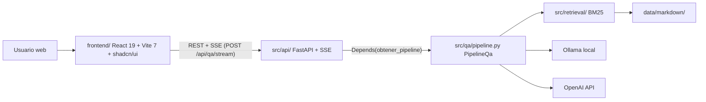

# Migración del frontend: Gradio → React 19 + Vite 7 + Backend FastAPI + SSE

Documento de arquitectura para la migración de la interfaz de usuario de Gradio a React 19 + Vite 7, con un backend HTTP FastAPI + sse-starlette que expone el `PipelineQa` existente al nuevo frontend. Para el contexto de la fase anterior (MVP BM25 con Gradio), ver [doc-001](doc-001%20-%20MVP-Fase-1-Proyecto-Final-QA-BM25.md). La decisión arquitectónica está registrada en [decision-2](../decisions/decision-2%20-%20Migracion-Frontend-React-Vite-Backend-FastAPI-SSE.md).

## 1. Motivación

Gradio fue la interfaz de prototipado del MVP (fase 1). Para la presentación del módulo y como base del módulo 2, se requiere:

- **Alto impacto visual**: UI moderna con sistema de diseño institucional, modo oscuro, animaciones, diseño responsive.
- **Separación de capas**: el backend Python (pipeline Q&A) y el frontend (UI) deben comunicarse por HTTP, no estar acoplados en el mismo proceso.
- **Streaming real**: SSE token a token sin el overhead de Gradio.
- **Extensibilidad**: arquitectura limpia para agregar funcionalidades en el módulo 2 (embeddings, base vectorial, etc.) sin tocar la UI.

## 2. Arquitectura objetivo



## 3. Contratos de los endpoints HTTP

Todos los endpoints tienen prefijo `/api`. En desarrollo, Vite los proxea de `localhost:5173` a `localhost:8000`.

### 3.1 GET /api/salud

```json
// Response 200
{"estado": "ok", "version": "1.0.0"}
```

### 3.2 GET /api/modelos

```json
// Response 200
{
  "modelos_ollama": ["llama3.1:8b", "gemma4:e2b"],
  "modelos_openai": ["gpt-4o", "gpt-4o-mini", "gpt-4-turbo", "chatgpt-4o-latest", "gpt-3.5-turbo"],
  "openai_disponible": true
}
```

### 3.3 GET /api/prompt-defecto

```json
// Response 200
{"prompt_sistema": "Eres un asistente..."}
```

### 3.4 POST /api/recargar-corpus

```json
// Request body: vacío o {}
// Response 200
{"mensaje": "Listo: índice BM25 recargado desde el directorio de Markdown."}
```

### 3.5 POST /api/qa (sincrónico)

```json
// Request body
{
  "pregunta": "¿Cuáles son los servicios de urgencias?",
  "prompt_sistema": null,
  "usar_ollama": true,
  "usar_openai": false,
  "modelo_ollama": "llama3.1:8b",
  "modelo_openai": "gpt-4o-mini",
  "num_ctx": 8192,
  "max_tokens_openai": null
}

// Response 200
{
  "texto_ollama": "La Fundación Valle del Lili...",
  "texto_openai": null,
  "fuentes": [
    {
      "archivo": "urgencias.md",
      "titulo": "Urgencias - Fundación Valle del Lili",
      "source_url": "https://valledellili.org/urgencias/",
      "score": 12.45
    }
  ],
  "metadatos_ollama": {"modelo": "llama3.1:8b", "latencia_ms": 1823},
  "metadatos_openai": null
}
```

Errores: `503` si Ollama no accesible, `422` si modelo no disponible, `400` si sin pregunta, `402` si sin API key OpenAI.

### 3.6 POST /api/qa/stream (SSE — Ollama o OpenAI individual)

```json
// Request body: igual que POST /api/qa

// Eventos SSE emitidos en orden:
data: {"tipo": "token", "motor": "ollama", "texto": "La "}
data: {"tipo": "token", "motor": "ollama", "texto": "Fundación "}
// ... más tokens ...
data: {"tipo": "final", "motor": "ollama", "texto": "...", "latencia_ms": 1823}
data: {"tipo": "fuentes", "fuentes": [...]}
// Si hay error:
data: {"tipo": "error", "motor": "ollama", "mensaje": "Ollama no está accesible..."}
// Keepalive cada 15s (mientras no hay tokens):
: keepalive
```

### 3.7 POST /api/qa/dual/stream (SSE — Ollama + OpenAI secuencial)

Igual que `/api/qa/stream` pero emite primero todos los eventos `motor: "ollama"` y luego todos los de `motor: "openai"`. Una sola pasada BM25 (`preparar_contexto_inferencia` llamado una vez).

## 4. Estructura del frontend

```
frontend/
  package.json               # nombre: qa-valledellili-ui
  pnpm-lock.yaml
  vite.config.ts             # alias @/=src/, proxy /api
  tsconfig.json              # strict: true
  eslint.config.js           # ESLint v9 flat config
  prettier.config.cjs
  components.json            # shadcn/ui config
  src/
    main.tsx                 # QueryClientProvider + ThemeProvider + App
    App.tsx
    features/
      chat/
        Chat.tsx             # contenedor; llama a sseClient.streamQa
        MessageList.tsx      # lista scrollable con auto-scroll
        MessageBubble.tsx    # Markdown con react-markdown + shiki
        ChatInput.tsx        # textarea + Enviar; Ctrl+Enter
        DualResponseView.tsx # dos columnas Ollama | OpenAI
        SourcesPanel.tsx     # cards de fuentes BM25
      settings/
        SettingsPanel.tsx    # contenedor del sidebar de config
        ModelSelector.tsx    # toggles + dropdowns de modelos
        SystemPromptEditor.tsx
    components/
      ui/                    # shadcn/ui (generados por CLI)
      AppShell.tsx           # layout: header + sidebar + main + footer
      ThemeToggle.tsx
    hooks/
      useModels.ts           # React Query: GET /api/modelos
      useReloadCorpus.ts     # mutation: POST /api/recargar-corpus
    lib/
      api.ts                 # fetch tipado (endpoints sincrónicos)
      sseClient.ts           # fetch + ReadableStream (NO EventSource)
      schemas.ts             # zod schemas + tipos inferidos
      cn.ts                  # clsx + tailwind-merge
    styles/
      globals.css            # @import "tailwindcss"; tokens CSS institucionales
  tests/
    unit/
    e2e/                     # Playwright
```

## 5. Diseño visual y tokens

Paleta institucional Valle del Lili:

| Token CSS | Valor | Uso |
| --- | --- | --- |
| `--color-primary` | `#6B21A8` | Morado institucional; botones, acentos |
| `--color-primary-light` | `#9333EA` | Hover, gradientes |
| `--color-secondary` | `#0D9488` | Teal complementario; badges, fuentes |
| `--color-secondary-light` | `#14B8A6` | Hover teal |
| `--color-background` | `#FFFFFF` / `#0F0A1A` | Fondo claro / oscuro |
| `--color-surface` | `#F8F7FF` / `#1A1030` | Superficies de cards claro / oscuro |
| `--color-text` | `#1F1235` / `#F0EAF8` | Texto principal |

Tipografía: Inter (cuerpo), JetBrains Mono (código).

## 6. Flujo de streaming SSE en el frontend

```
ChatInput → onSubmit(pregunta)
  → sseClient.streamQa('/api/qa/stream', peticion, handlers)
    → fetch(endpoint, { method: 'POST', body: JSON.stringify(peticion) })
    → response.body.pipeThrough(TextDecoderStream).getReader()
    → parsear líneas SSE ("data: {...}")
    → handlers.onToken(motor, texto)   → actualizar MessageBubble
    → handlers.onFuentes(fuentes)     → actualizar SourcesPanel
    → handlers.onFinal(motor, meta)   → ocultar skeleton, mostrar latencia
    → handlers.onError(mensaje)       → toast.error(mensaje)
```

`EventSource` nativo no soporta `POST`; por eso se usa `fetch + ReadableStream + TextDecoderStream`. Ver skill `react-vite-qa-ui` para el código de referencia.

## 7. Modo dual

Cuando `usarOllama && usarOpenAI`:

1. Frontend llama a `POST /api/qa/dual/stream`.
2. Backend llama a `preparar_contexto_inferencia(pregunta, prompt)` **una vez** → `ContextoInferencia`.
3. Emite eventos `motor: "ollama"` via `stream_ollama_desde_contexto`.
4. Emite eventos `motor: "openai"` via `stream_openai_desde_contexto`.
5. Frontend renderiza `DualResponseView` con dos columnas independientes.

## 8. Comandos canónicos

```bash
# Backend
uv sync
uv run uvicorn src.api.main:app --reload --port 8000

# Frontend
pnpm --dir frontend install
pnpm --dir frontend dev        # http://localhost:5173
pnpm --dir frontend build      # genera frontend/dist/
pnpm --dir frontend test       # Vitest
pnpm --dir frontend test:e2e   # Playwright

# Tests Python (incluyendo API)
uv run pytest

# Producción (Docker)
docker-compose up
```

## 9. Variables de entorno

Ver `.env.example`. Variables nuevas respecto al MVP fase 1:

| Variable | Default | Descripción |
| --- | --- | --- |
| `ALLOWED_ORIGINS` | `["http://localhost:5173"]` | Origenes CORS permitidos |
| `API_PORT` | `8000` | Puerto del servidor FastAPI |
| `VITE_API_BASE` | `/api` | Prefijo del API en el frontend |

## 10. Tareas Backlog asociadas

| Tarea | Descripción |
| --- | --- |
| [task-21](../tasks/task-21%20-%20Actualizar-reglas-Cursor-para-stack-ReactVite-FastAPISSE-y-excepción-TS-en-language-conventions.md) | Reglas Cursor actualizadas |
| [task-22](../tasks/task-22%20-%20Reescribir-skill-gradio-qa-ui-a-react-vite-qa-ui-y-crear-fastapi-sse-api.md) | Skills react-vite-qa-ui y fastapi-sse-api |
| task-25 a task-28 | Backend FastAPI + SSE + tests |
| task-29 a task-31 | Bootstrap frontend + diseño sistema |
| task-32 a task-35 | Funcionalidad de chat e integración |
| task-36 a task-37 | Accesibilidad y tests |
| task-38 | Dockerfile y docker-compose |
| task-39 | Paridad + deprecación Gradio |

## 11. Referencias internas

- ADR: [decision-2 — Migración Frontend React + Vite + Backend FastAPI + SSE](../decisions/decision-2%20-%20Migracion-Frontend-React-Vite-Backend-FastAPI-SSE.md)
- Doc anterior: [doc-001 — MVP Fase 1](doc-001%20-%20MVP-Fase-1-Proyecto-Final-QA-BM25.md)
- Skills: `.claude/skills/react-vite-qa-ui/SKILL.md`, `.claude/skills/fastapi-sse-api/SKILL.md`
- Reglas: `.cursor/rules/frontend-style.mdc`, `.cursor/rules/api-fastapi.mdc`
- README del repositorio: [README.md](../../README.md)
