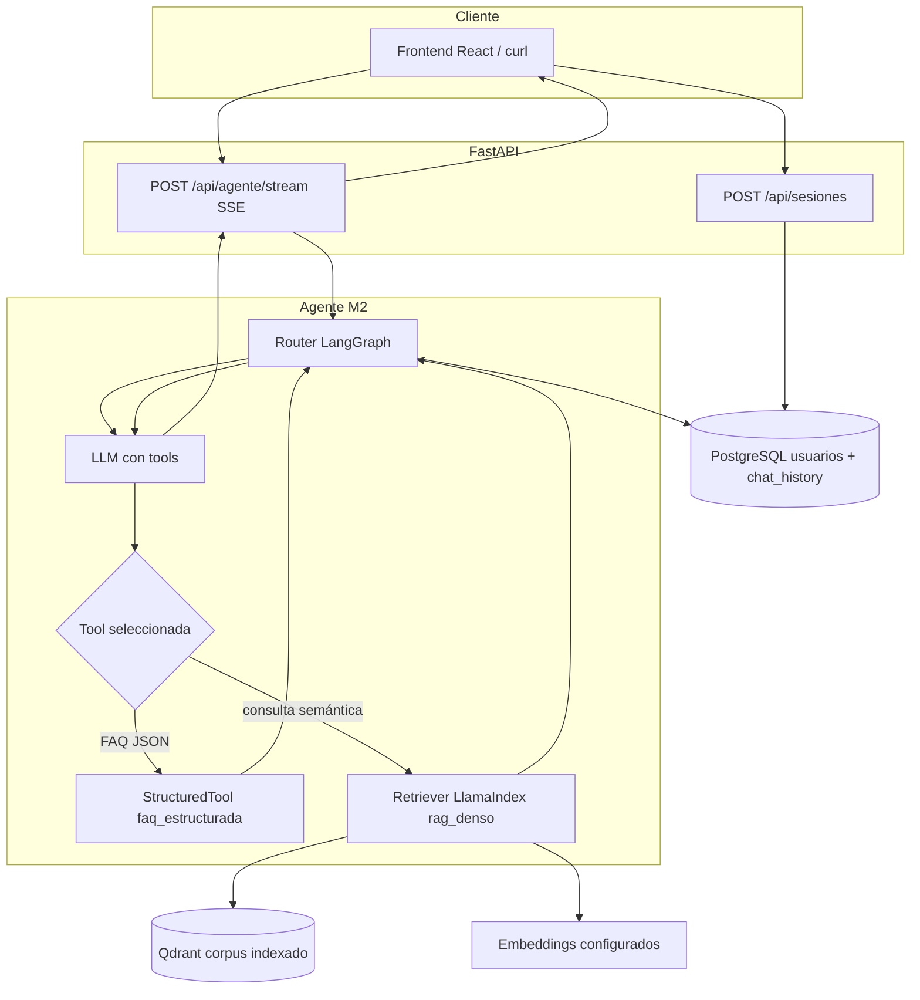
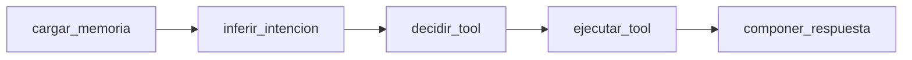
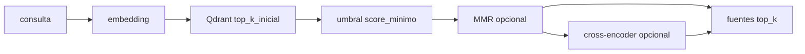

# Arquitectura operativa del agente (Modulo 2)

Guía para desarrollo, demostración y resolución de problemas del **agente conversacional** del Modulo 2: router **LangGraph**, memoria en **PostgreSQL**, recuperación **densa** en **Qdrant** (sin BM25 en runtime). La decisión de stack y consecuencias están en el ADR [decision-3](../decisions/decision-3%20-%20Arquitectura-Agente-Memoria-RAG-Qdrant-M2.md). Para el contexto de la capa web y SSE del producto, ver [decision-2](../decisions/decision-2%20-%20Migracion-Frontend-React-Vite-Backend-FastAPI-SSE.md) y [doc-002](doc-002%20-%20Migracion-Frontend-React-Vite-Backend-FastAPI.md).

## 1. Vista general

- **Entrada**: el usuario se identifica con `POST /api/sesiones`; el chat usa `POST /api/agente/stream` (SSE con eventos extendidos: `pensamiento`, `herramienta`, `token`, `fuentes`, `final`, `error`, etc.).
- **Orquestación**: un grafo **LangGraph** decide si invoca herramientas y compone la respuesta; el LLM del router usa tool-calling (`faq_estructurada`, `rag_denso`, `listar_estructurado`). Antes del router se infiere una **intención** heurística (`factual` / `listado` / `conteo`) para enrutar listados sin LLM cuando hay filtros deducibles (ver §4.5).
- **Memoria**: mensajes persistidos con **LangChain** `PostgresChatMessageHistory` (`langchain-postgres`); el contexto inyectado respeta ventana temporal `HISTORIAL_DIAS_MAX` y tope de turnos `HISTORIAL_TURNOS_MAX` (ver `src/api/configuracion.py`).
- **RAG**: solo **similitud densa** sobre vectores en **Qdrant**; el corpus canónico vive en `data/markdown/` y alimenta **ingesta** (`scripts.indexar_corpus_qdrant`). Para reducir ruido de plantilla antes de vectorizar, se puede generar un derivado limpio en `data/processed/markdown_limpio/` con `scripts.limpiar_corpus_markdown` y apuntar `--markdown-dir` a esa ruta (detalle en [scripts/README.md](../../scripts/README.md)); en runtime el agente **no** lee Markdown en disco, solo Qdrant.



En inferencia **no** participa BM25 ni `data/markdown/` como índice léxico: el único recuperador del producto M2 es el camino **embedding + Qdrant**.

## 2. Herramientas del router: FAQ, RAG denso y listado estructurado

| Herramienta (`name`) | Fuente | Rol pedagógico |
| --- | --- | --- |
| `faq_estructurada` | `data/structured/faqs.json` (validado contra schema) | Muestra **respuesta estable y auditable** para datos fijos (horarios, PBX, NIT): sin alucinar números; encaja con políticas institucionales y pruebas deterministas. |
| `rag_denso` | Chunks vectoriales en **Qdrant** (ingesta desde Markdown) | Cubre **preguntas abiertas** sobre documentación narrativa; el modelo compone con fragmentos recuperados por similitud (top-k y umbral `RAG_SCORE_MINIMO` en configuración). Acepta opcionalmente `filtros_tipo_pagina` (lista de valores de payload `tipo_pagina`, p. ej. `institucional`) para acotar consultas institucionales. |
| `listar_estructurado` | Mismo índice **Qdrant** vía `scroll` + filtro de payload | **Enumeración o conteo** determinista de conjuntos (p. ej. pediatras por sede) sin depender del top-k semántico; devuelve `conteo`, `items`, `muestra_truncada`, `filtros_aplicados`. Si `conteo == 0`, el grafo hace **fallback** a `rag_denso` con la pregunta original. |

**Por qué conviven**: separa **hechos tabulares** (FAQ), **conocimiento textual extenso** recuperado por embedding (RAG) y **agregaciones por metadatos** (listado). El router aprende a elegir canal según la intención; en laboratorio, `MOCK_LLM=1` fuerza herramientas según tokens `e2e7001` / `e2e7002` / `e2e7003` / `e2e7004` en la pregunta (ver `tests/e2e/test_escenarios_modulo2.py` y [scripts/README.md](../../scripts/README.md)).

## 3. Memoria conversacional

**Beneficios**

- Continuidad multi-turno sin perder contexto entre peticiones HTTP.
- Identidad estable por usuario (`session_id` canónico tipo `user:<uuid>` alineado con Postgres).

**Límites operativos** (variables de entorno / `Configuracion`)

- `HISTORIAL_DIAS_MAX` (por defecto **7**): mensajes más antiguos no entran en la ventana cargada para el router.
- `HISTORIAL_TURNOS_MAX` (por defecto **20**): tope adicional de turnos en la ventana efectiva.

**Privacidad y datos personales**

- Se persisten **preguntas y respuestas** en PostgreSQL para el funcionamiento del chat; tratar el motor como dato personal según políticas del curso o institución.
- Ajustar retención (`HISTORIAL_DIAS_MAX`, backups, anonimización) según lineamientos; no versionar secretos en `.env` ni en tareas del backlog.

## 4. Comandos: desarrollo local y Docker Compose

### 4.0 Recarga de parametros (`.env` vs panel administrativo)

Los valores cargados desde `.env` atraviesan `obtener_configuracion()` en `src/api/configuracion.py`, decorada con `@lru_cache` de la biblioteca estandar: **cualquier cambio en `.env` exige reiniciar** el proceso de Uvicorn (o invalidar manualmente el cache en laboratorio) para que la API observe los nuevos valores.

Los parametros del agente M2 persistidos mediante `PATCH /api/admin/agente-m2` se resuelven en un **bundle por peticion** (`RuntimeAgenteBundle`): la **proxima** llamada a `POST /api/agente/stream` ya usa lo guardado en base de datos **sin** reinicio del servicio.

**Variables** (placeholders; detalle en `.env.example`):

- `POSTGRES_*` o `DATABASE_URL` (asyncpg).
- `QDRANT_URL`, `QDRANT_COLLECTION`, `OPENAI_API_KEY` (router, composición y/o embeddings según modo).
- `MOCK_LLM=1` para E2E sin llamadas reales al LLM del router (ver salud).

### 4.1 Solo API con dependencias ya levantadas

Desde la raíz del repositorio:

```bash
uv sync
uv run alembic upgrade head
export QDRANT_URL=http://127.0.0.1:6333
uv run uvicorn src.api.main:app --reload --host 0.0.0.0 --port 8000
```

### 4.2 Stack completo con contenedores

```bash
docker compose up -d --build
```

- **Postgres** publica `15432:5432` en el host por defecto (`POSTGRES_PUBLISH_PORT`).
- **Qdrant** REST: puerto host `6333` por defecto (`QDRANT_REST_PORT`).
- **API**: `8000` por defecto (`API_PORT`).
- Tras cambios en el esquema: el servicio `db-init` ejecuta `alembic upgrade head`.

### 4.3 Limpieza del corpus (antes de la ingesta Qdrant)

El HTML exportado a Markdown suele arrastrar bloques repetidos (menús, redes, pies legales, listados de “otros especialistas” en fichas del directorio médico). Ese ruido **no** debe editarse en `data/markdown/` (fuente de verdad); el script `uv run python -m scripts.limpiar_corpus_markdown` aplica reglas declarativas en `config/limpieza_corpus_valledellili.yaml`, conserva el front matter **literal** y escribe `data/processed/markdown_limpio/valledellili-org/` con `_manifest_limpieza.json` (métricas e idempotencia por hash). La ingesta siguiente usa el mismo indexador cambiando solo `--markdown-dir` (ver [scripts/README.md](../../scripts/README.md), sección **`scripts.limpiar_corpus_markdown`**).

Ingesta de corpus hacia Qdrant (desde el host con Qdrant accesible):

```bash
export QDRANT_URL=http://127.0.0.1:6333
export OPENAI_API_KEY=sk-reemplazar
uv run python -m scripts.indexar_corpus_qdrant --markdown-dir data/markdown/valledellili-org --glob "**/*.md"
```

Más opciones y modo mock: [scripts/README.md](../../scripts/README.md) (sección **E2E del Modulo 2** y **`scripts.indexar_corpus_qdrant`**).

### 4.4 Chunking semantico y payload enriquecido (TASK-69)

- **Estrategia de fragmentacion**: variable `CHUNK_STRATEGY` en `.env` / `Configuracion`: `sentence` (retrocompatible, `SentenceSplitter` sobre el cuerpo) o `markdown` (`MarkdownNodeParser` con post-fractura por tamano maximo en caracteres). Ver [decision-4](../decisions/decision-4%20-%20Payload-Qdrant-enriquecido-y-chunking-Markdown.md).
- **Payload extendido** en Qdrant (ademas de `archivo`, `titulo`, `source_url`, `seccion`, `chunk_index`, `content_hash`, `id_chunk`, `texto`): `tipo_pagina`, `subtipo`, `especialidad` (lista), `sedes` (lista), `nombre_medico`, `headings_path`, `h1`, `h2`, `h3`, `tags`. Las heuristicas viven en `src/rag/extractor_metadata.py`.
- **Indices de payload** (`tipo_pagina`, `especialidad`, `sedes`, `seccion`) se crean al asegurar la coleccion; en cliente `:memory:` Qdrant solo emite advertencia (sin efecto).
- **Migracion**: se recomienda indexar en una **coleccion nueva** (p. ej. `corpus_fvl_v2`) para A/B frente a `corpus_fvl` sin downtime; el runtime del agente sigue leyendo solo `QDRANT_COLLECTION` configurada.

Ejemplo con corpus limpio (TASK-68) y embeddings locales HuggingFace:

```bash
export QDRANT_URL=http://127.0.0.1:6333
export EMBEDDING_PROVIDER=huggingface
export EMBEDDING_MODEL=sentence-transformers/all-MiniLM-L6-v2
export EMBEDDING_DIMS=384
export CHUNK_STRATEGY=markdown
export QDRANT_COLLECTION=corpus_fvl_v2
uv run python -m scripts.indexar_corpus_qdrant \
  --markdown-dir data/processed/markdown_limpio/valledellili-org \
  --glob "**/*.md" \
  --limit 50
```

### 4.5 Recuperacion adaptativa (intencion, listados y filtro blando en RAG)

| Etapa | Modulo | Comportamiento |
| --- | --- | --- |
| Intencion | `src/rag/intencion.py` | `inferir_intencion` clasifica `factual` / `listado` / `conteo` con regex (prioridad: conteo > listado > factual). Los patrones de conteo usan formas plurales (`cuantos` / `cuantas`) para no confundir con «cuanto cuesta». |
| Filtros listado | `src/rag/filtros_listado_heuristica.py` | Deduce `tipo_pagina`, `especialidad`, `sedes`, `especialidad_contains` desde texto (sin LLM); especialidades canonicas en `data/eval/especialidades_canonicas.json`. |
| Scroll Qdrant | `src/rag/recuperador_listados.py` | `RecuperadorListados.listar` arma filtros de payload, deduplica por `source_url` o nombre+archivo y devuelve `muestra_truncada` si aplica. |
| Tool | `src/agentes/herramientas/listar_estructurado_tool.py` | `StructuredTool` `listar_estructurado` registrada en el grafo por defecto. |
| Filtro blando RAG | `src/rag/recuperador_denso.py` | `VectorStoreQuery` con `MetadataFilters` (`tipo_pagina` IN lista) cuando `rag_denso` recibe `filtros_tipo_pagina`; sugerencia automatica para misión/visión institucional. |
| Grafo | `src/agentes/router.py` | Nodo `inferir_intencion` antes de `decidir_tool`; atajo a `listar_estructurado` con argumentos heuristicos cuando la intencion es `listado`/`conteo` y hay filtros. Si el listado devuelve `conteo == 0`, **fallback** a `rag_denso`. |

**Evento SSE `herramienta`**: el payload JSON puede incluir `resultado_listado` (`conteo`, `muestra_truncada`, `filtros_aplicados`, hasta **50** filas de `items` con `nombre`, `especialidad`, `sedes`, `source_url`, `archivo`) para alimentar la tabla del chat cuando `nombre` es `listar_estructurado`.



### Reranking y diversidad (RAG denso, TASK-71)

El recuperador `RecuperadorDenso` puede **sobrerrecuperar** en Qdrant, filtrar por umbral de similitud, aplicar **MMR** (diversidad) y, opcionalmente, un **cross-encoder** local (`sentence-transformers`) para reordenar los fragmentos enviados al compositor. La tool `listar_estructurado` **no** usa reranker.

Con **`RAG_MMR_HABILITADO=true`**, el MMR implementado asume **similitud coseno** alineada con Qdrant: `asegurar_coleccion` valida que `QDRANT_DISTANCE` sea `Cosine` y, si no, levanta `ValueError` con mensaje orientativo (alternativa: desactivar MMR o implementar un MMR generico por metrica, fuera del alcance actual). La ingesta en `scripts.indexar_corpus_qdrant` **normaliza L2** los vectores antes del upsert (idempotente si el embedder ya devuelve vectores unitarios, p. ej. OpenAI `text-embedding-3-*`).

| Parametro (`.env` / `Configuracion`) | Default | Notas |
| --- | --- | --- |
| `RAG_TOP_K` | `5` | Fragmentos finales en la respuesta. |
| `RAG_SCORE_MINIMO` | `0.25` | Umbral de similitud (metrica coseno en coleccion tipica). |
| `RAG_TOP_K_INICIAL` | `20` | Candidatos solicitados a Qdrant antes de MMR/rerank (solo si MMR o reranker activos). |
| `RAG_MMR_HABILITADO` | `true` | Penaliza chunks casi duplicados en el top-k. |
| `RAG_MMR_LAMBDA` | `0.5` | Trade-off relevancia vs diversidad (`1.0` = equivalente a ordenar solo por similitud a la consulta). |
| `RAG_RERANKER_HABILITADO` | `false` | Activa `CrossEncoder` local; coste CPU/memoria adicional. |
| `RAG_RERANKER_MODELO` | `BAAI/bge-reranker-base` | Id HuggingFace o ruta compatible. Alternativa ligera documentada: `cross-encoder/ms-marco-MiniLM-L-6-v2`. |
| `RAG_RERANKER_TOP_N_ENTRADA` | `10` | Maximo de pares (consulta, fragmento) evaluados por el reranker tras MMR (o por similitud si MMR esta desactivado). |

**Latencia orientativa (CPU tipo laptop):** MMR sobre ~20 vectores suele ser del orden de **unos pocos ms**; el cross-encoder `bge-reranker-base` sobre ~10 pares puede sumar del orden de **decenas a ~100 ms por par** segun hardware (orden de magnitud similar a una llamada extra ligera al LLM). Si el reranker no puede cargarse (dependencia ausente u offline), el recuperador **degrada con advertencia** y sigue solo con MMR/similitud.



### Evaluacion cuantitativa del RAG (golden set, TASK-72)

- **Golden set versionado**: `data/eval/golden_set_rag.jsonl` con consultas curadas y `archivos_relevantes` como ground truth; **schema** en `data/eval/golden_set.schema.json`.
- **Script**: `uv run python -m scripts.eval_metricas_rag` — validacion local sin red (`--solo-validar-golden`), corrida completa contra Qdrant y reporte Markdown + `*.results.jsonl` en `data/eval/reportes/`.
- **Metricas** (implementacion pura en `src/rag/metricas_eval.py`): todas operan sobre la lista ordenada de archivos por chunk (`archivos_por_chunk`), pero **no** comparten la misma granularidad; al comparar configuraciones conviene citar la fila correspondiente.

| metrica | granularidad | implementacion | comentario |
| --- | --- | --- | --- |
| `hit@k` | ranking por chunk (primer acierto) | `hit_at_k` | Vale 1 si algun chunk entre los primeros `k` pertenece a un archivo del ground truth. |
| `precision@k` | documento deduplicado en el top-k | `precision_at_k` | Conjunto `T` de **archivos unicos** entre los primeros `k` chunks; el denominador sigue siendo `k`. |
| `recall@k` | documento deduplicado en el top-k | `recall_at_k` | Mismo `T` que en `precision@k`; cociente respecto a `|R|` (ground truth). |
| `MRR` | ranking por chunk (truncado a `k`) | `mrr` | Inverso del rank **1-indexado** del primer chunk cuyo archivo esta en `R`; 0 si no hay acierto en el top-k. |
| `nDCG@k` | ranking por chunk (relevancia binaria por posicion de chunk) | `ndcg_at_k` | Ganancia 1 si el archivo del chunk en esa posicion pertenece a `R`. El iDCG usa la suma de descuentos de las `k` ranuras como si todas fueran relevantes (`sum 1/log2(i+2)` para `i=0..k-1`), de modo que `nDCG = DCG/iDCG` queda en `[0, 1]` (TASK-74). |

- **Adicional**: `recall_conteo` para listados cuando exista la integracion con TASK-70.
- **Comparacion entre configuraciones**: flag `--comparar` sobre dos archivos `*.results.jsonl` (delta agregado y por consulta; codigo de salida no cero si el MRR medio cae mas del umbral).
- **Detalle operativo y comandos de ejemplo**: [scripts/README.md](../../scripts/README.md), seccion **`scripts.eval_metricas_rag`**.

## 5. Troubleshooting

| Síntoma | Causa probable | Acción |
| --- | --- | --- |
| `POST /api/sesiones` falla o timeouts al arrancar | Postgres no listo, puerto equivocado, credenciales | `docker compose ps`; revisar `POSTGRES_PUBLISH_PORT` vs `POSTGRES_HOST`/`POSTGRES_PORT` en `.env` (desde host suele ser `localhost` y `15432` si usas el compose por defecto). Esperar `healthy` del healthcheck. |
| RAG sin resultados o latencia muy alta hacia Qdrant | Qdrant lento, red, URL incorrecta | Verificar `QDRANT_URL` (en contenedor `api` debe ser `http://qdrant:6333`; desde host `http://127.0.0.1:6333`). Revisar logs del servicio `qdrant` y firewall. |
| Errores al embedir / ingesta | `OPENAI_API_KEY` ausente o inválida con `EMBEDDING_PROVIDER=openai` | Exportar clave válida o cambiar proveedor según documentación del proyecto; confirmar `EMBEDDING_DIMS` alineado con el modelo. |
| Respuestas genéricas sin chunks | Colección vacía o umbral alto | Ejecutar ingesta; en Qdrant comprobar colección `QDRANT_COLLECTION`. Ajustar `RAG_SCORE_MINIMO` / `RAG_TOP_K` con criterio. |
| `POST /api/agente/stream` HTTP 503 | Grafo no disponible (p. ej. sin `OPENAI_API_KEY` y sin `MOCK_LLM`) | Definir `OPENAI_API_KEY` o `MOCK_LLM=1`; ver `GET /api/salud` (`agente_mock_llm`). |
| HTTP 401/403 en agente | Cookie o cabecera de sesión no coincide | Repetir `POST /api/sesiones`, reutilizar cookie `fvl_session_id` o cabecera `X-Session-Id` con el mismo `session_id` del cuerpo JSON. |

## 6. Cuatro escenarios E2E (referencia `curl`)

Los tests automatizados están en `tests/e2e/test_escenarios_modulo2.py`. Requieren API alcanzable y, para aserciones estrictas de herramienta, **`MOCK_LLM=1` en el servidor**. Sustituye `BASE_URL` (por ejemplo `http://127.0.0.1:8000`).

**1) Obtener `SESSION_ID` y guardar cookie de sesión**

```bash
export BASE_URL=http://127.0.0.1:8000
curl -sS -c /tmp/fvl-cookies.txt -X POST "${BASE_URL}/api/sesiones" \
  -H "Content-Type: application/json" \
  -d '{"documento_identidad":"doc-demo-curl","nombre":"Demo curl"}' -o /tmp/fvl-sesion.json
SESSION_ID=$(python3 -c "import json; print(json.load(open('/tmp/fvl-sesion.json'))['session_id'])")
```

**2) Llamada SSE al agente** (cabecera + cuerpo alineados; `-N` evita bufferizar el stream)

```bash
curl -N -sS -b /tmp/fvl-cookies.txt \
  -H "Content-Type: application/json" \
  -H "X-Session-Id: ${SESSION_ID}" \
  -X POST "${BASE_URL}/api/agente/stream" \
  -d "{\"session_id\":\"${SESSION_ID}\",\"pregunta\":\"Texto de la pregunta aquí\",\"primer_turno\":true}"
```

Escenarios alineados con el PDF de la actividad (misma lógica que pytest); en el texto de `pregunta` incluir los tokens documentados en el código cuando `MOCK_LLM=1`:

| ID | Objetivo | Indicación | `primer_turno` |
| --- | --- | --- | --- |
| (a) RAG denso | Consulta abierta institucional | Token `e2e7001` (ver `test_e2e_escenario_a_rag_denso`). | `true` |
| (b) Memoria | Dos turnos: el segundo referencia al primero | Turno 1 con `e2e7001`; turno 2 con `e2e7003` (color). | `true` luego `false` |
| (c) FAQ | Pregunta tipo horario/contacto | Token `e2e7002` (ver `test_e2e_escenario_c_faq_estructurada`). | `true` |
| (d) Mixto | FAQ y RAG en la misma sesión | Tres turnos en `test_e2e_escenario_d_mixto_misma_sesion`. | alterna `true`/`false` |

Comprobar modo mock:

```bash
curl -sS "${BASE_URL}/api/salud"
```

Debe incluir `"agente_mock_llm": true` cuando el backend arrancó con `MOCK_LLM=1`.

Ejecución pytest (referencia):

```bash
export EJECUTAR_E2E_MODULO2=1
export BASE_URL=http://127.0.0.1:8000
uv run pytest tests/e2e/test_escenarios_modulo2.py -v
```

## 7. Migración desde BM25 (M1) a Qdrant denso (M2)

1. **Corpus**: mantener o generar Markdown canónico bajo `data/markdown/` (flujo scrape/export del Modulo 1 sigue siendo fuente de verdad textual).
2. **No usar BM25 en runtime M2**: el agente no invoca `src/retrieval/` ni recarga de índice BM25 para responder; el camino productivo es **embeddings + Qdrant**.
3. **Indexar**: con Qdrant accesible y claves según proveedor de embeddings, ejecutar `uv run python -m scripts.indexar_corpus_qdrant` (argumentos en [scripts/README.md](../../scripts/README.md)).
4. **Verificar salud**: `GET ${BASE_URL}/api/salud`; comprobar conectividad a Postgres y Qdrant según despliegue; opcionalmente una pregunta con `e2e7001` en entorno mock para confirmar eventos `herramienta` / `fuentes`.
5. **Frontend**: el chat productivo consume `/api/agente/stream`; el flujo BM25 de `POST /api/qa/stream` queda como legado M1 según evolución del repo.

## Referencias internas

- [decision-3 — Arquitectura agente, memoria, RAG, Qdrant (M2)](../decisions/decision-3%20-%20Arquitectura-Agente-Memoria-RAG-Qdrant-M2.md)
- [scripts/README.md — ingesta Qdrant y E2E](../../scripts/README.md)
- Código: `src/api/routers/agente.py`, `src/api/factoria_grafo_agente.py`, `src/agentes/`, `src/rag/`
