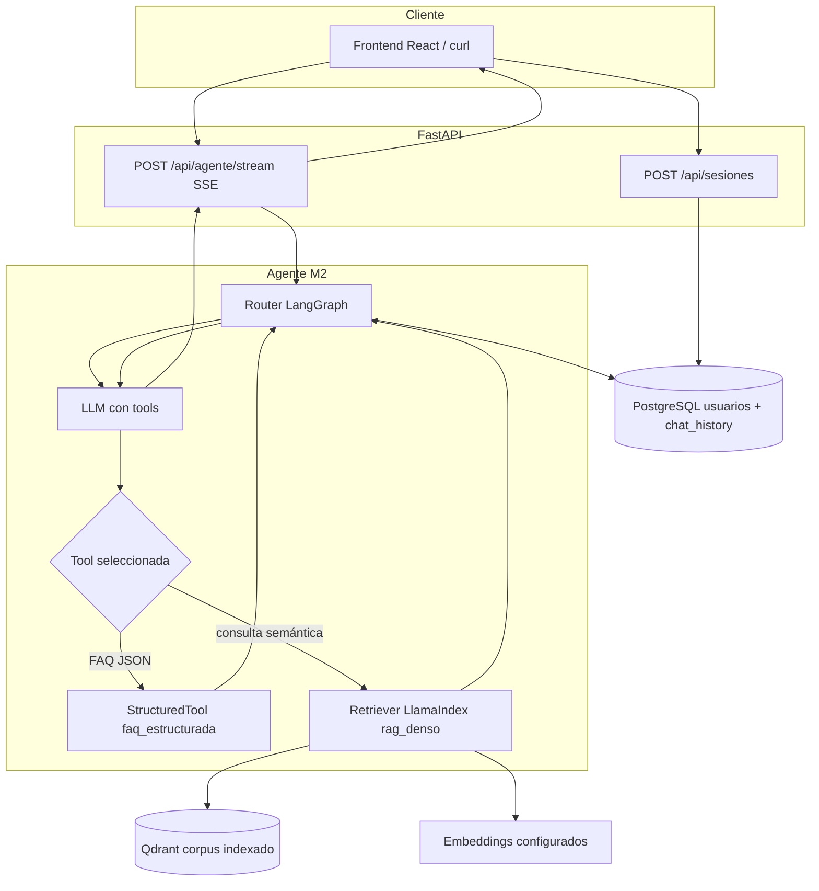

# Arquitectura operativa del agente (Modulo 2)

Guía para desarrollo, demostración y resolución de problemas del **agente conversacional** del Modulo 2: router **LangGraph**, memoria en **PostgreSQL**, recuperación **densa** en **Qdrant** (sin BM25 en runtime). La decisión de stack y consecuencias están en el ADR [decision-3](../decisions/decision-3%20-%20Arquitectura-Agente-Memoria-RAG-Qdrant-M2.md). Para el contexto de la capa web y SSE del producto, ver [decision-2](../decisions/decision-2%20-%20Migracion-Frontend-React-Vite-Backend-FastAPI-SSE.md) y [doc-002](doc-002%20-%20Migracion-Frontend-React-Vite-Backend-FastAPI.md).

## 1. Vista general

- **Entrada**: el usuario se identifica con `POST /api/sesiones`; el chat usa `POST /api/agente/stream` (SSE con eventos extendidos: `pensamiento`, `herramienta`, `token`, `fuentes`, `final`, `error`, etc.).
- **Orquestación**: un grafo **LangGraph** decide si invoca herramientas y compone la respuesta; el LLM del router usa tool-calling (`faq_estructurada`, `rag_denso`).
- **Memoria**: mensajes persistidos con **LangChain** `PostgresChatMessageHistory` (`langchain-postgres`); el contexto inyectado respeta ventana temporal `HISTORIAL_DIAS_MAX` y tope de turnos `HISTORIAL_TURNOS_MAX` (ver `src/api/configuracion.py`).
- **RAG**: solo **similitud densa** sobre vectores en **Qdrant**; el corpus canónico sigue en `data/markdown/` y alimenta **ingesta** (`scripts.indexar_corpus_qdrant`), no sustituye al vector store en cada consulta.



En inferencia **no** participa BM25 ni `data/markdown/` como índice léxico: el único recuperador del producto M2 es el camino **embedding + Qdrant**.

## 2. Dos herramientas: FAQ determinista y RAG denso

| Herramienta (`name`) | Fuente | Rol pedagógico |
| --- | --- | --- |
| `faq_estructurada` | `data/structured/faqs.json` (validado contra schema) | Muestra **respuesta estable y auditable** para datos fijos (horarios, PBX, NIT): sin alucinar números; encaja con políticas institucionales y pruebas deterministas. |
| `rag_denso` | Chunks vectoriales en **Qdrant** (ingesta desde Markdown) | Cubre **preguntas abiertas** sobre documentación narrativa; el modelo compone con fragmentos recuperados por similitud (top-k y umbral `RAG_SCORE_MINIMO` en configuración). |

**Por qué conviven**: separa **hechos tabulares** (FAQ) de **conocimiento textual extenso** (corpus). El router aprende a elegir canal según la intención; en laboratorio, `MOCK_LLM=1` fuerza herramientas según tokens `e2e7001` / `e2e7002` / `e2e7003` en la pregunta (ver `tests/e2e/test_escenarios_modulo2.py` y [scripts/README.md](../../scripts/README.md)).

## 3. Memoria conversacional

**Beneficios**

- Continuidad multi-turno sin perder contexto entre peticiones HTTP.
- Identidad estable por usuario (`session_id` canónico tipo `user:<uuid>` alineado con Postgres).

**Límites operativos** (variables de entorno / `Configuracion`)

- `HISTORIAL_DIAS_MAX` (por defecto **7**): mensajes más antiguos no entran en la ventana cargada para el router.
- `HISTORIAL_TURNOS_MAX` (por defecto **20**): tope adicional de turnos en la ventana efectiva.

**Privacidad y datos personales**

- Se persisten **preguntas y respuestas** en PostgreSQL para el funcionamiento del chat; tratar el motor como dato personal según políticas del curso o institución.
- Ajustar retención (`HISTORIAL_DIAS_MAX`, backups, anonimización) según lineamientos; no versionar secretos en `.env` ni en tareas del backlog.

## 4. Comandos: desarrollo local y Docker Compose

**Variables** (placeholders; detalle en `.env.example`):

- `POSTGRES_*` o `DATABASE_URL` (asyncpg).
- `QDRANT_URL`, `QDRANT_COLLECTION`, `OPENAI_API_KEY` (router, composición y/o embeddings según modo).
- `MOCK_LLM=1` para E2E sin llamadas reales al LLM del router (ver salud).

### 4.1 Solo API con dependencias ya levantadas

Desde la raíz del repositorio:

```bash
uv sync
uv run alembic upgrade head
export QDRANT_URL=http://127.0.0.1:6333
uv run uvicorn src.api.main:app --reload --host 0.0.0.0 --port 8000
```

### 4.2 Stack completo con contenedores

```bash
docker compose up -d --build
```

- **Postgres** publica `15432:5432` en el host por defecto (`POSTGRES_PUBLISH_PORT`).
- **Qdrant** REST: puerto host `6333` por defecto (`QDRANT_REST_PORT`).
- **API**: `8000` por defecto (`API_PORT`).
- Tras cambios en el esquema: el servicio `db-init` ejecuta `alembic upgrade head`.

Ingesta de corpus hacia Qdrant (desde el host con Qdrant accesible):

```bash
export QDRANT_URL=http://127.0.0.1:6333
export OPENAI_API_KEY=sk-reemplazar
uv run python -m scripts.indexar_corpus_qdrant --markdown-dir data/markdown/valledellili-org --glob "**/*.md"
```

Más opciones y modo mock: [scripts/README.md](../../scripts/README.md) (sección **E2E del Modulo 2** y **`scripts.indexar_corpus_qdrant`**).

## 5. Troubleshooting

| Síntoma | Causa probable | Acción |
| --- | --- | --- |
| `POST /api/sesiones` falla o timeouts al arrancar | Postgres no listo, puerto equivocado, credenciales | `docker compose ps`; revisar `POSTGRES_PUBLISH_PORT` vs `POSTGRES_HOST`/`POSTGRES_PORT` en `.env` (desde host suele ser `localhost` y `15432` si usas el compose por defecto). Esperar `healthy` del healthcheck. |
| RAG sin resultados o latencia muy alta hacia Qdrant | Qdrant lento, red, URL incorrecta | Verificar `QDRANT_URL` (en contenedor `api` debe ser `http://qdrant:6333`; desde host `http://127.0.0.1:6333`). Revisar logs del servicio `qdrant` y firewall. |
| Errores al embedir / ingesta | `OPENAI_API_KEY` ausente o inválida con `EMBEDDING_PROVIDER=openai` | Exportar clave válida o cambiar proveedor según documentación del proyecto; confirmar `EMBEDDING_DIMS` alineado con el modelo. |
| Respuestas genéricas sin chunks | Colección vacía o umbral alto | Ejecutar ingesta; en Qdrant comprobar colección `QDRANT_COLLECTION`. Ajustar `RAG_SCORE_MINIMO` / `RAG_TOP_K` con criterio. |
| `POST /api/agente/stream` HTTP 503 | Grafo no disponible (p. ej. sin `OPENAI_API_KEY` y sin `MOCK_LLM`) | Definir `OPENAI_API_KEY` o `MOCK_LLM=1`; ver `GET /api/salud` (`agente_mock_llm`). |
| HTTP 401/403 en agente | Cookie o cabecera de sesión no coincide | Repetir `POST /api/sesiones`, reutilizar cookie `fvl_session_id` o cabecera `X-Session-Id` con el mismo `session_id` del cuerpo JSON. |

## 6. Cuatro escenarios E2E (referencia `curl`)

Los tests automatizados están en `tests/e2e/test_escenarios_modulo2.py`. Requieren API alcanzable y, para aserciones estrictas de herramienta, **`MOCK_LLM=1` en el servidor**. Sustituye `BASE_URL` (por ejemplo `http://127.0.0.1:8000`).

**1) Obtener `SESSION_ID` y guardar cookie de sesión**

```bash
export BASE_URL=http://127.0.0.1:8000
curl -sS -c /tmp/fvl-cookies.txt -X POST "${BASE_URL}/api/sesiones" \
  -H "Content-Type: application/json" \
  -d '{"documento_identidad":"doc-demo-curl","nombre":"Demo curl"}' -o /tmp/fvl-sesion.json
SESSION_ID=$(python3 -c "import json; print(json.load(open('/tmp/fvl-sesion.json'))['session_id'])")
```

**2) Llamada SSE al agente** (cabecera + cuerpo alineados; `-N` evita bufferizar el stream)

```bash
curl -N -sS -b /tmp/fvl-cookies.txt \
  -H "Content-Type: application/json" \
  -H "X-Session-Id: ${SESSION_ID}" \
  -X POST "${BASE_URL}/api/agente/stream" \
  -d "{\"session_id\":\"${SESSION_ID}\",\"pregunta\":\"Texto de la pregunta aquí\",\"primer_turno\":true}"
```

Escenarios alineados con el PDF de la actividad (misma lógica que pytest); en el texto de `pregunta` incluir los tokens documentados en el código cuando `MOCK_LLM=1`:

| ID | Objetivo | Indicación | `primer_turno` |
| --- | --- | --- | --- |
| (a) RAG denso | Consulta abierta institucional | Token `e2e7001` (ver `test_e2e_escenario_a_rag_denso`). | `true` |
| (b) Memoria | Dos turnos: el segundo referencia al primero | Turno 1 con `e2e7001`; turno 2 con `e2e7003` (color). | `true` luego `false` |
| (c) FAQ | Pregunta tipo horario/contacto | Token `e2e7002` (ver `test_e2e_escenario_c_faq_estructurada`). | `true` |
| (d) Mixto | FAQ y RAG en la misma sesión | Tres turnos en `test_e2e_escenario_d_mixto_misma_sesion`. | alterna `true`/`false` |

Comprobar modo mock:

```bash
curl -sS "${BASE_URL}/api/salud"
```

Debe incluir `"agente_mock_llm": true` cuando el backend arrancó con `MOCK_LLM=1`.

Ejecución pytest (referencia):

```bash
export EJECUTAR_E2E_MODULO2=1
export BASE_URL=http://127.0.0.1:8000
uv run pytest tests/e2e/test_escenarios_modulo2.py -v
```

## 7. Migración desde BM25 (M1) a Qdrant denso (M2)

1. **Corpus**: mantener o generar Markdown canónico bajo `data/markdown/` (flujo scrape/export del Modulo 1 sigue siendo fuente de verdad textual).
2. **No usar BM25 en runtime M2**: el agente no invoca `src/retrieval/` ni recarga de índice BM25 para responder; el camino productivo es **embeddings + Qdrant**.
3. **Indexar**: con Qdrant accesible y claves según proveedor de embeddings, ejecutar `uv run python -m scripts.indexar_corpus_qdrant` (argumentos en [scripts/README.md](../../scripts/README.md)).
4. **Verificar salud**: `GET ${BASE_URL}/api/salud`; comprobar conectividad a Postgres y Qdrant según despliegue; opcionalmente una pregunta con `e2e7001` en entorno mock para confirmar eventos `herramienta` / `fuentes`.
5. **Frontend**: el chat productivo consume `/api/agente/stream`; el flujo BM25 de `POST /api/qa/stream` queda como legado M1 según evolución del repo.

## Referencias internas

- [decision-3 — Arquitectura agente, memoria, RAG, Qdrant (M2)](../decisions/decision-3%20-%20Arquitectura-Agente-Memoria-RAG-Qdrant-M2.md)
- [scripts/README.md — ingesta Qdrant y E2E](../../scripts/README.md)
- Código: `src/api/routers/agente.py`, `src/api/factoria_grafo_agente.py`, `src/agentes/`, `src/rag/`
