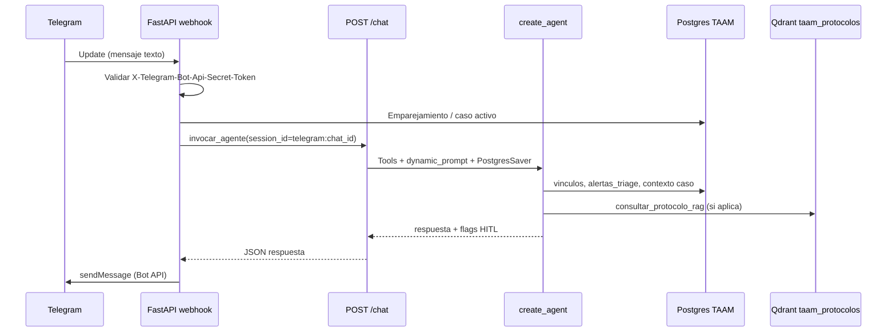
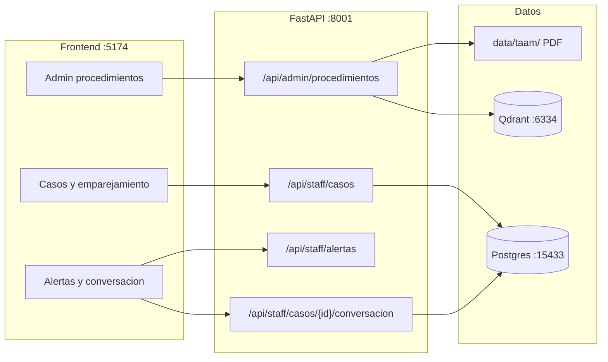
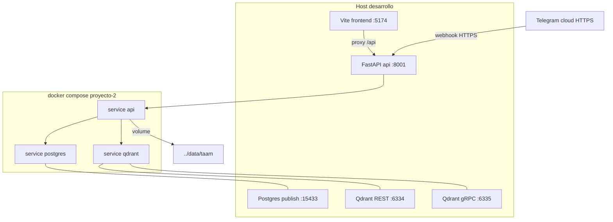

# Arquitectura operativa TAAM (Módulo 3)

Guía para desarrollo, demostración y sustentación del **Bot posoperatorio TAAM** en `proyecto-2/`: agente **LangChain Ruta A**, canal **Telegram vía 2** (webhook en el mismo FastAPI), panel staff en React y datos OLTP/vectoriales **aislados** del asistente institucional M2 en `proyecto-1/`.

| Documento | Rol |
| --- | --- |
| [decision-7 — Arquitectura M3 TAAM](../decisions/decision-7%20-%20Arquitectura-M3-TAAM-Proyecto-2-Telegram-Ruta-A.md) | ADR adoptado (Ruta A, Telegram, puertos, stack) |
| [decision-4 — Payload Qdrant y chunking](../decisions/decision-4%20-%20Payload-Qdrant-enriquecido-y-chunking-Markdown.md) | Patrón de payload en **ingesta** (M2); reutilizado al indexar PDFs TAAM |
| [Caso de Uso TAAM](usecases/Caso%20de%20Uso%20TAAM%20-%20Bot%20Posoperatorio.md) | 5 UC-MVP, triage, Fase 2 |
| [GUION-DEMO-TAAM](usecases/GUION-DEMO-TAAM.md) | Demo 15 min (TASK-114) |
| [doc-003 — Arquitectura M2](doc-003%20-%20Arquitectura-Agente-Modulo-2.md) | Producto paralelo en `proyecto-1/` (no mezclar runtime) |
| [doc-007 — Evaluacion OpenFang](doc-007%20-%20Evaluacion-OpenFang-Proyecto-2-TAAM.md) | Estudio Ruta B: ventajas/desventajas, migracion vs mantener proyecto-2 |
| [doc-008 — Arquitectura Ruta B OpenFang](doc-008%20-%20Arquitectura-M3-TAAM-Ruta-B-OpenFang-Proyecto-3.md) | Implementacion paralela en `proyecto-3/` (decision-8) |

> **`decision-4` no es el ADR de arquitectura M3.** En este repositorio `decision-4` describe enriquecimiento de payload Qdrant del corpus M2; la arquitectura TAAM es **`decision-7`**.

## 1. Problema y solución MVP

### Problema

La Fundación Valle del Lili necesita **acompañar pacientes en postoperatorio** (medicación, cuidados, señales de alarma) sin depender solo de visitas presenciales. El personal clínico requiere visibilidad de interacciones y de casos que requieren revisión humana, **sin mezclar** datos con el asistente institucional del Módulo 2.

### Solución MVP (TAAM)

| Pieza | Implementación |
| --- | --- |
| Canal paciente | **Telegram** (Bot Lili); integración **vía 2**: `POST /api/integracion/telegram/webhook` en FastAPI TAAM — **sin N8N, sin WhatsApp, sin polling** en producto |
| Agente | **Ruta A**: `create_agent` + tools con esquemas Pydantic + `HumanInTheLoopMiddleware` en severidad `urgente` |
| Memoria conversacional | `PostgresSaver` (checkpointer); `thread_id` = `session_id` = `telegram:{chat_id}` |
| Identidad paciente ↔ chat | OLTP: `vinculos_telegram` + código de emparejamiento (TTL) |
| RAG | PDFs de protocolo en `data/taam/` → chunks → colección Qdrant **`taam_protocolos`** (host **6334**) |
| Panel staff | React en `proyecto-2/frontend/` (JWT Bearer); catálogo, casos, alertas, conversación |
| Recordatorios | Job asyncio en lifespan; plantillas por tipo de procedimiento; solo Telegram |

## 2. Evolución M2 (`proyecto-1`) → M3 (`proyecto-2`)

Ambos proyectos comparten el **workspace** (`data/` en la raíz) vía `src/rutas_workspace.py`. **No** hay imports de runtime entre proyectos.

| Tema | proyecto-1 (M2) | proyecto-2 (TAAM / M3) |
| --- | --- | --- |
| **Producto** | Asistente institucional FVL | Bot posoperatorio TAAM |
| **Orquestación agente** | **LangGraph** (router + tool-calling) | **LangChain** `create_agent` |
| **API conversacional** | `POST /api/agente/stream` (SSE multi-evento) | `POST /chat` (JSON request/response) |
| **Canal externo** | Solo web React | **Telegram** webhook + Bot API |
| **Postgres OLTP** | DB `app`, host **15432**, tablas M2 (`usuarios`, `chat_history`, …) | DB **`taam`**, host **15433**, tablas TAAM (`casos_postoperatorio`, `vinculos_telegram`, `alertas_triage`, …) |
| **Memoria LLM** | `PostgresChatMessageHistory` (langchain-postgres) | **`PostgresSaver`** checkpointer (mismo motor TAAM, tablas distintas) |
| **Qdrant** | Colecciones `corpus_*`, REST host **6333** | Colección **`taam_protocolos`**, REST host **6334** |
| **RAG runtime** | LlamaIndex recuperador denso | LangChain `QdrantVectorStore` + tool `consultar_protocolo_rag` |
| **Corpus ingesta** | `data/markdown/` (+ opcional `processed/`) | `data/taam/procedimientos/{uuid}/protocolo.pdf` |
| **FAQs** | `data/structured/` (M2) | `data/structured/taam_faqs.json` |
| **Auth panel** | Cookie sesión DocId + `X-Session-Id` | **JWT** staff (`POST /api/auth/staff/login`) |
| **API HTTP (dev)** | **8000** | **8001** |
| **Frontend Vite** | **5173** | **5174** |
| **ADR principal** | [decision-3](../decisions/decision-3%20-%20Arquitectura-Agente-Memoria-RAG-Qdrant-M2.md) | [decision-7](../decisions/decision-7%20-%20Arquitectura-M3-TAAM-Proyecto-2-Telegram-Ruta-A.md) |

## 3. Vista end-to-end (runtime)

### 3.1 Flujo paciente: Telegram → agente → respuesta



**Reglas clave:**

- `session_id` canónico: `telegram:{chat_id}` (entero de Telegram).
- El webhook delega al **mismo** servicio que expone `POST /chat` (no hay orquestador externo).
- Idempotencia de updates: tabla `telegram_updates_procesados`.

### 3.2 Flujo staff y administración



Historial de conversación en panel: mensajes del **checkpointer** (`PostgresSaver`), no tablas `chat_history` de M2.

### 3.3 Despliegue local (Docker Compose TAAM)

Puertos tomados de [`proyecto-2/docker-compose.yml`](../../proyecto-2/docker-compose.yml) y [`proyecto-2/README.md`](../../proyecto-2/README.md). Coexistencia con M2 en la misma máquina:



| Servicio | Puerto host (defecto) | Notas |
| --- | --- | --- |
| API TAAM | **8001** | `GET /api/salud` → `proyecto: taam` |
| Postgres TAAM | **15433** | DB `taam` |
| Qdrant REST | **6334** | Colección `taam_protocolos` |
| Qdrant gRPC | **6335** | Cliente gRPC opcional |
| Vite (dev, fuera de compose) | **5174** | Proxy `/api` → 8001 |

**Referencia M2 (no usar en diagramas TAAM):** API 8000, Postgres 15432, Qdrant 6333.

## 4. Matriz de cumplimiento — rubrica LangChain (Ruta A)

Verificación automatizada en el repo:

```bash
cd proyecto-2
./scripts/verificar_stack_m3.sh
```

| Componente exigido (M3) | Uso en TAAM | Ruta en repo | Verificación script |
| --- | --- | --- | --- |
| `init_chat_model` | LLM del agente y clasificadores | `src/agentes/modelo.py` | `grep init_chat_model src/agentes` |
| `create_agent` | Orquestación con tools estrictas | `src/agentes/agente_taam.py` | `grep create_agent` |
| `HumanInTheLoopMiddleware` | Pausa / revisión en `urgente` | `src/agentes/agente_taam.py` | `grep HumanInTheLoopMiddleware` |
| `dynamic_prompt` | Contexto RAG + caso en prompt | `src/agentes/prompts.py` | `grep dynamic_prompt` |
| `PostgresSaver` | Checkpointer persistente | `src/agentes/checkpointer.py` | `grep PostgresSaver` |
| `RecursiveCharacterTextSplitter` | Chunking PDF protocolo | `src/ingesta/protocolo_pdf.py` | `grep` en `src/ingesta` |
| Vector store LangChain | RAG denso TAAM | `src/rag/vector_store.py` | ingesta + tool RAG |
| Tools Pydantic (function calling) | 5 tools MVP | `src/agentes/tools/` | nombres en script |
| `obtener_contexto_caso` | Metadatos caso + notas | `tools/obtener_contexto_caso.py` | OK tool |
| `consultar_protocolo_rag` | Similitud sobre `taam_protocolos` | `tools/consultar_protocolo_rag.py` | OK tool |
| `faq_postoperatorio` | FAQs `taam_faqs.json` | `tools/faq_postoperatorio.py` | OK tool |
| `clasificar_triage` | Severidad cerrada | `tools/clasificar_triage.py` | OK tool |
| `escalar_a_equipo` | Inserta `alertas_triage` | `tools/escalar_a_equipo.py` | OK tool |

**Payload Qdrant en ingesta:** alinear metadatos con [decision-4](../decisions/decision-4%20-%20Payload-Qdrant-enriquecido-y-chunking-Markdown.md) donde aplique (tipo procedimiento, hash PDF, offsets de chunk).

## 5. Casos de uso MVP (trazabilidad)

Resumen alineado al [documento de casos de uso](usecases/Caso%20de%20Uso%20TAAM%20-%20Bot%20Posoperatorio.md):

| UC | Objetivo | Rutas / módulos principales |
| --- | --- | --- |
| **UC-MVP-01** | Catálogo procedimiento + PDF + ingesta | `POST /api/admin/procedimientos`, `src/ingesta/`, `scripts/ingestar_protocolo_pdf.py` |
| **UC-MVP-02** | Alta caso + código emparejamiento Telegram | `POST /api/staff/casos`, `POST .../codigo-emparejamiento`, `POST /api/telegram/emparejar` |
| **UC-MVP-03** | Chat Bot + triage + HITL urgente | Webhook → `POST /chat`, tools triage/escalar, `alertas_triage` |
| **UC-MVP-04** | Recordatorios proactivos (solo Telegram) | `src/integracion/recordatorios/`, job lifespan, `POST .../disparar-recordatorio-prueba` |
| **UC-MVP-05** | Panel seguimiento (lectura + marcar revisado) | `GET /api/staff/alertas`, `PATCH .../{id}`, `GET .../conversacion`, frontend `features/seguimiento/` |

**Demo en vivo:** [GUION-DEMO-TAAM.md](usecases/GUION-DEMO-TAAM.md) — semilla `scripts/sembrar_demo_taam.py`, webhook HTTPS, credenciales `*@demo.taam`.

## 6. Estructura de código (`proyecto-2/`)

```text
src/api/              # FastAPI: salud, admin, staff, chat, telegram
src/agentes/          # create_agent, tools, PostgresSaver, prompts
src/integracion/      # telegram (webhook), recordatorios (scheduler)
src/ingesta/          # PDF → chunks → Qdrant
src/rag/              # QdrantVectorStore TAAM
src/persistencia/     # SQLAlchemy async, repositorios OLTP
src/configuracion.py
alembic/versions/     # esquema taam
frontend/             # React 19 + Vite (staff)
scripts/              # ingesta, demo, verificar_stack_m3.sh, webhook
tests/                # api, integracion, agentes (mocks LLM/Telegram)
```

Operación detallada: [`proyecto-2/README.md`](../../proyecto-2/README.md). Agente: [`proyecto-2/src/agentes/README.md`](../../proyecto-2/src/agentes/README.md).

## 7. Limitaciones MVP y trabajo futuro (Fase 2)

| Fuera del MVP (Fase 2 / explícito) | Estado en repo |
| --- | --- |
| N8N, WhatsApp, polling Telegram | No implementado; decisión vía 2 en decision-7 |
| RBAC granular por rol clínico | JWT staff con roles básicos; sin matriz completa |
| Recordatorios por **email** de citas | No hay SMTP ni agenda hospitalaria |
| Evidencias multimedia en Telegram | Solo texto en MVP |
| Intervención del cirujano en el hilo | No |
| OCR en PDF escaneado | PDF sin texto → `indexacion_estado=error` |
| Rate limit en login staff | Documentado como mejora en proxy |

## 8. Bonus transversal t-SNE (curso)

El módulo ofrece un **bonus opcional** de análisis con t-SNE/UMAP sobre vectores de conversación ([actividad M3](actividades/Actividad%20del%20M%C3%B3dulo%203_%20Productizaci%C3%B3n,%20Despliegue%20Avanzado%20y%20Sistemas%20Ag%C3%A9nticos.md)).

**En este repositorio:** no hay notebook ni artefactos t-SNE/UMAP versionados para TAAM ni M2. La sustentación puede citar esta sección como «no aplicado»; implementarlo sería trabajo aparte (exportar embeddings de hilos + notebook anexo).

## 9. Outline — sección M3 en informe del curso (PDF/LaTeX)

Si el curso exige un informe unificado, se sugiere una sección **«Módulo 3 — TAAM»** con esta estructura (contenido ampliado desde este doc-004):

1. **Contexto y problema** (§1 de este documento + resumen UC).
2. **Decisión arquitectónica** — figura Ruta A + Telegram vía 2; cita decision-7.
3. **Comparativa M2 vs M3** — tabla §2.
4. **Diagramas** — secuencia paciente (§3.1) y despliegue (§3.3).
5. **Stack LangChain** — matriz §4 + salida de `verificar_stack_m3.sh`.
6. **Demostración** — referencia al GUION y capturas (panel + Telegram).
7. **Pruebas** — `uv run pytest` en `proyecto-2/`; mocks en CI vs demo con API real.
8. **Limitaciones y trabajo futuro** — §7.
9. **Anexo opcional t-SNE** — solo si se entrega bonus (§8).

Ruta sugerida si el equipo versiona LaTeX: `proyecto-2/informe/` (aún no creada en el repo al cierre de TASK-116).

## 10. Referencias internas

- [decision-7 — Arquitectura M3 TAAM](../decisions/decision-7%20-%20Arquitectura-M3-TAAM-Proyecto-2-Telegram-Ruta-A.md)
- [decision-4 — Payload Qdrant (ingesta)](../decisions/decision-4%20-%20Payload-Qdrant-enriquecido-y-chunking-Markdown.md)
- [doc-003 — Arquitectura M2](doc-003%20-%20Arquitectura-Agente-Modulo-2.md)
- [doc-006 — Estudio Clean Architecture M2](doc-006%20-%20Estudio-Migracion-Clean-Architecture.md)
- [m-0 — Agentic Final Project](../milestones/m-0%20-%20agentic-final-project.md)

---

*Actualizar `updated_date` en el front matter si cambian puertos, rutas o stack tras nuevas tareas M3.*
