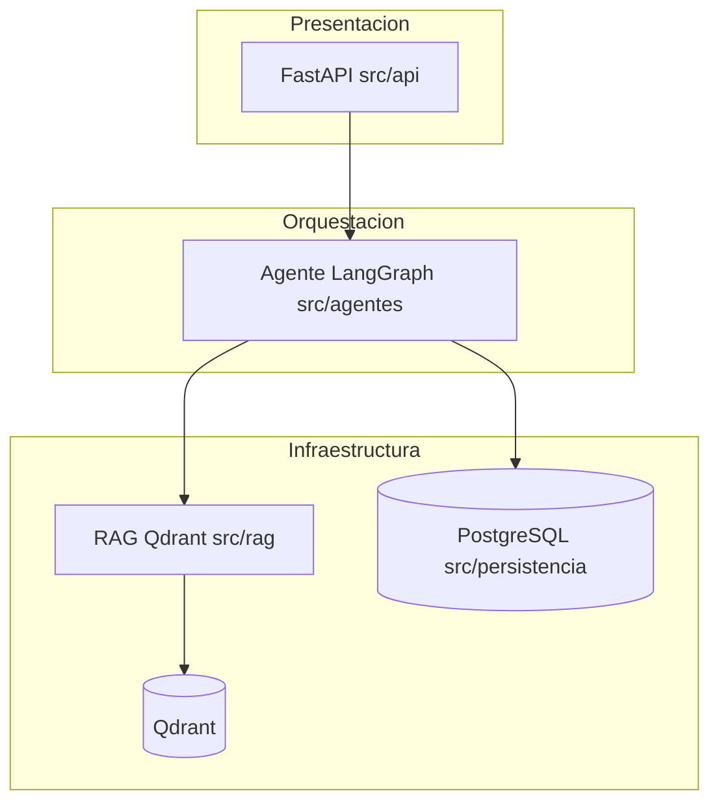

# Estudio de migración hacia una arquitectura en capas tipo Clean Architecture

Este documento es un **estudio de viabilidad y organización**: no constituye una decisión adoptada ni sustituye al ADR de stack del Módulo 2. La arquitectura operativa vigente se describe en [doc-003 — Arquitectura operativa del agente (Módulo 2)](doc-003%20-%20Arquitectura-Agente-Modulo-2.md) y las decisiones de producto en [decision-3 — Agente, memoria, RAG y Qdrant](../decisions/decision-3%20-%20Arquitectura-Agente-Memoria-RAG-Qdrant-M2.md).

> **Numeración:** este estudio se publicó originalmente como `doc-004`; se renumeró a **`doc-006`** para reservar `doc-004` al informe de arquitectura TAAM (Módulo 3). Ver [doc-004 — Arquitectura M3 TAAM](doc-004%20-%20Arquitectura-M3-Bot-Posoperatorio-TAAM.md).

## 1. Resumen ejecutivo

**Qué podría mejorar** una reorganización al estilo Clean Architecture o hexagonal:

- **Claridad para auditorías académicas**: límites explícitos entre “reglas estables del producto” y “detalles de frameworks o proveedores”.
- **Narrativa de capas** alineada con libros de texto: presentación, aplicación, dominio, infraestructura.
- **Pruebas**: aislar reglas que no dependen de red ni de LangChain/OpenAI sustituyendo adaptadores por dobles de prueba.

**Qué no resuelve** por sí sola una migración de carpetas o de capas formales:

- **No reduce de forma automática** el volumen de integración con LLM, LangGraph, SSE ni Qdrant; esas piezas seguirán siendo la mayor parte del código “real”.
- **No sustituye** la necesidad de documentar el flujo HTTP → agente → herramientas (FAQ, RAG, listados) ya cubierto en doc-003.

Conclusión anticipada: en este repositorio suele ser más rentable una estrategia **incremental** (“clean enough”) que un rediseño total en cuatro paquetes rígidos, salvo que el equipo planee múltiples productos que compartan el mismo núcleo de reglas.

## 2. Estado actual (baseline)

El proyecto **ya separa** responsabilidades por carpetas bajo `src/`, lo cual es compatible con una lectura hexagonal informal:

| Rol conceptual | Ubicación típica | Contenido resumido |
| --- | --- | --- |
| Presentación / transporte HTTP | `src/api/` | `main.py`, lifespan, CORS, `routers/` (salud, sesiones, agente SSE, admin), `dependencias.py`, esquemas Pydantic, SSE. |
| Orquestación del caso de uso “chat” | `src/agentes/` | Grafo LangGraph (`router.py`), estado, tools, memoria Postgres, prompts, runtime del bundle LLM. |
| Infraestructura de recuperación vectorial | `src/rag/` | Qdrant, embeddings, recuperador denso, listados, MMR, reranker, heurísticas, métricas de evaluación. |
| Infraestructura OLTP | `src/persistencia/` | Motor SQLAlchemy async, modelos, repositorios (usuarios, sesiones, config admin). |
| Ingesta y corpus | `scripts/`, `data/markdown/`, `data/structured/` | Indexación a Qdrant, FAQs JSON con schema, corpus Markdown canónico. |

El **contrato de producto** (sin BM25 en runtime, solo denso en Qdrant) está fijado en decision-3; el contexto histórico del MVP BM25 aparece en [doc-001](doc-001%20-%20MVP-Fase-1-Proyecto-Final-QA-BM25.md) sin reabrir esa decisión aquí.

### 2.1. Límites de dependencia (vista para el estudio)

El diagrama siguiente resume la dirección habitual de las dependencias en tiempo de petición (simplificado; no lista cada módulo interno).



En una lectura **Clean Architecture estricta**, las flechas “hacia adentro” deberían apuntar a **interfaces o entidades** desacopladas de FastAPI y de LangChain. Hoy gran parte de la orquestación **depende directamente** de esas librerías, lo cual es habitual en sistemas agenticos y constituye el principal trade-off de una migración profunda.

## 3. Qué significa “Clean Architecture” en este contexto

Robert C. Martin resume la idea en **regla de dependencia**: las dependencias del código fuente apuntan hacia adentro; el núcleo no conoce frameworks ni bases de datos concretas.

Traducción práctica a este stack:

- **Periferia (adaptadores de salida)**: cliente Qdrant, SQLAlchemy, pool `psycopg` para memoria LangChain, clientes OpenAI, implementación concreta del grafo LangGraph, montaje FastAPI.
- **Periferia (adaptadores de entrada)**: routers HTTP, serialización SSE, cabeceras y cookies de sesión.
- **Núcleo potencial** (si se extrajera): reglas estables y testeables sin red, por ejemplo:
  - textos o políticas de respuesta institucional compartidas;
  - validación de parámetros de herramientas o límites de negocio (topes, ventanas de historial expresadas como reglas, no como lectura de `os.environ`);
  - contratos de datos puros (DTOs o value objects) entre capas.

**LangGraph y las StructuredTool** encajan naturalmente como **motor de aplicación en la periferia**: forzarlas al centro como “entidades puras” suele generar **adaptadores artificiales** (puertos genéricos por cada nodo del grafo) con poco beneficio si solo existe un camino de ejecución.

## 4. Propuestas de organización del proyecto

Se presentan dos intensidades; pueden combinarse (por ejemplo, Opción A ahora y Opción B solo en submódulos concretos).

### 4.1. Opción A — Reorganización de bajo riesgo (carpetas y documentación)

Objetivo: **mejorar la navegabilidad** sin reescribir la lógica del agente.

- **Subdividir `src/rag/`** por intención de uso, por ejemplo:
  - `rag/runtime/` — módulos importados por el agente o por la factoría del grafo en cada consulta;
  - `rag/evaluacion/` — métricas, scripts auxiliares compartidos con laboratorio, experimentos documentados.
- **Documentar en README o en doc-003** una tabla “**núcleo productivo** vs **laboratorio / scripts**” para que un evaluador no confunda ingesta o evaluación con el runtime de `POST /api/agente/stream`.
- **Mantener** `src/api/`, `src/agentes/`, `src/persistencia/` como están, salvo movimientos mecánicos acompañados de tests.

Ventaja: coste de migración acotado (principalmente imports y rutas en CI). Desventaja: no introduce por sí sola interfaces de dominio nuevas.

### 4.2. Opción B — Migración fuerte hacia paquetes tipo Clean Architecture

Estructura ilustrativa (nombres en español ASCII acordes al repo):

```text
src/
  dominio/           # entidades, value objects, excepciones de negocio
  aplicacion/        # casos de uso (servicios); solo depende de dominio + puertos
  puertos/           # interfaces (ABC o Protocol): EmbeddingsPort, VectorStorePort, ...
  infraestructura/   # implementaciones: qdrant, sqlalchemy, langgraph_adapter
  presentacion/      # FastAPI, DTOs HTTP, mapeo a casos de uso
```

**Mapeo orientativo** desde el árbol actual:

| Actual | Destino probable en Opción B |
| --- | --- |
| `src/api/routers/*` | `presentacion/` (delgado; llama a casos de uso) |
| `src/api/factoria_grafo_agente.py`, parte de `dependencias.py` | `infraestructura/` o `presentacion/bootstrap` |
| `src/agentes/router.py` y tools | `infraestructura/` (adaptador LangGraph) o `aplicacion/` si se descompone en pasos explícitos |
| `src/rag/qdrant_store.py`, `embeddings.py` | `infraestructura/` implementando `puertos/` |
| `src/persistencia/` | `infraestructura/` |
| Prompts institucionales estables | `dominio/` o `aplicacion/` como texto + reglas |

**Coste**: alto — hay que actualizar todos los imports, tests, factorías y posiblemente el empaquetado (`uv`). El riesgo de regresiones en SSE y en el orden de inicialización del lifespan aumenta.

## 5. Candidatos a eliminación, archivo o aclaración

Toda eliminación debería ir precedida de **búsqueda de referencias** (`import`, documentación, CI) y de **suite verde** (`uv run pytest`). Lo siguiente son **candidatos**, no órdenes.

### 5.1. `src/app/` y `src/app/legacy/` (cerrado en TASK-87)

El paquete `src/app` fue **retirado del arbol** en la TASK-87: la UI Gradio ya no se distribuye en este repositorio. El contexto de la migración a React y FastAPI está en [doc-002](doc-002%20-%20Migracion-Frontend-React-Vite-Backend-FastAPI.md); el historial de código permanece en git. El README raíz incluye una nota visible al respecto.

### 5.2. `src/qa/`

Contiene clientes Ollama/OpenAI, composición de prompts y utilidades del **flujo Q&A clásico** (Módulo 1). El **runtime del agente M2** documentado en doc-003 **no depende** de `src/qa/` para servir el chat; el uso principal observado suele ser **tests** bajo `tests/qa/` y posibles importaciones puntuales desde otros tests.

Candidatos de reorganización **sin cambiar comportamiento**:

- Renombrar o mover a `src/laboratorio/qa_legacy/` (o similar) y actualizar imports de tests.
- O mantener el nombre pero documentar explícitamente en README: “**No forma parte del camino M2 en producción**”.

Eliminar el paquete por completo solo tendría sentido si el equipo **abandona** esas pruebas y scripts que lo importan.

### 5.3. Configuración y variables de entorno

No se recomienda borrar claves de `.env.example` sin revisión: algunas alimentan **Alembic**, admin M2 o flags de RAG.

Sí es útil una **auditoría periódica** de:

- [`src/api/configuracion.py`](../../proyecto-1/src/api/configuracion.py) frente a [`.env.example`](../../proyecto-1/.env.example) (variables sin uso, duplicados, defaults muertos);
- migraciones en `alembic/versions/` y su coherencia con el modelo actual (solo consolidar cuando haya política de squash aprobada por el equipo).

### 5.4. Otros artefactos

- **`scripts/`**: muchos archivos son **operación o laboratorio**; no deben contarse como “complejidad del chat” en una defensa oral, pero sí justificarse como pipeline de datos.
- **`frontend/`**: capa cliente separada; ya cumple el rol de “adaptador de entrada” en el sentido amplio del sistema distribuido.

## 6. Ventajas y desventajas

| Aspecto | Ventajas potenciales | Desventajas / riesgos |
| --- | --- | --- |
| Claridad académica | Mapa mental claro para evaluadores; separación “reglas vs tecnología”. | Curva de aprendizaje si cada capa añade indirección sin dominio rico. |
| Pruebas | Casos de uso testeables con dobles en `puertos/`. | Doblar demasiados mocks de LangChain/LangGraph puede fragilizar la suite. |
| Evolución | Facilita un segundo cliente (CLI, batch) si los casos de uso están desacoplados de FastAPI. | En proyectos con un solo entrypoint HTTP, el beneficio puede ser marginal frente al coste. |
| Mantenimiento del agente | Ninguna mejora mágica; depende de disciplina en cualquier layout. | **Abstracción prematura**: interfaces “por si acaso” que solo tienen una implementación. |
| Alineación con ecosistema LLM | Se puede mantener LangGraph en la perifería sin mentir sobre el modelo mental. | Forzar el grafo al “dominio puro” suele producir muchas líneas de pegamento. |

## 7. Recomendación prudente

1. **Priorizar Opción A** si el objetivo inmediato es responder a una auditoría sobre “demasiados archivos”: reorganizar carpetas, etiquetar núcleo vs laboratorio y mejorar el diagrama en doc-003 o en el README.
2. **Introducir puertos explícitos solo donde haya reglas estables** reutilizables (p. ej. límites de recuperación, normalización de session id) y **una** capa de servicio entre el router y el grafo si el router empieza a acumular lógica.
3. **Evitar Opción B completa** salvo requisito explícito del curso o producto multi-salida, por el coste de migración y el acoplamiento inherente a proveedores de LLM.
4. Criterio de cierre útil: *si no hay un segundo consumidor del mismo caso de uso fuera de FastAPI, no crear un paquete `aplicacion/` genérico con más de una docena de archivos vacíos o triviales.*

## 8. Próximos pasos opcionales

Si el equipo decide ejecutar cambios estructurales:

- Abrir una **tarea** en `backlog/tasks/` con alcance (solo doc + README, vs refactor de `rag/`, vs extracción de puertos).
- Actualizar **doc-003** con el diagrama o la tabla de “núcleo vs laboratorio” una vez aplicada la reorganización.
- Valorar un **ADR nuevo** (`decision-N`) solo si se adopta formalmente un layout de paquetes distinto al actual; este doc-006 permanece como estudio de referencia.

---

*Documento de estudio; no implica compromiso de implementación. Actualizar `updated_date` en el front matter si el contenido evoluciona de forma sustancial.*
