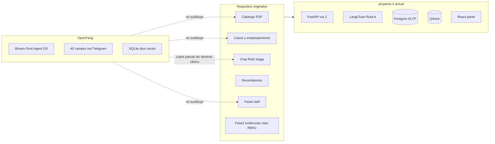
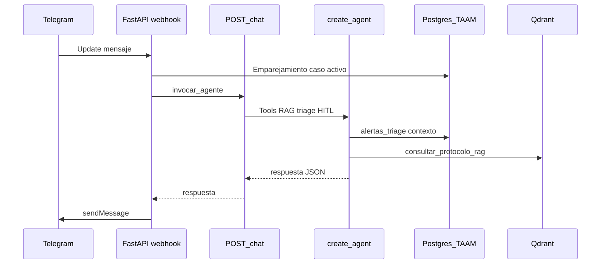
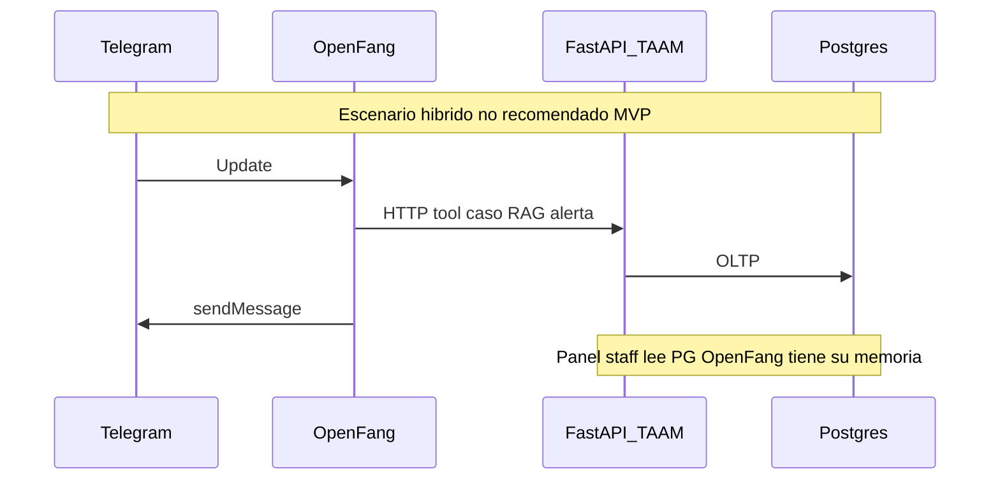

# Evaluacion OpenFang frente a TAAM (proyecto-2)

Estudio de **viabilidad y costo-beneficio** sobre usar [OpenFang](https://www.openfang.sh/) ([repositorio](https://github.com/RightNow-AI/openfang)) como base del Bot posoperatorio TAAM en lugar de — o junto a — la implementacion actual en `proyecto-2/`.

> **No es un ADR.** La arquitectura adoptada sigue en [decision-7 — Arquitectura M3 TAAM](../decisions/decision-7%20-%20Arquitectura-M3-TAAM-Proyecto-2-Telegram-Ruta-A.md) (`accepted`, Ruta A LangChain + FastAPI vía 2). Este documento **complementa** esa decision con un analisis explicito de la alternativa OpenFang (Ruta B en el vocabulario del curso).

| Documento | Rol |
| --- | --- |
| [Caso de Uso TAAM](usecases/Caso%20de%20Uso%20TAAM%20-%20Bot%20Posoperatorio.md) | Requisitos funcionales, MVP vs Fase 2 |
| [doc-004 — Arquitectura TAAM](doc-004%20-%20Arquitectura-M3-Bot-Posoperatorio-TAAM.md) | Arquitectura operativa vigente |
| [decision-7](../decisions/decision-7%20-%20Arquitectura-M3-TAAM-Proyecto-2-Telegram-Ruta-A.md) | Decision adoptada (excluye OpenFang en MVP) |
| [proyecto-2/README.md](../../proyecto-2/README.md) | Guia de ejecucion local |

**Fuentes OpenFang consultadas (mayo 2026):** sitio oficial, README publico del repositorio (version referenciada ~v0.6.x). El producto se declara **pre-1.0** con posibles cambios entre versiones menores; en produccion se recomienda fijar commit.

---

## 1. Resumen ejecutivo

### Preguntas que responde este informe

| Pregunta | Respuesta breve |
| --- | --- |
| ¿Encaja OpenFang con el Bot posoperatorio TAAM? | **Parcialmente** como motor conversacional y canal; **no** como sustituto del dominio clinico (casos, emparejamiento, triage OLTP, panel staff, ingesta PDF→Qdrant con metadatos de procedimiento). |
| ¿Es viable una **migracion** desde `proyecto-2`? | Tecnicamente posible en escenarios hibridos, pero **media-baja** viabilidad sin romper vía 2, la rubrica M3 o duplicar persistencia. |
| ¿Vale la pena una **reescritura desde cero** en OpenFang? | **No** para el entregable del curso ni para el MVP ya implementado; solo tendria sentido en un **greenfield** post-curso con equipo Rust y sin exigencia de Ruta A. |
| ¿Que hacer entonces? | **Mantener `proyecto-2`**; usar OpenFang como **referencia** (Hands, seguridad, multi-canal) al disenar Fase 2. |

### Sintesis ventajas / desventajas / recomendacion

| | OpenFang | proyecto-2 (actual) |
| --- | --- | --- |
| **Ventajas** | Binario Rust ligero; ~40 canales (Telegram incluido); Hands con cron; 16 capas de seguridad; MCP/A2A | Dominio TAAM completo; alineado con rubrica M3; stack Python/React del equipo; demo E2E documentada |
| **Desventajas** | Sin modulo clinico; memoria distinta al OLTP; pre-1.0; curva Rust; no cumple Ruta A sin fachada | Un canal MVP (Telegram); scheduler propio mas simple que Hands; seguridad basica para demo |
| **Recomendacion** | No adoptar en MVP ni migrar ahora | **Continuar** como sistema de registro |

### Veredicto por escenario

| Escenario | Viabilidad tecnica | ¿Vale la pena (curso / repo actual)? |
| --- | --- | --- |
| Migracion incremental (agente o Telegram → OpenFang; conservar FastAPI + panel + Postgres/Qdrant) | Media-baja | **No** |
| Reescritura desde cero en OpenFang | Media | **No** (salvo producto nuevo fuera de rubrica) |
| Hibrido (OpenFang sidecar de canal o scheduler) | Baja-media | Solo exploracion Fase 2, no prioridad |
| Mantener proyecto-2; inspiracion en patrones OpenFang | Alta | **Si** — recomendacion principal |

---

## 2. Requisitos funcionales (tecnologia-agnostico)

Los siguientes casos de uso provienen del **documento original** del cliente (actores: pacientes, cirujanos, asistentes, administrador, Bot Lili). Se listan **sin** asumir LangChain, FastAPI ni OpenFang.

| # | Caso de uso original | Necesidad de negocio |
| --- | --- | --- |
| 1 | **Registrar procedimiento** (admin) | Catalogo de tipos de procedimiento con documento PDF de recomendaciones generales, indexable para consulta automatica. |
| 2 | **Gestionar usuarios** (admin) | Administracion de actores (roles, altas/bajas, permisos). |
| 3 | **Registrar procedimiento quirurgico** (asistente) | Caso por paciente: identificacion, tipo de procedimiento, cirujano, recomendaciones especificas opcionales. |
| 4 | **Seguimiento de interacciones y doble check de triage** (cirujano/asistente) | Ver lo que el paciente envio al bot y validar o corregir la clasificacion automatica de riesgo. |
| 5 | **Recordatorios de citas** (Bot Lili) | Revisar citas agendadas y enviar recordatorios por email y/o mensajeria. |
| 6 | **Recordatorios postoperatorio** (Bot Lili) | Recordar medicacion, terapias y cuidados segun protocolo (horarios/cantidades cuando aplique). |
| 7 | **Requerir evidencias postoperatorio** (Bot Lili) | Pedir al paciente pruebas (foto, audio, video, texto) cuando el protocolo lo indique. |
| 8 | **Chat con Bot Lili** (paciente) | Dudas sobre cirugia/postoperatorio; buscar en base vectorial; si no hay respuesta, escalar a medico/asistente asignado. |
| 9 | **Consultar e intervenir en el chat** (cirujano/asistente) | Leer conversaciones y, si hace falta, intervenir en el hilo con el paciente. |

### Cruce con MVP (5 UC) y Fase 2

El repositorio acota el MVP a cinco casos (UC-MVP-01…05) y deja el resto para Fase 2. No confundir «no implementado en MVP» con «imposible en OpenFang».

| Requisito original | En MVP TAAM (`proyecto-2`) | Fuera de MVP (Fase 2 / explicito) |
| --- | --- | --- |
| 1 Registrar procedimiento + PDF | UC-MVP-01 | — |
| 2 Gestionar usuarios | Auth staff minima | RBAC completo |
| 3 Caso quirurgico por paciente | UC-MVP-02 (sin PDF por paciente) | PDF por paciente (sustituido por protocolo general + notas) |
| 4 Seguimiento / doble check triage | UC-MVP-05 (lectura + marcar revisado) | Intervencion en vivo en Telegram |
| 5 Recordatorios de citas | — | Email + agenda hospitalaria |
| 6 Recordatorios postoperatorio | UC-MVP-04 (plantilla + fecha cirugia, Telegram) | Extraccion perfecta de horarios desde PDF |
| 7 Evidencias multimedia | — | Almacenamiento, moderacion, antivirus |
| 8 Chat + RAG + escalacion | UC-MVP-03 | — |
| 9 Consultar/intervenir chat | UC-MVP-05 parcial (solo consulta) | Envio staff → Telegram |

Referencia detallada: [Caso de Uso TAAM — secciones 6 y 7](usecases/Caso%20de%20Uso%20TAAM%20-%20Bot%20Posoperatorio.md).

---

## 3. Que es OpenFang (hechos verificables)

OpenFang se presenta como un **Agent Operating System** open source, implementado principalmente en **Rust** (~137K LOC, multiples crates), distribuido como **un binario** (~32 MB) con dashboard en `http://localhost:4200`.

| Capacidad | Descripcion relevante para TAAM |
| --- | --- |
| **Agentes** | Agentes predefinidos y configurables; no orientados a un dominio hospitalario. |
| **Hands** | Paquetes autonomos con `HAND.toml`, prompt largo, `SKILL.md`, guardrails; ejecutan en **cron** sin esperar input del usuario (util como **patron** para recordatorios). |
| **Canales** | ~40 adaptadores (Telegram, Discord, Slack, WhatsApp, email, etc.). |
| **Memoria** | SQLite + embeddings vectoriales; sesiones cross-canal; compactacion automatica. **No** sustituye un esquema OLTP de casos clinicos. |
| **Herramientas** | ~53 tools nativas + MCP cliente/servidor + A2A. |
| **Seguridad** | Sandbox WASM, cadena Merkle de auditoria, taint tracking, SSRF, rate limiting, etc. |
| **Madurez** | Pre-1.0; cambios entre minors; pin por commit si se usa en produccion. |

**Lo que OpenFang no ofrece out-of-the-box para TAAM:** registro de `casos_postoperatorio`, codigos de emparejamiento con TTL, severidad de triage cerrada (`info` | `seguimiento` | `urgente`) persistida en `alertas_triage`, panel web staff con JWT, ingesta de PDFs de protocolo hacia una coleccion Qdrant con `tipo_procedimiento_id`, ni integracion **vía 2** (webhook Telegram en el mismo proceso que la API REST de negocio).

---

## 4. Estado actual de proyecto-2 (baseline)

Resumen alineado con [doc-004](doc-004%20-%20Arquitectura-M3-Bot-Posoperatorio-TAAM.md):

| Capa | Implementacion |
| --- | --- |
| Canal paciente | Telegram: webhook `POST /api/integracion/telegram/webhook` en FastAPI |
| Agente | LangChain `create_agent`, tools Pydantic, `dynamic_prompt`, `HumanInTheLoopMiddleware` en `escalar_a_equipo` |
| Memoria conversacional | `PostgresSaver`; `session_id` = `telegram:{chat_id}` |
| OLTP | PostgreSQL `taam` (casos, vinculos, alertas, plantillas, recordatorios) |
| RAG | Qdrant coleccion `taam_protocolos`; tool `consultar_protocolo_rag` |
| Panel | React 19 + Vite en `proyecto-2/frontend/` |
| Recordatorios | Job asyncio en lifespan + disparo manual para demo |

Archivos representativos: `proyecto-2/src/agentes/agente_taam.py`, `proyecto-2/src/integracion/telegram/`, `proyecto-2/src/integracion/recordatorios/`, `proyecto-2/src/api/routers/staff_*`, `proyecto-2/scripts/ingestar_protocolo_pdf.py`.

La rubrica M3 exige trazas verificables (`create_agent`, `PostgresSaver`, `HumanInTheLoopMiddleware`, etc.) — ver `proyecto-2/scripts/verificar_stack_m3.sh` y decision-7.

---

## 5. Matriz de cobertura (requisito original → soluciones)

Leyenda: **OOTB** = out-of-the-box; **Custom** = desarrollo significativo; **Gap** = no cubierto sin reimplementar el producto TAAM.

| # | Requisito | MVP proyecto-2 | OpenFang OOTB | Custom en OpenFang | Gap / costo alto |
| --- | --- | --- | --- | --- | --- |
| 1 | Catalogo + PDF | UC-MVP-01; ingesta → Qdrant | Agente generico + files | Tool/MCP: subir PDF, chunk, indexar con metadatos | Sin modelo `tipos_procedimiento` ni panel admin |
| 2 | Gestion usuarios | JWT staff minimo | Auth generica del OS | Integrar IdP / tablas rol-permiso | RBAC clinico completo en ambos lados |
| 3 | Caso por paciente | UC-MVP-02; emparejamiento | — | DB externa + tools: crear caso, codigo | Toda la logica OLTP es custom |
| 4 | Seguimiento triage | UC-MVP-05; `alertas_triage` | Logs / dashboard generico | API lectura alertas + UI o export | Bandeja semantica clinica no existe |
| 5 | Recordatorios citas | Fuera MVP | Hand + cron + canal email posible | Conector agenda + plantillas | Igual complejidad que Fase 2 actual |
| 6 | Recordatorios postoperatorio | UC-MVP-04; plantillas + `fecha_cirugia` | Hand programado + Telegram | Leer `recordatorios_programados` en Postgres | Cronograma clinico sigue en OLTP Python |
| 7 | Evidencias multimedia | Fuera MVP | Recepcion multimedia en canales | S3, antivirus, moderacion, politicas | Mismo esfuerzo que Fase 2 en cualquier stack |
| 8 | Chat RAG + escalacion | UC-MVP-03; tools + HITL | Chat + memoria vectorial | Tools: RAG Qdrant, triage, insert alerta | Escalacion estructurada y disclaimer regulado son custom |
| 9 | Consultar / intervenir | UC-MVP-05 lectura | Historial en memoria OpenFang | Panel o API; envio staff a Telegram | Intervencion en hilo = Fase 2 en ambos |

### Ejemplo detallado: chat con escalacion (requisito 8)

**proyecto-2:** el webhook delega en `POST /chat`; el agente ejecuta `obtener_contexto_caso`, `consultar_protocolo_rag`, `faq_postoperatorio`, `clasificar_triage` y, si aplica, `escalar_a_equipo` con interrupcion HITL antes de persistir severidad `urgente` en `alertas_triage`.

**OpenFang:** puede mantener un agente conversacional con recuperacion vectorial y envio por Telegram, pero el **vinculo caso ↔ chat**, las **severidades cerradas**, el **disclaimer obligatorio** y la **bandeja de alertas** para el personal requieren integracion explicita con PostgreSQL (MCP, HTTP tools o microservicio puente). Sin ese puente, el panel staff de React no tendria fuente de verdad coherente.

---

## 6. Ventajas de OpenFang para TAAM

| Ventaja | Aplicacion a TAAM |
| --- | --- |
| **Multi-canal** | Fase 2: email/WhatsApp ademas de Telegram sin reescribir adaptadores desde cero. |
| **Hands y cron** | Modelo mental claro para UC 5–6 (recordatorios proactivos); inspiracion para endurecer `integracion/recordatorios/`. |
| **Rendimiento y despliegue** | Binario unico, arranque rapido, menor huella que stack Python completo en escenarios de muchos agentes. |
| **Seguridad y auditoria** | Merkle trail, sandbox WASM, taint tracking — valorables en un despliegue **real** FVL (post-curso), no decisivos para demo academica. |
| **MCP / A2A** | Integracion futura con HIS, laboratorio o agendas si el hospital expone servicios. |
| **Ecosistema** | Comunidad activa (~17k estrellas en GitHub, mayo 2026); documentacion y cookbook en openfang.sh. |

---

## 7. Desventajas y riesgos para este proyecto

| Riesgo | Impacto |
| --- | --- |
| **Ruta B vs rubrica M3** | decision-7 y el curso exigen **Ruta A** (LangChain function calling + FastAPI vía 2). OpenFang fue **descartado en MVP** junto a N8N y WhatsApp ([use case §6](usecases/Caso%20de%20Uso%20TAAM%20-%20Bot%20Posoperatorio.md)). Migrar implica perder evidencias `grep`/script de verificacion o mantener una fachada fragil. |
| **Dominio clinico fuera del producto** | Emparejamiento, casos activos, plantillas por fecha de cirugia, triage OLTP y panel staff son el **nucleo** de TAAM; OpenFang no los trae. |
| **Doble persistencia** | Memoria OpenFang (SQLite + vector interno) vs `PostgresSaver` + tablas TAAM → riesgo de historiales divergentes para UC-MVP-05. |
| **vía 2 rota en escenarios hibridos** | Si Telegram lo maneja solo OpenFang, el webhook ya no vive en el mismo FastAPI que `POST /chat` y los routers staff — contradice la integracion acordada. |
| **Curva operativa** | Rust, `openfang.toml`, dashboard :4200, ciclo de vida distinto a `uv` + Docker Compose TAAM en :8001. |
| **Pre-1.0** | Breaking changes; costo de mantenimiento y pin de version en cualquier piloto serio. |
| **Evidencias multimedia** | OpenFang no elimina almacenamiento seguro, moderacion ni cumplimiento normativo (UC 7). |
| **Costo de oportunidad** | Reimplementar en OpenFang retrasa Fase 2 (RBAC, intervencion en chat, citas) ya planificada en Python/React. |

---

## 8. Escenarios de migracion y reescritura

### 8.1 Flujo actual (referencia)

### 8.2 Escenario A — Solo canal (OpenFang recibe Telegram)

- **Idea:** OpenFang consume updates de Telegram; FastAPI conserva OLTP y panel.
- **Problema:** deja de cumplir **vía 2** (webhook en el mismo servicio que la API de negocio).
- **Esfuerzo:** 2–4 semanas-persona (puente, sincronizacion de sesiones, despliegue dual).
- **Demo 15 min:** riesgo alto de fallos de integracion ([GUION-DEMO-TAAM](usecases/GUION-DEMO-TAAM.md)).

### 8.3 Escenario B — Solo agente (OpenFang ejecuta LLM; FastAPI proxy)

- **Idea:** `POST /chat` delega en API OpenFang.
- **Problema:** duplicacion de contrato; tools clinicas deben replicarse como tools OpenFang/MCP; HITL y `alertas_triage` siguen en Postgres.
- **Esfuerzo:** 3–6 semanas-persona.
- **Rubrica:** no demuestra `create_agent` en `proyecto-2` sin artificio.

### 8.4 Escenario C — Reescritura total en OpenFang

- **Idea:** sustituir FastAPI + React por dashboard OpenFang + configuracion de agentes.
- **Problema:** rehacer UC-MVP-01…05, ingesta PDF, panel staff, semillas demo; mayor esfuerzo que completar Fase 2 en el stack actual.
- **Esfuerzo:** 2–4 meses-persona (equipo pequeno).
- **Cuando tiene sentido:** producto nuevo, sin obligacion de Ruta A, equipo Rust dedicado.

### 8.5 Escenario D — No migrar; inspiracion (recomendado)

- Mantener `proyecto-2` como sistema de registro.
- Tomar de OpenFang: manifests tipo `HAND.toml`, fases de playbook, guardrails de acciones sensibles, ideas de auditoria para hardening post-MVP.
- Para multi-canal Fase 2: evaluar adaptador nativo vs mantener Telegram y anadir SMTP/WhatsApp en FastAPI antes de introducir un segundo runtime.

---

## 9. ¿Vale la pena? — Criterios de decision

| Criterio | Peso (curso M3) | proyecto-2 | OpenFang |
| --- | --- | --- | --- |
| Cumplir rubrica LangChain Ruta A | **Alto** | Cumple | No cumple sin fachada |
| Demo E2E Telegram + panel | **Alto** | Cumple | Parcial |
| Time-to-demo / sustentacion | **Alto** | Implementado | Alto rework |
| Dominio clinico (casos, triage, alertas) | **Alto** | Cumple | Custom mayoritario |
| Seguridad / auditoria produccion | Bajo en MVP | Basica | Fuerte |
| Multi-canal futuro | Medio (Fase 2) | Telegram en MVP | Fuerte |
| Alineacion stack equipo (Python/React) | Medio | Alta | Baja (Rust) |
| Madurez / estabilidad API | Medio | Controlada en repo | Pre-1.0 |

### Recomendacion formal

1. **No migrar** ni **reescribir** TAAM sobre OpenFang para el MVP del Modulo 3 ni para la sustentacion actual.
2. **Mantener** decision-7 y `proyecto-2` como implementacion canonica.
3. **Reconsiderar** OpenFang solo si se cumple al menos una de estas condiciones:
   - el curso deja de exigir Ruta A y vía 2 verificables;
   - se prioriza un producto multi-agente multi-canal **sin** panel React custom;
   - hay un proyecto **greenfield** post-curso con equipo Rust y aceptacion de pre-1.0.
4. En ese caso futuro, abrir un **nuevo ADR** (p. ej. `decision-8`), no solo actualizar este informe.

---

## 10. Referencias y mantenimiento

| Recurso | URL |
| --- | --- |
| OpenFang (sitio) | https://www.openfang.sh/ |
| OpenFang (codigo) | https://github.com/RightNow-AI/openfang |
| Arquitectura TAAM vigente | [doc-004](doc-004%20-%20Arquitectura-M3-Bot-Posoperatorio-TAAM.md) |
| ADR M3 adoptado | [decision-7](../decisions/decision-7%20-%20Arquitectura-M3-TAAM-Proyecto-2-Telegram-Ruta-A.md) |

**Historial:** `doc-007` creado el 2026-05-22 como estudio de referencia; estado `borrador` hasta revision del equipo.

**Revision sugerida:** tras cambios mayores de OpenFang (v1.0) o al planificar Fase 2 multi-canal; comparar de nuevo la matriz de la seccion 5.
