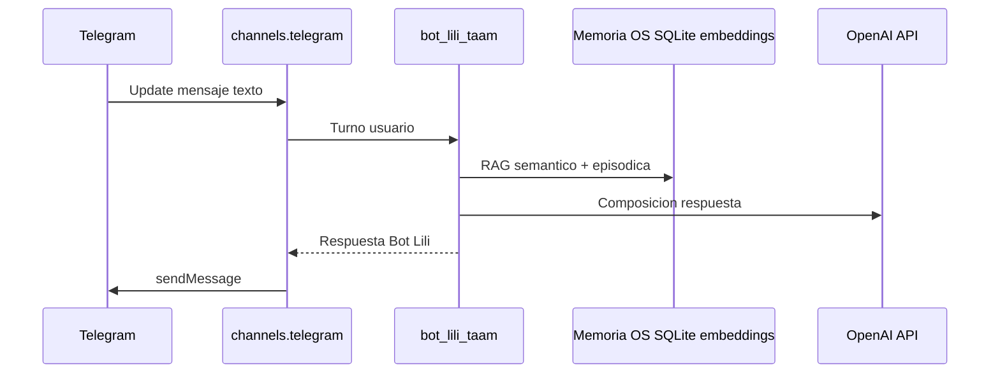
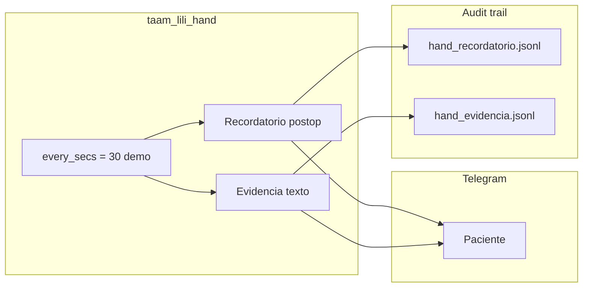
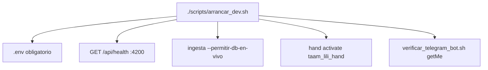

# Arquitectura operativa TAAM — Ruta B (OpenFang)

Guía para desarrollo, demostración y sustentación del **Bot posoperatorio TAAM** en `proyecto-3/`: **OpenFang** como Agent OS, canal **Telegram** nativo, Hand autonomo **`taam_lili_hand`**, ingesta Python hacia memoria del OS y bonus **t-SNE** sobre historial JSONL. Implementación **paralela** a la Ruta A en `proyecto-2/`; no sustituye M2 (`proyecto-1/`) ni el MVP LangChain adoptado en [decision-7](../decisions/decision-7%20-%20Arquitectura-M3-TAAM-Proyecto-2-Telegram-Ruta-A.md).

| Documento | Rol |
| --- | --- |
| [decision-8 — Arquitectura M3 Ruta B](../decisions/decision-8%20-%20Arquitectura-M3-TAAM-Proyecto-3-Ruta-B-OpenFang-Telegram-tSNE.md) | ADR adoptado (OpenFang puro, Telegram, t-SNE bonus) |
| [decision-7 — Arquitectura M3 Ruta A](../decisions/decision-7%20-%20Arquitectura-M3-TAAM-Proyecto-2-Telegram-Ruta-A.md) | MVP evaluable LangChain + FastAPI + OLTP |
| [doc-004 — Arquitectura TAAM Ruta A](doc-004%20-%20Arquitectura-M3-Bot-Posoperatorio-TAAM.md) | Guía operativa `proyecto-2/` |
| [doc-007 — Evaluacion OpenFang](doc-007%20-%20Evaluacion-OpenFang-Proyecto-2-TAAM.md) | Estudio viabilidad / gaps frente al dominio completo |
| [Caso de Uso TAAM](usecases/Caso%20de%20Uso%20TAAM%20-%20Bot%20Posoperatorio.md) | 5 UC-MVP, triage, Fase 2 |
| [Guion demo Ruta B](../../proyecto-3/docs/guion-demo-ruta-b.md) | Sustentación 15 min (TASK-133) |
| [README proyecto-3](../../proyecto-3/README.md) | Instalación, arranque, pruebas |

> **Ruta del curso en este repo:** Ruta A adoptada en `proyecto-2/` (decision-7) y Ruta B **demostrativa** en `proyecto-3/` (decision-8). Ambas coexisten con bots Telegram distintos.

## 1. Problema y solución MVP (Ruta B)

### Problema

1. Demostrar en sustentación la **Ruta B** del Módulo 3 (Agent OS, ingesta de conocimiento corporativo, Hand autónomo, canal Telegram) sin desmontar el MVP Ruta A.
2. Mapear casos de uso TAAM a capacidades reales de OpenFang, dejando **explícitos** los gaps frente al producto clínico completo.
3. Ofrecer un árbol `proyecto-3/` reproducible: config, Hand, ingesta, análisis t-SNE.

### Solución MVP (OpenFang puro)

| Pieza | Implementación |
| --- | --- |
| Runtime conversacional | Binario **OpenFang 0.6.9** + `openfang/openfang.toml` |
| Agente paciente | Manifest `openfang/agents/bot_lili_taam/agent.toml` |
| Canal paciente | **Telegram** bridge nativo (`[channels.telegram]`, token en `.env`) |
| RAG / conocimiento | Ingesta `ingesta/indexar_corpus_openfang.py` → Vector Store + Structured KV del OS |
| Memoria conversacional | Capas del OS (SQLite, embeddings, JSONL por `session_id`) |
| Automatización | Hand `taam_lili_hand` (cron demo `every_secs = 30`) |
| Staff / OLTP | **No** — dashboard OpenFang `:4200` + consulta JSONL |
| Bonus curso | Notebook t-SNE en `analisis_tsne/notebooks/` |

Corpus compartido en raíz del workspace: `data/markdown/`, PDFs bajo `data/taam/` (`UAO_WORKSPACE_ROOT`).

## 2. Comparativa Ruta A vs Ruta B

Sin contradecir [decision-7](../decisions/decision-7%20-%20Arquitectura-M3-TAAM-Proyecto-2-Telegram-Ruta-A.md) ni [decision-8](../decisions/decision-8%20-%20Arquitectura-M3-TAAM-Proyecto-3-Ruta-B-OpenFang-Telegram-tSNE.md).

| Tema | `proyecto-2/` (Ruta A) | `proyecto-3/` (Ruta B) |
| --- | --- | --- |
| **Ruta curso / ADR** | LangChain function calling + FastAPI ([decision-7](../decisions/decision-7%20-%20Arquitectura-M3-TAAM-Proyecto-2-Telegram-Ruta-A.md)) | OpenFang Agent OS ([decision-8](../decisions/decision-8%20-%20Arquitectura-M3-TAAM-Proyecto-3-Ruta-B-OpenFang-Telegram-tSNE.md)) |
| **Orquestación** | `create_agent` + tools Pydantic + `PostgresSaver` | Agente OpenFang + RAG memoria OS + Hand procedural |
| **API HTTP producto** | FastAPI `:8001`, `POST /chat`, webhook Telegram | Dashboard OpenFang `:4200` (`GET /api/health`); sin FastAPI TAAM |
| **Telegram** | Webhook en FastAPI (`POST /api/integracion/telegram/webhook`) | Bridge nativo OpenFang (`bot_token_env`) |
| **Bot BotFather** | Token dedicado Ruta A | Token **distinto** Ruta B |
| **Postgres OLTP** | DB `taam` (`casos_postoperatorio`, `vinculos_telegram`, `alertas_triage`, …) | **No** en MVP |
| **Qdrant** | Colección `taam_protocolos` (`:6334`) | **No** — vectores en memoria OpenFang |
| **Panel staff** | React `:5174`, JWT, alertas, conversación | Dashboard OS + scripts JSONL (sin React TAAM) |
| **Emparejamiento paciente** | Código + tabla `vinculos_telegram` | Solo contexto episódico del chat |
| **Triage / alertas** | `alertas_triage`, HITL en `urgente` | Escalación narrativa + KV `hand_escalacion` + guardrails |
| **Recordatorios** | Job asyncio + plantillas OLTP | Hand `taam_lili_hand` (cron) |
| **Evidencias** | Texto en MVP; multimedia Fase 2 | Hand pide **texto** por Telegram |
| **Ingesta corpus** | PDF → Qdrant (LangChain) | Markdown/PDF → memoria OpenFang (`uv run python ingesta/...`) |
| **Python auxiliar** | Runtime completo TAAM | Solo ingesta + t-SNE + tests (`uv` 3.12.12) |
| **Demo 15 min** | [GUION-DEMO-TAAM](usecases/GUION-DEMO-TAAM.md) + semilla Postgres | [guion-demo-ruta-b](../../proyecto-3/docs/guion-demo-ruta-b.md) + `arrancar_dev.sh` |
| **LLM por defecto** | OpenAI (comparable) | OpenAI en `[default_model]`; fallback Ollama documentado |

**Sesión canónica (ambas rutas):** `session_id` = `telegram:{chat_id}`.

## 3. Vista end-to-end (runtime)

### 3.1 Flujo paciente: Telegram → agente → respuesta



**Reglas clave:**

- Sin webhook FastAPI intermedio; el bridge es parte del daemon OpenFang.
- Secretos solo en `.env` (`OPENAI_API_KEY`, `TELEGRAM_BOT_TOKEN`).
- `OPENFANG_HOME` por defecto `proyecto-3/openfang/data/` (gitignore).

### 3.2 Hand autónomo: recordatorio y evidencia



En producción futura el schedule puede pasar a cron matutino (ver decision-8); en demo se usa intervalo corto para evidenciar proactividad.

### 3.3 Arranque desarrollo (un comando)



Detalle operativo: [README proyecto-3](../../proyecto-3/README.md) (TASK-131).

## 4. Mapeo casos de uso TAAM ↔ Ruta B

Referencia completa: [Caso de Uso TAAM](usecases/Caso%20de%20Uso%20TAAM%20-%20Bot%20Posoperatorio.md) y tabla en decision-8.

| # | Caso de uso (actor) | Cobertura `proyecto-3` | Mecanismo |
| --- | --- | --- | --- |
| 1 | Registrar procedimiento + PDF (admin) | **Parcial** | Ingesta hacia Vector Store + Structured KV; sin CRUD admin ni panel |
| 2 | Gestionar usuarios (admin) | **Fuera de scope** | — |
| 3 | Registrar procedimiento por paciente (asistente) | **Fuera de scope** | Sin OLTP de casos |
| 4 | Seguimiento / doble check triage (cirujano) | **Parcial** | Dashboard + JSONL; sin `alertas_triage` |
| 5 | Recordatorios de citas (Bot Lili) | **Fuera de scope MVP** | Sin email ni agenda |
| 6 | Recordatorio postoperatorio (Bot Lili) | **Cubierto** | Hand `taam_lili_hand` + Telegram |
| 7 | Requerir evidencias (Bot Lili) | **Parcial** | Evidencia en **texto**; sin multimedia |
| 8 | Chat con Bot Lili (paciente) | **Cubierto** | Agente + RAG memoria OS |
| 9 | Consultar / intervenir chat (clínico) | **Parcial** | Solo consulta dashboard / export; sin intervención en hilo |

**Trazabilidad UC-MVP del informe Ruta A:** ver [doc-004 §5](doc-004%20-%20Arquitectura-M3-Bot-Posoperatorio-TAAM.md) para la matriz completa en `proyecto-2/`.

## 5. Memoria de 6 capas (OpenFang) en TAAM

| Capa | Uso Bot Lili / TAAM |
| --- | --- |
| Working | Turno actual (síntoma, última pregunta) |
| Episodic | Historial por `telegram:{chat_id}` |
| Semantic (Vector Store) | Fragmentos de `data/markdown/` y PDFs TAAM ingeridos |
| Structured KV | Metadatos ligeros, flags recordatorio, disclaimer |
| Procedural (Hands) | `taam_lili_hand`: recordatorios y evidencias |
| Audit | JSONL de envíos Hand (`audit/hand_*.jsonl`) |

## 6. Guardrails y escalación clínica

Configuración declarativa en `proyecto-3/openfang/hands/taam_lili_hand/HAND.toml`:

| Clave | Propósito |
| --- | --- |
| `guardrails.no_diagnostico` | Prohibir diagnóstico médico en mensajes del Hand |
| `guardrails.disclaimer_obligatorio` | Disclaimer legal en salidas proactivas |
| `guardrails.escalar_palabras_alarma` | Frases que disparan escalación (p. ej. fiebre alta, sangrado abundante) |

Lógica compartida (tests TASK-126): `proyecto-3/src/guardrails/escalacion_clinica.py` — lectura de KV `{OPENFANG_HOME}/kv/hand_escalacion/{chat_id}.json`.

**Simulación sin Telegram en vivo:**

```bash
cd proyecto-3
uv run python scripts/evaluar_guardrail_entrada.py --chat-id CHAT_ID --texto "tengo fiebre alta" --solo-simular
```

Validación estática del manifest Hand: `uv run pytest tests/guardrails/ tests/test_hand_taam_lili.py -q`.

> **No sustituye** el triage OLTP ni la bandeja staff de Ruta A; en sustentación comparar explícitamente con UC-MVP-03/05 en `proyecto-2/`.

## 7. Componentes y rutas

| Componente | Responsabilidad | Ruta |
| --- | --- | --- |
| Config OS | Modelo, memoria, Telegram, Hands | `proyecto-3/openfang/openfang.toml` |
| Agente Lili | System prompt, tools OS | `proyecto-3/openfang/agents/bot_lili_taam/agent.toml` |
| Hand TAAM | Playbook autónomo | `proyecto-3/openfang/hands/taam_lili_hand/HAND.toml` |
| Skill / límites | Capacidades Hand | `proyecto-3/openfang/hands/taam_lili_hand/SKILL.md` |
| Adaptadores testeables | UC6 / UC7 en Python | `proyecto-3/src/hand/` |
| Datos runtime | SQLite, JSONL (gitignore) | `proyecto-3/openfang/data/` |
| Ingesta | Corpus → memoria OS | `proyecto-3/ingesta/indexar_corpus_openfang.py` |
| Historial UC4 | Lectura JSONL | `proyecto-3/src/openfang/`, `scripts/consultar_historial_sesion.py` |
| t-SNE | Embeddings + notebook | `proyecto-3/analisis_tsne/` |
| Arranque | E2E dev | `proyecto-3/scripts/arrancar_dev.sh` |
| Instalación OS | Pin 0.6.9 | `proyecto-3/scripts/instalar_openfang.sh` |

## 8. Verificación y demo

| Verificación | Comando / artefacto |
| --- | --- |
| Versión OpenFang | `openfang --version` (contiene 0.6.9) |
| Arranque completo | `cd proyecto-3 && ./scripts/arrancar_dev.sh` |
| Health dashboard | `curl -sS http://127.0.0.1:4200/api/health` |
| Tests unitarios (mocks) | `cd proyecto-3 && uv run pytest -q` (TASK-132) |
| Guion 15 min | [guion-demo-ruta-b.md](../../proyecto-3/docs/guion-demo-ruta-b.md) |
| Dashboard / JSONL | [dashboard-openfang.md](../../proyecto-3/docs/dashboard-openfang.md) |

**Fallback LLM (demo):** si OpenAI falla, `[default_model]` con `provider = "ollama"` — ver README § Fallback Ollama.

## 9. Limitaciones MVP y relación con Ruta A

| Fuera del MVP Ruta B | Dónde sí (Ruta A) |
| --- | --- |
| PostgreSQL casos, vínculos, alertas | `proyecto-2/` OLTP |
| Panel React staff | `proyecto-2/frontend/` |
| Webhook FastAPI Telegram | `proyecto-2/src/api/` |
| HITL formal en `urgente` | `HumanInTheLoopMiddleware` |
| Semilla demo `PAC-DEMO-*` | `scripts/sembrar_demo_taam.py` |
| Evidencias foto/audio/video | Fase 2 ambas rutas |

**Mitigación en informe:** citar siempre decision-7 (adoptada) y decision-8 (paralela); bots y `.env` separados.

## 10. Bonus t-SNE (Ruta Transversal B)

| Artefacto | Ruta |
| --- | --- |
| Extracción JSONL | `proyecto-3/src/openfang/` + scripts analisis_tsne |
| Notebook | `proyecto-3/analisis_tsne/notebooks/analisis_tsne.ipynb` |
| Fixtures demo (sin PHI) | `proyecto-3/tests/fixtures/tsne_*` |

Interpretación de clusters en el notebook; en sustentación enlazar con guardrails y vocabulario de alarma (min 12–15 del guion).

## 11. Referencias internas

- [decision-8 — Ruta B](../decisions/decision-8%20-%20Arquitectura-M3-TAAM-Proyecto-3-Ruta-B-OpenFang-Telegram-tSNE.md)
- [decision-7 — Ruta A](../decisions/decision-7%20-%20Arquitectura-M3-TAAM-Proyecto-2-Telegram-Ruta-A.md)
- [doc-004 — Arquitectura Ruta A](doc-004%20-%20Arquitectura-M3-Bot-Posoperatorio-TAAM.md)
- [m-1 — Milestone Ruta B](../milestones/m-1%20-%20taam-ruta-b-openfang.md)
- [m-0 — Milestone Ruta A](../milestones/m-0%20-%20agentic-final-project.md)
- [Actividad Módulo 3](actividades/Actividad%20del%20M%C3%B3dulo%203_%20Productizaci%C3%B3n,%20Despliegue%20Avanzado%20y%20Sistemas%20Ag%C3%A9nticos.md)

---

*Actualizar `updated_date` en el front matter si cambian versiones OpenFang, rutas o alcance tras nuevas tareas en `proyecto-3/`.*
