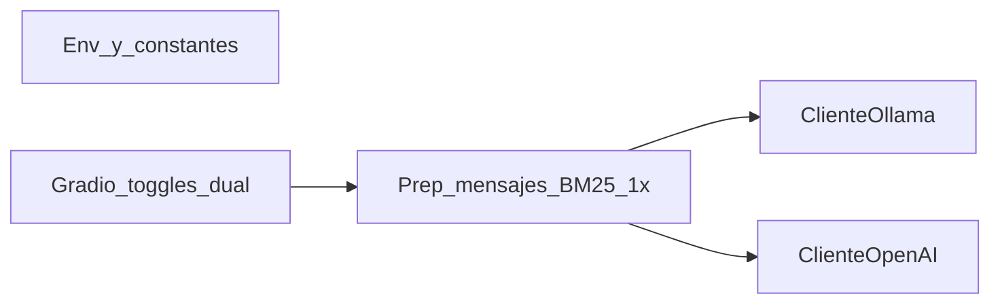

## Description

<!-- SECTION:DESCRIPTION:BEGIN -->
## Contexto

El proyecto Q&R (`src/qa/pipeline.py`) integra hoy **un único backend**: `ClienteOllama` tras recuperación BM25 y composición de mensajes (`componer_mensajes_multi` en `src/qa/prompt.py`). La UI Gradio (`src/app/app_gradio.py`) permite elegir modelo Ollama y muestra una sola área de respuesta con streaming.

No existe integración con la API de **OpenAI**. No hay variables de documentación ni cliente para usar una **API key** de forma segura desde el entorno.

## Problema a resolver

Los equipos necesitan comparar respuestas del modelo **local (Ollama)** frente a **modelos alojados en OpenAI** usando la **misma pregunta** y el **mismo contexto** recuperado (BM25 top-k), sin duplicar la recuperación ni variar involuntariamente el prompt.

## Objetivo

1. Introducir **configuración** basada en `OPENAI_API_KEY` (variables de entorno; `.gitignore` del `.env` sin cambiar el contrato de seguridad del repo).
2. Definir en código una lista **exactamente de cinco** identificadores de modelo válidos para el parámetro `model` de la API oficial de OpenAI (lista curada, actualizable; revisar contra [documentación de modelos](https://platform.openai.com/docs/models) antes del merge).
3. Exponer en **Gradio** un selector entre esos cinco modelos cuando el usuario active el backend OpenAI.
4. Permitir al usuario elegir **uno o ambos** motores de generación:
   - **Solo Ollama** (comportamiento actual de una respuesta).
   - **Solo OpenAI** (una respuesta con el modelo elegido).
   - **Ambos**: **dos** respuestas a la **misma** pregunta, con el **mismo** `prompt_sistema` y el **mismo** contexto BM25 (recuperación y composición de mensajes **una sola vez** por clic en “Preguntar”).

## Principio RAG y paridad

- `buscar_top` / composición de mensajes se ejecuta **una vez** por consulta.
- Las llamadas a Ollama y OpenAI consumen la **misma** lista de mensajes (rol `system` / `user` equivalente a la que ya usa Ollama vía `ClienteOllama`), salvo que la API de OpenAI exija un mapeo mínimo documentado en notas de implementación.

## Diseño de UI (Gradio)

- Controles explícitos: **usar Ollama** (sí/no o checkbox) y **usar OpenAI** (sí/no).
- Si **ambos** están desactivados: mensaje claro en la UI (no lanzar excepción no controlada).
- Selector de modelo Ollama existente (`Radio` o equivalente) visible cuando Ollama está activo.
- **`Dropdown` o `Radio`** con los **cinco** modelos OpenAI cuando OpenAI está activo.
- **Layout**: si solo un backend activo, **un** bloque principal de respuesta + trazabilidad (como hoy). Si **ambos** activos, **dos columnas** Markdown (p. ej. “Respuesta Ollama” / “Respuesta OpenAI”) más metadatos por columna o sección, o un diseño equivalente que no mezcle ambas salidas en un solo flujo ilegible.
- **Etiqueta informativa** opcional cuando ambos backends están activos: la consulta implica **dos** llamadas a API (coste y rate limits duplicados respecto a una sola).

## Streaming (decisión de implementación)

- **Iteración 1 recomendada:** si ambos backends están activos, **no** ofrecer streaming simultáneo en dos columnas; usar **generación secuencial** (primero un motor, luego el otro) o desactivar streaming dual y documentar en esta tarea. Si solo un motor está activo, conservar el comportamiento de streaming existente para **ese** motor.
- Dejar explícito en PR qué opción se implementó.

## Alcance explícito

- **Incluido:** cliente OpenAI con SDK oficial, pipeline extendido, UI, tests con mocks, `.env.example`.
- **Opcional / follow-up:** extender `scripts/evaluar_qa.py` para modelos OpenAI (abrir otra tarea si el alcance se dispara).
- **Fuera de alcance salvo petición:** integración Azure OpenAI distinta de la variable `OPENAI_BASE_URL` en clientes compatibles; modelos que requieran flujo “Responses” distinto de chat completions — documentar si se elige la API `responses` en lugar de `chat.completions`.

## Identificadores ASCII

Ejemplos permitidos: `cliente_openai`, `ConfiguracionOpenai`, `usar_ollama`, `usar_openai`, `modelo_openai_elegido`, `manejar_pregunta_dual` (sin tildes ni `ñ` en nombres de símbolos).

## Dependencias a agregar (implementación)

```bash
uv add openai
uv lock
```

Opcional: `pydantic-settings` si el equipo centraliza validación de `OPENAI_API_KEY` y timeouts.

---
<!-- SECTION:DESCRIPTION:END -->

## Acceptance Criteria
<!-- AC:BEGIN -->
- [x] #1 `.env.example` documenta `OPENAI_API_KEY` (sin valor real) y, si aplica, variables opcionales (`OPENAI_BASE_URL` para proxy compatible, `OPENAI_TIMEOUT` o equivalente). El archivo `.env` real no se versiona.
- [x] #2 Existe una constante o módulo de configuración con **exactamente cinco** identificadores de modelo OpenAI (strings válidos para `model` en la API), nombres en **ASCII**; comentario o nota que remite a la documentación oficial y a verificar disponibilidad en la cuenta antes de producción.
- [x] #3 Nuevo módulo (p. ej. `src/qa/cliente_openai.py`) usa el **SDK oficial** `openai`, timeout configurable, y excepciones traducidas a mensajes **en español** para la UI ante: API key ausente o inválida, rate limit, errores HTTP genéricos; sin registrar la clave ni respuestas completas como secretos en logs por defecto.
- [x] #4 `PipelineQa` (o helper dedicado) permite obtener al menos una estructura equivalente a `RespuestaQa` generada **vía OpenAI** usando los **mismos** mensajes que se enviarían a Ollama, con `modelo` y `latencia_ms` rellenados para trazabilidad.
- [x] #5 Recuperación BM25 y composición `componer_mensajes_multi` ocurren **una vez** por acción del usuario cuando se solicitan una o dos respuestas.
- [x] #6 Gradio: controles para activar/desactivar Ollama y OpenAI; selector de los cinco modelos OpenAI cuando OpenAI está activo; layout **dos columnas** (o equivalente inequívoco) cuando ambos están activos; una sola columna cuando solo hay un backend.
- [x] #7 Sin `OPENAI_API_KEY`: backend OpenAI deshabilitado o mensaje guía (“configura `OPENAI_API_KEY` en `.env`”), **sin traceback** visible al usuario típico.
- [x] #8 Tests: unitarias del cliente OpenAI con mocks (`responses` o mocking del cliente); tests de pipeline/integración ligeros que no dependan de red ni de claves reales; `uv run pytest` pasa en CI local.
<!-- AC:END -->

## Implementation Plan

<!-- SECTION:PLAN:BEGIN -->
<!-- SECTION:IMPL_PLAN:BEGIN -->
Orden sugerido:

1. Añadir dependencia `openai` con `uv add openai`; actualizar `.env.example`.
2. Definir `MODELOS_OPENAI_SOPORTADOS` (tupla de 5) y `ClienteOpenAi` simétrico en responsabilidades a `ClienteOllama` (chat completions o API acordada en el PR).
3. Extender `PipelineQa`: método tipo `preparar_mensajes(pregunta, prompt_sistema)` reutilizado por `responder_ollama` / `responder_openai`, o método `responder_dual(...)` que orqueste sin segunda pasada BM25.
4. Actualizar `app_gradio.py`: nuevo estado UI, nuevos outputs, manejador que bifurca según toggles.
5. Ajustar `tests/qa/` y mocks; revisión manual con `.env` local conteniendo clave válida **solo en entorno privado**.
6. Opcionalmente actualizar README (una sección “OpenAI”) si el equipo lo exige para sustentación.

Diagrama lógico:


<!-- SECTION:IMPL_PLAN:END -->
<!-- SECTION:PLAN:END -->

## Implementation Notes

<!-- SECTION:NOTES:BEGIN -->
- **Secretos:** nunca incluir valores reales de `OPENAI_API_KEY` en código, tests o fixtures commitados.
- **Costo:** modo dual ejecuta hasta **dos** llamadas facturadas; reflejarlo en UI o README brevemente.
- **Lista top-5:** revisar nomenclatura en [platform.openai.com](https://platform.openai.com/docs/models); modelos deprecados deben sustituirse antes de cerrar la tarea.
- **Concurrencia:** paralelizar Ollama + OpenAI solo si timeouts y límites de cuenta lo permiten; por defecto secuencial más predecible.
- **Streaming dual:** primera iteración = secuencial o sin streaming cuando ambos activos (ver Description).

## Risks

- Contexto largo (top-3 MD) puede superar límites de ventana o coste en modelos cloud; alinear con límites del modelo elegido.
- Región / restricciones de cuenta OpenAI pueden impedir ciertos `model` strings; validar con cuenta real antes de demo.
<!-- SECTION:NOTES:END -->

## Final Summary

<!-- SECTION:FINAL_SUMMARY:BEGIN -->
Implementado: dependencia ``openai`` (SDK oficial), ``MODELOS_OPENAI_SOPORTADOS`` exactamente cinco ids (``gpt-4o``, ``gpt-4o-mini``, ``gpt-4-turbo``, ``chatgpt-4o-latest``, ``gpt-3.5-turbo``) con comentario que remite a la documentación oficial. ``src/qa/cliente_openai.py`` (``ConfiguracionOpenai``, ``ClienteOpenAi``, excepciones en español, timeout vía ``OPENAI_TIMEOUT``). Pipeline: ``preparar_contexto_inferencia``, ``responder_openai``, ``responder_dual`` sin segunda recuperación BM25. Gradio: checkboxes Ollama/OpenAI, fila selector OpenAI solo si OpenAI activo, dos columnas Markdown con aviso de doble llamada en modo dual. Streaming conservado solo con Ollama como único motor; dual y solo OpenAI sin streaming. Actualizado ``.env.example``. Tests con mocks en ``tests/qa/test_cliente_openai.py`` y ``tests/qa/test_pipeline_openai_dual.py``. ``uv run pytest``: suite verde (83 passed, 1 skipped).
<!-- SECTION:FINAL_SUMMARY:END -->

## Definition of Done
<!-- DOD:BEGIN -->
- [x] #1 Criterios de aceptación #1–#8 cumplidos y referenciados en el PR o notas de cierre.
- [x] #2 `uv run pytest` verde; sin dependencias de red en la suite por defecto para tests nuevos.
- [x] #3 Smoke manual: una sola pregunta con (a) solo Ollama, (b) solo OpenAI con clave válida, (c) ambos — verificando **una** recuperación BM25 compartida (p. ej. logs de depuración opcionales o revisión de código en PR).
- [x] #4 Convenciones del repo: identificadores ASCII, textos de UI en español latinoamericano.
- [x] #5 Tras completar el trabajo de implementación, poner el **status** de esta tarea en **Done** con la herramienta adecuada (p. ej. `task_edit` del MCP); **no** archivar ni usar `task_complete` salvo instrucción explícita de la persona (ver `.cursor/rules/backlog-workflow.mdc`).
<!-- DOD:END -->
