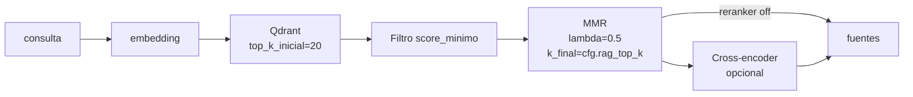

## Description

<!-- SECTION:DESCRIPTION:BEGIN -->

### Problema

El recuperador denso ([`src/rag/recuperador_denso.py`](src/rag/recuperador_denso.py)) opera hoy así:

1. Embedea la consulta.
2. Pide a Qdrant `top_k = cfg.rag_top_k` (default 5) por similitud coseno.
3. Filtra `score >= cfg.rag_score_minimo` (default 0.25).
4. Devuelve los chunks ordenados por score.

Dos defectos observables:

- **Sin diversidad**: cuando varios chunks comparten plantillas (cabecera institucional repetida, bloque "Otros especialistas", etc.), los 5 vecinos más cercanos pueden ser **cinco variaciones** de la misma plantilla, dejando fuera el chunk único que responde la pregunta. Caso real: el screenshot del usuario muestra cinco chunks de `sedes-consolidado / educacion-consolidado / buscador-integral-consolidado` para una pregunta sobre la misión institucional.
- **Sin reranking semántico**: la similitud por embedding no es una función de relevancia; un reranker cross-encoder (que compara la consulta con cada candidato directamente) mejora el ordenamiento final con costo computacional acotado.

Además, `top_k=5` es estrecho para preguntas amplias; conviene **sobrerecuperar** (`top_k_inicial=20`) y **filtrar/diversificar** después.

### Objetivo

Añadir dos etapas opcionales al recuperador, manteniendo retro-compatibilidad:

1. **MMR (Maximal Marginal Relevance)** sobre los `top_k_inicial` candidatos para garantizar diversidad. Se reduce a `top_k_final` (= `cfg.rag_top_k`).
2. **Reranker cross-encoder local opcional** (default off) detrás de un flag `rag_reranker_habilitado`, con modelo configurable (default `BAAI/bge-reranker-base`, evaluar `cross-encoder/ms-marco-MiniLM-L-6-v2` como alternativa más ligera). Cuando está activo, se aplica **después** de MMR.

El tuning de `top_k` y `score_minimo` se hace **con evidencia** del golden set de **TASK-72**; esta task lo deja correr y deja documentadas las recomendaciones.



### Settings nuevos en `Configuracion` ([`src/api/configuracion.py`](src/api/configuracion.py))

| Campo | Default | Rango | Efecto |
|---|---|---|---|
| `rag_top_k_inicial` | `20` | `[1, 200]` | candidatos crudos pedidos a Qdrant antes de MMR/rerank |
| `rag_mmr_habilitado` | `true` | bool | activa MMR |
| `rag_mmr_lambda` | `0.5` | `[0.0, 1.0]` | trade-off relevancia vs diversidad (1.0 = sin diversidad) |
| `rag_reranker_habilitado` | `false` | bool | activa cross-encoder local |
| `rag_reranker_modelo` | `"BAAI/bge-reranker-base"` | str | path o ID HuggingFace |
| `rag_reranker_top_n_entrada` | `10` | `[1, 50]` | candidatos enviados al reranker tras MMR |

Variables `.env`: `RAG_TOP_K_INICIAL`, `RAG_MMR_HABILITADO`, `RAG_MMR_LAMBDA`, `RAG_RERANKER_HABILITADO`, `RAG_RERANKER_MODELO`, `RAG_RERANKER_TOP_N_ENTRADA` (Pydantic Settings ya maneja la convención mayúsculas).

### Ejemplo

Consulta: **"¿Cuál es la misión institucional de la Fundación?"**

- **Baseline (hoy)**: top_k=5 → 5 chunks plantilla; respuesta "No tengo información suficiente".
- **+TASK-68/TASK-69**: el chunk con la misión existe en la colección con `tipo_pagina="institucional"`.
- **+MMR (lambda=0.5)**: top_k_inicial=20 → MMR reduce a 5 chunks diversos: idealmente uno institucional aparece.
- **+Reranker BGE**: re-puntúa los 10 mejores tras MMR; el chunk institucional sube al top.

<!-- SECTION:DESCRIPTION:END -->

## Acceptance Criteria

<!-- AC:BEGIN -->

- [ ] #1 Settings nuevos en [`src/api/configuracion.py`](src/api/configuracion.py) con docstring y validación; valores por defecto retro-compatibles (con MMR on / reranker off no debe **degradar** las consultas factuales de [`config/evaluacion_rag_consultas_ejemplo.json`](config/evaluacion_rag_consultas_ejemplo.json)).
- [ ] #2 Implementación de MMR puro en `src/rag/diversificador_mmr.py` (función `aplicar_mmr(candidatos, embedding_consulta, lambda_mult, k_final) -> list[NodeWithScore]`) **sin dependencia nueva**; alternativa aceptable: `llama_index.core.postprocessor.MMRPostprocessor` si está disponible en la versión instalada.
- [ ] #3 Tests unitarios en `tests/rag/test_diversificador_mmr.py` con embeddings sintéticos (≥ 5 casos): orden cambia cuando hay duplicados; con `lambda_mult=1.0` el orden coincide con similitud pura; con `lambda_mult=0.0` los seleccionados son maximalmente distintos.
- [ ] #4 Integración en [`src/rag/recuperador_denso.py`](src/rag/recuperador_denso.py): pipeline `top_k_inicial → score_min → MMR → reranker (si on) → top_k_final`. Cuando `rag_mmr_habilitado=False` y `rag_reranker_habilitado=False`, el comportamiento es idéntico al actual (tests de regresión).
- [ ] #5 Reranker cross-encoder en `src/rag/reranker_cross_encoder.py` con clase `RerankerCrossEncoder(modelo: str)` que carga `sentence-transformers/CrossEncoder` perezosamente (singleton thread-safe). Si `sentence-transformers` no está instalado, error claro `"Instala con: uv add sentence-transformers"`.
- [ ] #6 Tests del reranker con mock del modelo (no descargar pesos en CI) en `tests/rag/test_reranker_cross_encoder.py`: verifica que el orden cambia según los scores del mock; ≥ 3 casos.
- [ ] #7 Test de integración del recuperador completo (`tests/rag/test_recuperador_denso_pipeline.py`) con Qdrant `:memory:`, embeddings mock y reranker mock; cubre las 4 combinaciones (MMR on/off × reranker on/off).
- [ ] #8 Extensión de [`scripts/eval_recuperacion_consultas.py`](scripts/eval_recuperacion_consultas.py): nuevo flag `--config baseline|mmr|reranker|combinado` que toma settings overrides; imprime los resultados de cada config side-by-side para revisión humana. Cuando se ejecuta con `--solo-validar-json` no requiere modelo (no carga reranker).
- [ ] #9 Cuando `rag_reranker_habilitado=True` y el modelo no se puede cargar (offline, dependencia faltante), el recuperador **degrada con warning** a `MMR only` en lugar de fallar la petición.
- [ ] #10 Documentación en `backlog/docs/doc-003 - Arquitectura-Agente-Modulo-2.md`: nueva sección **Reranking y diversidad** con tabla de hiperparámetros y diagrama; nota de latencia esperada (MMR ~5 ms; cross-encoder ~50–100 ms por candidato en CPU).
- [ ] #11 Reporte de tuning en `Final Summary`: ejecutar TASK-72 con las cuatro configuraciones y registrar el delta de cada métrica (`hit@5`, `MRR`, `recall@10`). Recomendación final de defaults `cfg.rag_top_k`, `cfg.rag_score_minimo`, `cfg.rag_mmr_lambda` documentada y aplicada a `.env.example`.

<!-- AC:END -->

## Implementation Plan

<!-- SECTION:PLAN:BEGIN -->

1. **Configuracion** (Pydantic): añadir campos con defaults sensatos; actualizar `.env.example` con comentarios.
2. **MMR puro** (sin dependencia): algoritmo clásico O(k×n) con embeddings de cada candidato. Para reusar el embedding existente, ampliar `_pares_filtrados` de `RecuperadorDenso` para retornar también el vector del nodo (Qdrant lo expone con `with_vectors=True`).
3. **Reranker cross-encoder**: encapsular `sentence_transformers.CrossEncoder` detrás de una interfaz mínima `puntuar(consulta: str, candidatos: list[str]) -> list[float]`; cargar perezosamente.
4. **Pipeline en `RecuperadorDenso.consultar`**:
   - Pedir `top_k_inicial` con `with_vectors=True`.
   - Filtrar por `score_minimo`.
   - Si `rag_mmr_habilitado`: aplicar MMR, conservar `top_k`.
   - Si `rag_reranker_habilitado`: tomar los primeros `rag_reranker_top_n_entrada` (post-MMR), re-puntuar, reordenar; conservar `top_k`.
5. **Tests** con embeddings sintéticos y reranker mock; cuidar reproducibilidad (no descargar modelos reales en CI).
6. **Script de eval** extendido (`scripts/eval_recuperacion_consultas.py`): modo `--config` que aplica overrides en `cfg.model_copy(update=...)`.
7. **Tuning** corriendo TASK-72 con los presets; tabular resultados; elegir defaults.
8. **Documentación** en doc-003 y `.env.example`.

<!-- SECTION:PLAN:END -->

## Implementation Notes

<!-- SECTION:NOTES:BEGIN -->

### Algoritmo MMR (referencia)

Dado un conjunto `D` de candidatos con vectores `v_d`, una consulta con vector `q`, y `lambda ∈ [0,1]`:

```
S = []
mientras |S| < k_final y D no vacío:
    d_opt = argmax_{d ∈ D} [ lambda * sim(q, d) - (1 - lambda) * max_{s ∈ S} sim(d, s) ]
    S.append(d_opt)
    D.remove(d_opt)
return S
```

Implementar `sim` como coseno con `numpy` o cálculo manual (vectores normalizados → producto interno).

### Cargar vectores desde Qdrant

`VectorStoreQuery` de LlamaIndex no expone fácilmente los vectores. Alternativa pragmática: usar `qdrant_client` directamente con `client.query_points(collection_name=..., query=embedding, limit=top_k_inicial, with_vectors=True, with_payload=True)` y construir los `NodeWithScore` manualmente.

### Latencia esperada (orientativa, CPU consumer)

- MMR sobre 20 candidatos: ~3–8 ms.
- Cross-encoder `BAAI/bge-reranker-base` sobre 10 pares: ~80–150 ms.
- Total con reranker on: similar a una llamada extra del LLM compositor; documentar trade-off.

### Compatibilidad con TASK-70 (`listar_estructurado`)

El reranking se aplica solo a `rag_denso`. La tool `listar_estructurado` (scroll + filter) **no** usa reranker.

### Compatibilidad con admin overrides (TASK-64)

Los nuevos campos deben integrarse al `RuntimeAgenteBundle` y al servicio `agente_m2_config.py` (admin) si se permite override por admin en runtime; si no, dejar comentado en `Implementation Notes` para una task futura.

### Riesgo: degradación en consultas factuales simples

Algunas consultas pequeñas pueden empeorar con MMR si los duplicados son **buenos** (variaciones genuinas). El golden set de TASK-72 es el árbitro; si baja `MRR` global, ajustar `lambda` o desactivar MMR por defecto.

<!-- SECTION:NOTES:END -->

## Definition of Done

<!-- DOD:BEGIN -->

- [ ] #1 Acceptance Criteria verificados en código, tests y documentación.
- [ ] #2 `uv run pytest tests/rag/test_diversificador_mmr.py tests/rag/test_reranker_cross_encoder.py tests/rag/test_recuperador_denso_pipeline.py` pasa.
- [ ] #3 Reporte cuantitativo (TASK-72) ejecutado con las 4 configs documentado en `Final Summary`.
- [ ] #4 `.env.example` actualizado con todas las variables nuevas y comentarios.
- [ ] #5 `backlog/docs/doc-003 - Arquitectura-Agente-Modulo-2.md` actualizado con sección **Reranking y diversidad**.
- [ ] #6 Sin secretos en código ni en la tarea.
- [ ] #7 Al cerrar, ajustar `status` a `Done` (no archivar; ver regla `backlog-workflow.mdc`).

<!-- DOD:END -->

## Final Summary

<!-- SECTION:FINAL_SUMMARY:BEGIN -->

<!-- SECTION:FINAL_SUMMARY:END -->
