# Arquitectura TAAM — proyecto-2 (Módulo 3)

Documento de referencia técnica del **Bot posoperatorio TAAM** (Telegram Asistente de Acompañamiento Médico). Complementa la guía operativa en [README.md](README.md) y el informe de arquitectura en [doc-004](../backlog/docs/doc-004%20-%20Arquitectura-M3-Bot-Posoperatorio-TAAM.md), con mayor detalle en componentes, datos y flujos por actor.

| Documento | Rol |
| --- | --- |
| **Este archivo** | Vista técnica completa: capas, módulos, stack, datos, API, agente, diagramas de secuencia |
| [README.md](README.md) | Guía paso a paso, comandos, variables `.env`, usuarios demo |
| [doc-004](../backlog/docs/doc-004%20-%20Arquitectura-M3-Bot-Posoperatorio-TAAM.md) | Comparativa M2/M3, matriz rubrica LangChain, outline informe |
| [decision-7](../backlog/decisions/decision-7%20-%20Arquitectura-M3-TAAM-Proyecto-2-Telegram-Ruta-A.md) | ADR adoptado: Ruta A LangChain, Telegram vía 2 |

---

## 1. Introducción y contexto

### 1.1 Problema

La Fundación Valle del Lili necesita **acompañar pacientes en postoperatorio** (medicación, cuidados, señales de alarma) sin depender solo de visitas presenciales. El personal clínico requiere visibilidad de interacciones y de casos que requieren revisión humana, **sin mezclar** datos con el asistente institucional del Módulo 2 (`proyecto-1/`).

### 1.2 Solución MVP (TAAM)

| Pieza | Implementación |
| --- | --- |
| Canal paciente | **Telegram** (bot Lili); integración **vía 2**: webhook en el mismo FastAPI — sin N8N, sin WhatsApp, sin polling |
| Agente | **Ruta A LangChain**: `create_agent` + tools Pydantic + `HumanInTheLoopMiddleware` opcional |
| Memoria conversacional | `AsyncPostgresSaver` (checkpointer LangGraph); `thread_id` = `session_id` = `telegram:{chat_id}` |
| Identidad paciente ↔ chat | OLTP: `vinculos_telegram` + código de emparejamiento (TTL 24 h) |
| RAG | Protocolos PDF/Markdown en `data/taam/` → colección Qdrant `taam_protocolos` |
| Panel staff | React 19 + Vite 8; JWT Bearer (`asistente`, `clinico`, `admin`) |
| Recordatorios | Job asyncio en lifespan; plantillas por tipo de procedimiento; solo Telegram |

### 1.3 Aislamiento respecto a proyecto-1 (M2)

Ambos proyectos comparten el **workspace** (`data/` en la raíz del repo) vía [`src/rutas_workspace.py`](src/rutas_workspace.py). **No** hay imports de runtime entre proyectos.

| Tema | proyecto-1 (M2) | proyecto-2 (TAAM) |
| --- | --- | --- |
| Producto | Asistente institucional FVL | Bot posoperatorio TAAM |
| Orquestación | LangGraph (router + SSE) | LangChain `create_agent` |
| API conversacional | `POST /api/agente/stream` | `POST /chat` (JSON) + webhook Telegram |
| Postgres OLTP | DB `app`, host **15432** | DB **`taam`**, host **15433** |
| Memoria LLM | `PostgresChatMessageHistory` | `PostgresSaver` checkpointer |
| Qdrant | Colecciones `corpus_*`, REST **6333** | Colección `taam_protocolos`, REST **6334** |
| Corpus vectorial | `data/markdown/` | Solo `data/taam/procedimientos/{uuid}/` |
| Auth panel | Cookie sesión DocId | JWT staff |
| API HTTP (dev) | **8000** | **8001** |
| Frontend Vite | **5173** | **5174** |

Comparativa ampliada: [doc-004 §2](../backlog/docs/doc-004%20-%20Arquitectura-M3-Bot-Posoperatorio-TAAM.md).

---

## 2. Vista de contenedores (C4 nivel 2)

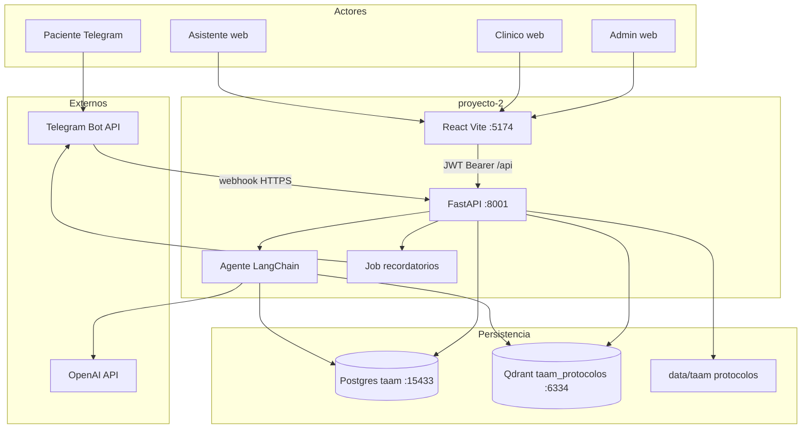

**Principio de diseño:** un solo proceso FastAPI concentra webhook Telegram, API staff/admin, agente y scheduler de recordatorios. No hay orquestador externo (N8N) ni microservicios adicionales en el MVP.

---

## 3. Capas y módulos del backend

### 3.1 Mapa de carpetas `src/`

| Módulo | Responsabilidad | Archivos representativos |
| --- | --- | --- |
| [`src/api/`](src/api/) | HTTP, routers, esquemas Pydantic, servicios de dominio | [`main.py`](src/api/main.py), [`routers/`](src/api/routers/), [`servicios/chat.py`](src/api/servicios/chat.py) |
| [`src/agentes/`](src/agentes/) | `create_agent`, tools, guardrails, HITL, checkpointer | [`agente_taam.py`](src/agentes/agente_taam.py), [`servicio.py`](src/agentes/servicio.py), [`tools/`](src/agentes/tools/) |
| [`src/integracion/telegram/`](src/integracion/telegram/) | Webhook, cliente Bot API, formateo Markdown | [`manejador.py`](src/integracion/telegram/manejador.py), [`cliente.py`](src/integracion/telegram/cliente.py) |
| [`src/integracion/recordatorios/`](src/integracion/recordatorios/) | Scheduler asyncio, programación de envíos | `scheduler.py`, `programacion.py` |
| [`src/ingesta/`](src/ingesta/) + [`src/rag/`](src/rag/) | PDF/MD → chunks → embeddings → Qdrant | [`protocolo_ingesta.py`](src/ingesta/protocolo_ingesta.py), [`vector_store.py`](src/rag/vector_store.py) |
| [`src/persistencia/`](src/persistencia/) | SQLAlchemy 2 async, modelos ORM, repositorios | [`modelos.py`](src/persistencia/modelos.py), `repositorios/` |
| [`src/configuracion.py`](src/configuracion.py) | `pydantic-settings`, lectura de `.env` | — |
| [`src/rutas_workspace.py`](src/rutas_workspace.py) | Resolución de `data/` en el monorepo | — |

### 3.2 Routers FastAPI

Registrados en [`src/api/main.py`](src/api/main.py):

| Router | Prefijo | Tag / propósito |
| --- | --- | --- |
| `salud` | `/api` | Health check |
| `auth_staff` | `/api/auth/staff` | Login JWT |
| `admin_procedimientos` | `/api/admin` | Catálogo protocolos + ingesta |
| `admin_medicos` | `/api/admin` | Catálogo médicos |
| `admin_recordatorios_job` | `/api/admin` | Config job recordatorios |
| `admin_agente_hitl` | `/api/admin` | Toggle HITL en escalamiento |
| `admin_telegram_webhook` | `/api/admin` | Registrar/consultar webhook |
| `staff_casos` | `/api/staff` | Casos, emparejamiento, tipos, médicos |
| `staff_seguimiento` | `/api/staff` | Alertas, conversación, HITL staff |
| `staff_dashboard` | `/api/staff` y `/api/admin` | KPIs panel |
| `telegram_emparejar` | `/api/telegram` | Emparejamiento interno |
| `telegram_webhook` | `/api/integracion/telegram` | Webhook canónico M3 |
| `chat` | `/` | `POST /chat` (mismo servicio que webhook) |

### 3.3 Lifespan de la aplicación

Al arrancar ([`main.py`](src/api/main.py)):

1. **Motor SQLAlchemy async** hacia Postgres `taam` (o SQLite en tests).
2. **Checkpointer:**
   - Producción/Docker: `AsyncPostgresSaver` vía [`gestionar_checkpointer_postgres_async`](src/agentes/checkpointer.py).
   - Tests SQLite: `MemorySaver` + `create_all` de tablas OLTP.
3. **Estado operativo** en `app.state`: job recordatorios (`config_operativa_taam`) y HITL (`agente_hitl_escalar_habilitado`) con hot-reload desde panel admin.
4. **Tarea asyncio** `ejecutar_bucle_recordatorios` en background; se cancela limpiamente al shutdown.

---

## 4. Stack tecnológico

### 4.1 Backend

Definido en [`pyproject.toml`](pyproject.toml). Python **3.12.12** exacto; gestión con **uv**.

| Capa | Tecnología |
| --- | --- |
| HTTP | FastAPI, Uvicorn, pydantic-settings |
| OLTP | SQLAlchemy 2 async, Alembic, asyncpg, psycopg |
| Auth staff | PyJWT (HS256), bcrypt |
| Agente | LangChain `create_agent`, LangGraph checkpointer (`langgraph-checkpoint-postgres`) |
| LLM / embeddings | langchain-openai (`init_chat_model`, `OpenAIEmbeddings`) |
| RAG | langchain-qdrant, qdrant-client |
| Ingesta | pdfplumber, PyYAML, langchain-text-splitters |
| Resiliencia ingesta | tenacity (reintentos con backoff) |

### 4.2 Frontend

Definido en [`frontend/package.json`](frontend/package.json).

| Capa | Tecnología |
| --- | --- |
| UI | React 19, TypeScript strict, Vite 8 |
| Estilos | Tailwind CSS v4, shadcn/ui (Radix), lucide-react |
| Datos | TanStack Query v5, Zod |
| UX | sonner (toasts), next-themes, recharts (dashboard) |
| Markdown | react-markdown, remark-gfm |

Proxy dev: `/api` → `http://127.0.0.1:8001` ([`frontend/vite.config.ts`](frontend/vite.config.ts)).

### 4.3 Infraestructura local

[`docker-compose.yml`](docker-compose.yml):

| Servicio | Imagen / build | Puerto host (defecto) |
| --- | --- | --- |
| `postgres` | postgres:17.9-alpine | **15433** |
| `qdrant` | qdrant/qdrant:v1.18.0 | REST **6334**, gRPC **6335** |
| `pgweb` | sosedoff/pgweb:0.16.2 | **8082** |
| `api` | Dockerfile local | **8001** |

El contenedor `api` ejecuta `alembic upgrade head` al arrancar ([`scripts/docker_entrypoint.sh`](scripts/docker_entrypoint.sh)) y opcionalmente semilla demo.

---

## 5. Modelo de datos

### 5.1 Diagrama entidad-relación (OLTP)

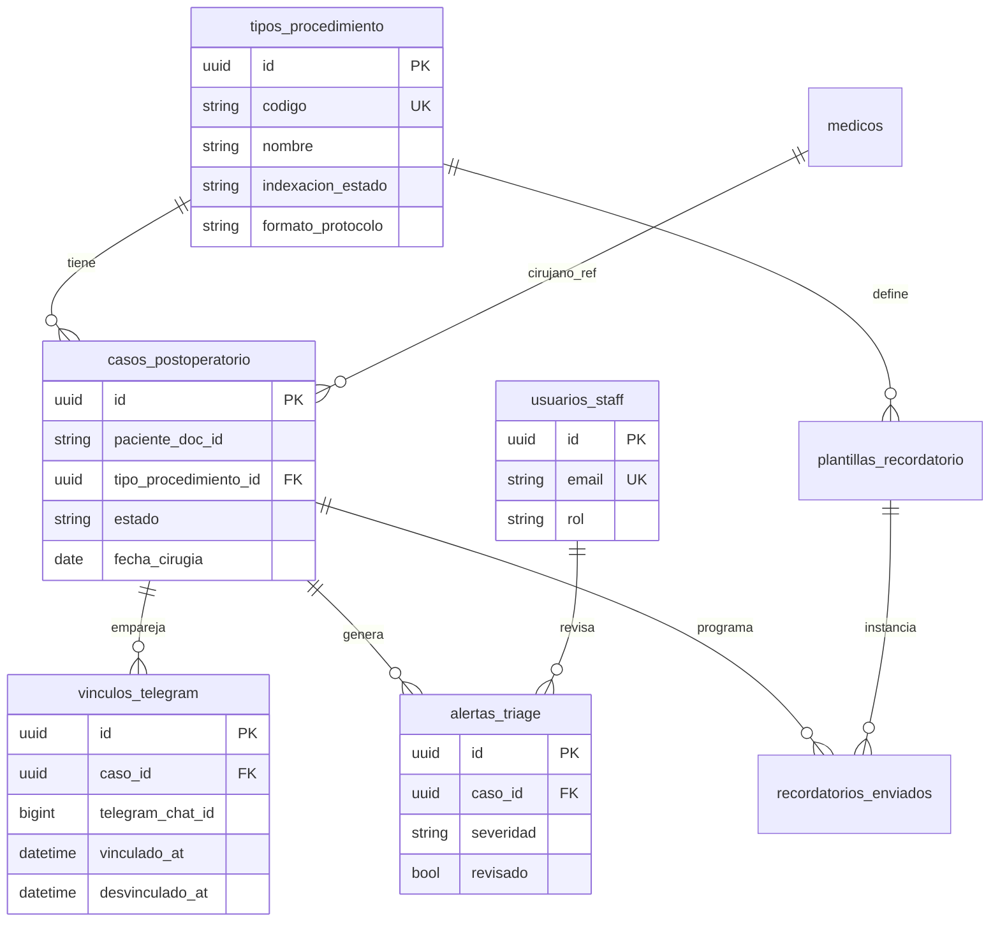

### 5.2 Tablas principales

Definidas en [`src/persistencia/modelos.py`](src/persistencia/modelos.py). Migraciones en [`alembic/versions/`](alembic/versions/).

| Tabla | Propósito |
| --- | --- |
| `tipos_procedimiento` | Catálogo quirúrgico; estado de indexación Qdrant (`pendiente` \| `ok` \| `error`) |
| `medicos` | Catálogo de cirujanos (`codigo_registro` alineado con `cirujano_id` en casos) |
| `casos_postoperatorio` | Paciente + procedimiento + cirujano + notas; `estado` activo/cerrado |
| `vinculos_telegram` | Emparejamiento `telegram_chat_id` ↔ caso; índice único parcial si `desvinculado_at IS NULL` |
| `telegram_updates_procesados` | Idempotencia de updates Telegram (`update_id` PK) |
| `alertas_triage` | Bandeja clínica; severidad `info` \| `seguimiento` \| `urgente`; auditoría de revisión |
| `plantillas_recordatorio` | Textos por tipo de procedimiento (`medicacion`, `terapia`, `control`) |
| `recordatorios_enviados` | Cola de envíos programados (`pendiente` → `enviado` \| `error`) |
| `usuarios_staff` | Credenciales panel; roles `asistente` \| `clinico` \| `admin` |
| `config_operativa_taam` | Singleton (`id=1`): intervalo job recordatorios, flag HITL |

### 5.3 Datos fuera de Postgres OLTP

| Dato | Ubicación | Notas |
| --- | --- | --- |
| Historial conversacional | Checkpointer (`PostgresSaver`) | `thread_id` = `telegram:{chat_id}`; **no** tablas `chat_history` de M2 |
| Vectores protocolo | Qdrant colección `taam_protocolos` | Única ingesta vectorial TAAM |
| Archivos protocolo | `data/taam/procedimientos/{uuid}/protocolo.pdf` o `.md` | Volumen Docker en `/app/data/taam` |
| FAQs postoperatorias | `data/structured/taam_faqs.json` | Tool determinista; **sin** embeddings |
| Prompts agente | Código en `src/agentes/prompts.py` | `@dynamic_prompt`; **sin** Qdrant |

---

## 6. Agente conversacional (Ruta A)

Documentación operativa del módulo: [`src/agentes/README.md`](src/agentes/README.md).

### 6.1 Ensamblado

[`construir_agente_taam`](src/agentes/agente_taam.py):

- **Modelo:** `init_chat_model` ([`src/agentes/modelo.py`](src/agentes/modelo.py)); defecto `openai:gpt-4o-mini` (`AGENTE_MODELO`).
- **Tools:** cinco herramientas con esquemas Pydantic ([`src/agentes/tools/fabrica.py`](src/agentes/tools/fabrica.py)):

| Tool (`name`) | Función |
| --- | --- |
| `obtener_contexto_caso` | Metadatos OLTP del caso vinculado al `chat_id` |
| `consultar_protocolo_rag` | Similitud densa sobre `taam_protocolos` |
| `faq_postoperatorio` | Búsqueda en `taam_faqs.json` |
| `clasificar_triage` | Severidad cerrada: `info`, `seguimiento`, `urgente` |
| `escalar_a_equipo` | Inserta fila en `alertas_triage` (con HITL opcional) |

- **Middleware:** `prompt_dinamico_taam` (`@dynamic_prompt`) inyecta contexto de caso y RAG.
- **HITL opcional:** `HumanInTheLoopMiddleware` interrumpe antes de `escalar_a_equipo` si `agente_hitl_escalar_habilitado=true`.

### 6.2 Guardrails de alcance

[`guardrails_alcance.py`](src/agentes/guardrails_alcance.py) evalúa cada mensaje **antes** del LLM:

1. Heurísticas rápidas (temas ajenos al postoperatorio → rechazo).
2. Clasificador LLM estructurado en mensajes dudosos.
3. Fuera de alcance: respuesta fija persistida en checkpointer sin invocar tools.

Variable: `AGENTE_GUARDRAILS_HABILITADO` (defecto `true`).

### 6.3 Cadena de invocación

```
Webhook Telegram / POST /chat
  → procesar_turno_chat (src/api/servicios/chat.py)
    → validar vinculo activo
    → invocar_agente (src/agentes/servicio.py)
      → reanudar_hitl_si_pendiente (si HITL activo)
      → evaluar_alcance_consulta
      → agente.ainvoke (create_agent + PostgresSaver)
    → asegurar_alerta_desde_turno (respaldo si severidad alta)
  → sendMessage (Telegram) o JSON (POST /chat)
```

**Session ID canónico:** `telegram:{chat_id}` (entero de Telegram).

### 6.4 Escalamiento y alertas

| Modo HITL | Comportamiento |
| --- | --- |
| **Desactivado** (defecto) | `escalar_a_equipo` persiste alerta de inmediato; `asegurar_alerta_desde_turno` crea fila de respaldo si la tool no lo hizo |
| **Activado** | Grafo en `__interrupt__`; sin alerta hasta `approve` vía `POST /api/staff/casos/{id}/reanudar-hitl` o auto-`reject` en el siguiente mensaje del paciente |

Verificación rubrica LangChain: `./scripts/verificar_stack_m3.sh`.

---

## 7. API y autorización

### 7.1 Mecanismos de autenticación

| Mecanismo | Uso |
| --- | --- |
| **JWT Bearer** | Panel React; `POST /api/auth/staff/login` → token HS256 (8 h por defecto) |
| **`X-Admin-Key`** | Rutas `/api/admin/*` (CI, scripts); alternativa a JWT `rol=admin` |
| **`X-Telegram-Bot-Api-Secret-Token`** | Webhook Telegram (`TELEGRAM_WEBHOOK_SECRET`) |

### 7.2 Inventario por grupo

#### Salud y auth

| Método | Ruta | Roles | Descripción |
| --- | --- | --- | --- |
| `GET` | `/api/salud` | público | Estado del servicio (`proyecto: taam`) |
| `POST` | `/api/auth/staff/login` | público | Login email/contraseña → JWT |

#### Staff — casos (UC-MVP-02)

| Método | Ruta | Roles | Descripción |
| --- | --- | --- | --- |
| `GET` | `/api/staff/tipos-procedimiento` | staff | Tipos con `indexacion_estado=ok` |
| `GET` | `/api/staff/medicos` | staff | Médicos activos para select |
| `POST` | `/api/staff/casos` | staff | Alta de caso; programa recordatorios |
| `GET` | `/api/staff/casos` | staff | Listado paginado |
| `POST` | `/api/staff/casos/{id}/codigo-emparejamiento` | staff | Código 6–8 chars, TTL 24 h |
| `POST` | `/api/staff/casos/{id}/desvincular-telegram` | **admin** | Soft-unlink + notificación Telegram |
| `POST` | `/api/staff/casos/{id}/disparar-recordatorio-prueba` | staff | Demo de recordatorio |

#### Staff — seguimiento (UC-MVP-05)

| Método | Ruta | Roles | Descripción |
| --- | --- | --- | --- |
| `GET` | `/api/staff/alertas` | staff | Bandeja de alertas |
| `PATCH` | `/api/staff/alertas/{id}` | staff | Marcar `revisado=true` |
| `GET` | `/api/staff/casos/{id}/conversacion` | staff | Hilo desde checkpointer |
| `GET` | `/api/staff/casos/{id}/resumen` | staff | Resumen caso + alertas + recordatorios |
| `POST` | `/api/staff/casos/{id}/reanudar-hitl` | staff | Cerrar interrupción HITL (`approve` \| `reject`) |

#### Staff / admin — dashboard

| Método | Ruta | Roles | Descripción |
| --- | --- | --- | --- |
| `GET` | `/api/staff/dashboard/resumen` | staff | KPIs generales |
| `GET` | `/api/admin/dashboard/resumen` | admin | KPIs ampliados |

#### Admin — catálogos y operación

| Método | Ruta | Descripción |
| --- | --- | --- |
| `POST/GET/PATCH` | `/api/admin/procedimientos[...]` | CRUD protocolos + reindexar |
| `GET` | `/api/admin/procedimientos/{id}/protocolo` | Descarga binaria del protocolo |
| `POST/GET/PATCH/DELETE` | `/api/admin/medicos[...]` | CRUD médicos (baja lógica) |
| `GET/PATCH` | `/api/admin/recordatorios-job` | Job recordatorios (hot-reload) |
| `GET/PATCH` | `/api/admin/agente-hitl` | Toggle HITL escalamiento |
| `GET/POST` | `/api/admin/telegram-webhook` | Estado y registro webhook |

#### Integración Telegram

| Método | Ruta | Auth | Descripción |
| --- | --- | --- | --- |
| `POST` | `/api/integracion/telegram/webhook` | secret Telegram | Updates Bot API (canónico M3) |
| `POST` | `/api/telegram/emparejar` | interno | Emparejamiento por código |
| `POST` | `/chat` | pruebas / interno | Mismo servicio que webhook |

### 7.3 Privacidad (PII) por rol

El rol **`asistente`** ve en seguimiento `paciente_doc_id` y `telegram_chat_id` **enmascarados** (solo últimos 4 caracteres). Los roles **`clinico`** y **`admin`** ven identificadores completos.

---

## 8. Frontend: rutas y mapa por rol

Aplicación SPA en [`frontend/`](frontend/). Navegación en [`SettingsPanel.tsx`](frontend/src/features/settings/SettingsPanel.tsx); rutas en [`App.tsx`](frontend/src/App.tsx).

### 8.1 Autenticación

- Login en `/login` → JWT en `sessionStorage` (`taam-staff-auth-v1`).
- Peticiones autenticadas vía `apiFetch` ([`src/lib/api.ts`](frontend/src/lib/api.ts)) con `Authorization: Bearer`.
- 401/403 limpian sesión y redirigen a login.

### 8.2 Rutas por rol

| Rol | Rutas | Función |
| --- | --- | --- |
| **asistente** | `/`, `/casos`, `/casos/nuevo` | Dashboard, alta de casos, código emparejamiento |
| **clinico** | `/`, `/seguimiento`, `/seguimiento/caso/{id}` | Bandeja alertas, conversación (solo lectura), marcar revisado |
| **admin** | Rutas staff + `/admin/procedimientos`, `/admin/medicos`, `/admin/recordatorios`, `/admin/agente-hitl`, `/admin/telegram` | Catálogos, ingesta, configuración operativa |

Rutas `/admin/*` bloqueadas en cliente para roles no admin (toast + redirección a `/`).

### 8.3 Features principales

| Feature | Carpeta | API consumida |
| --- | --- | --- |
| Auth | `features/auth/` | `POST /api/auth/staff/login` |
| Dashboard | `features/dashboard/` | `GET /api/staff/dashboard/resumen` |
| Casos | `features/casos/` | `/api/staff/casos`, tipos, médicos |
| Seguimiento | `features/seguimiento/` | alertas, conversación, resumen |
| Admin procedimientos | `features/admin-procedimientos/` | `/api/admin/procedimientos` |
| Admin médicos | `features/admin-medicos/` | `/api/admin/medicos` |
| Admin recordatorios | `features/admin-recordatorios/` | `/api/admin/recordatorios-job` |
| Admin HITL | `features/admin-agente-hitl/` | `/api/admin/agente-hitl` |
| Admin Telegram | `features/admin-telegram/` | `/api/admin/telegram-webhook` |

---

## 9. Flujos de secuencia — paciente (Telegram)

### 9.1 Emparejamiento (`/start CODIGO`)

El asistente genera un código en el panel; el paciente lo envía al bot.

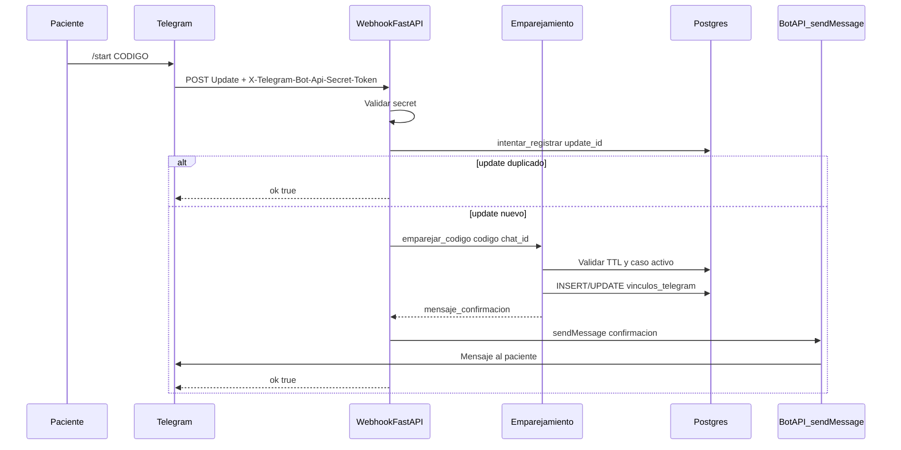

Código: [`manejador.py`](src/integracion/telegram/manejador.py), [`emparejamiento.py`](src/api/servicios/emparejamiento.py).

### 9.2 Consulta clínica (turno normal)

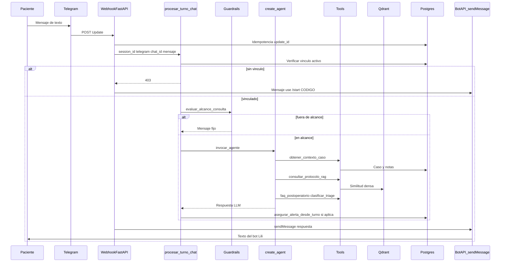

### 9.3 Escalamiento urgente (rama HITL)

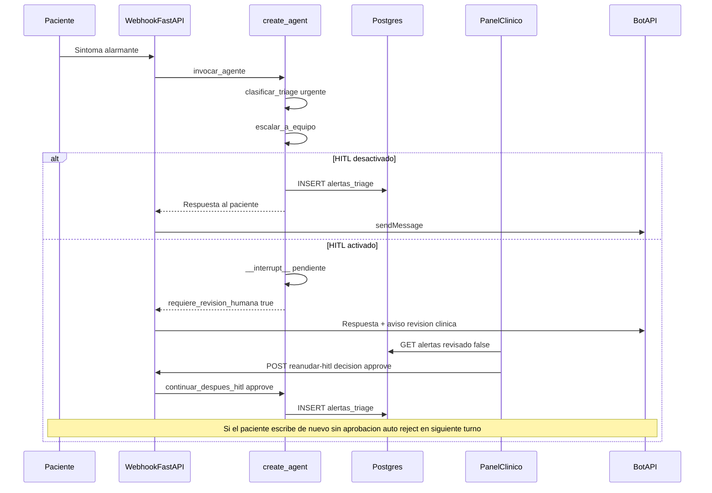

### 9.4 Recordatorio proactivo (background)

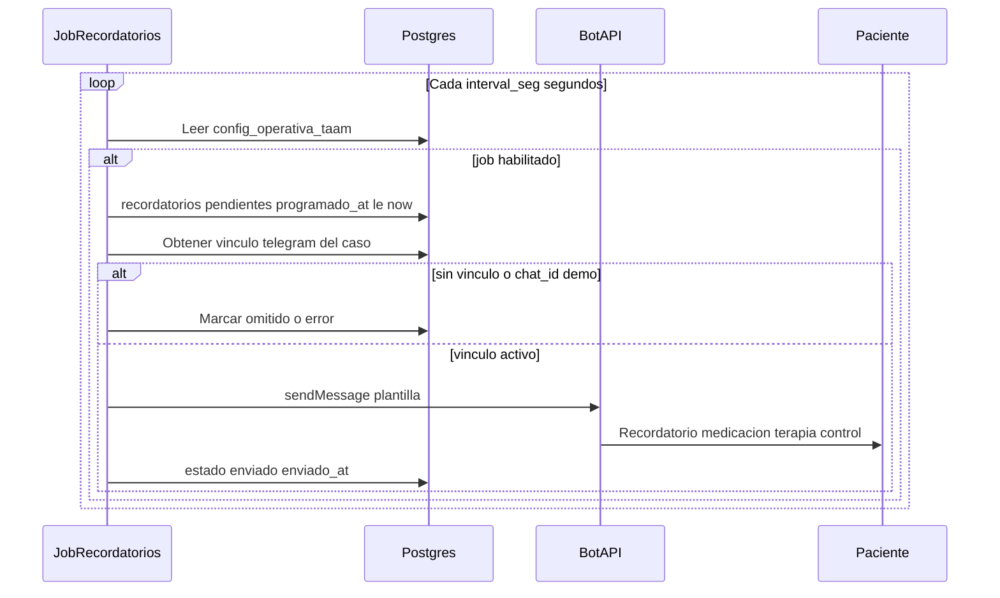

Los recordatorios se programan al crear un caso (`POST /api/staff/casos`) según plantillas del `tipo_procedimiento`.

---

## 10. Flujos de secuencia — staff y admin (web)

### 10.1 Asistente: alta de caso y código de emparejamiento

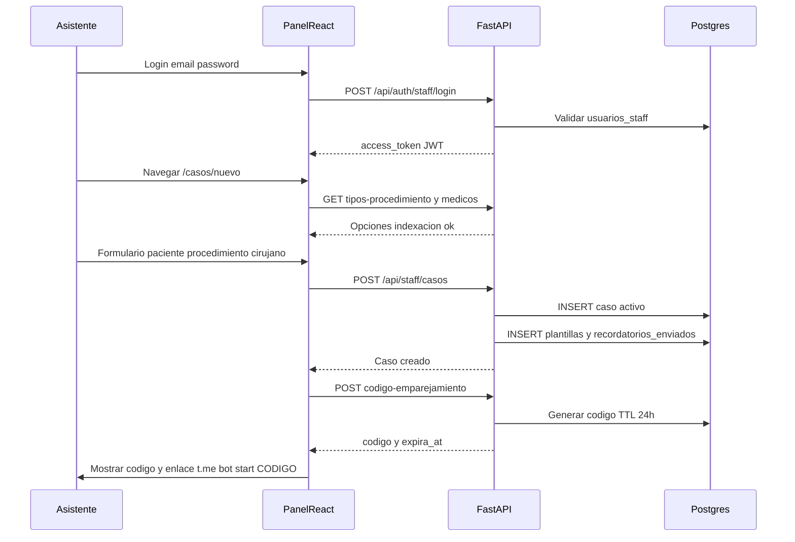

### 10.2 Clínico: revisión de alerta y conversación

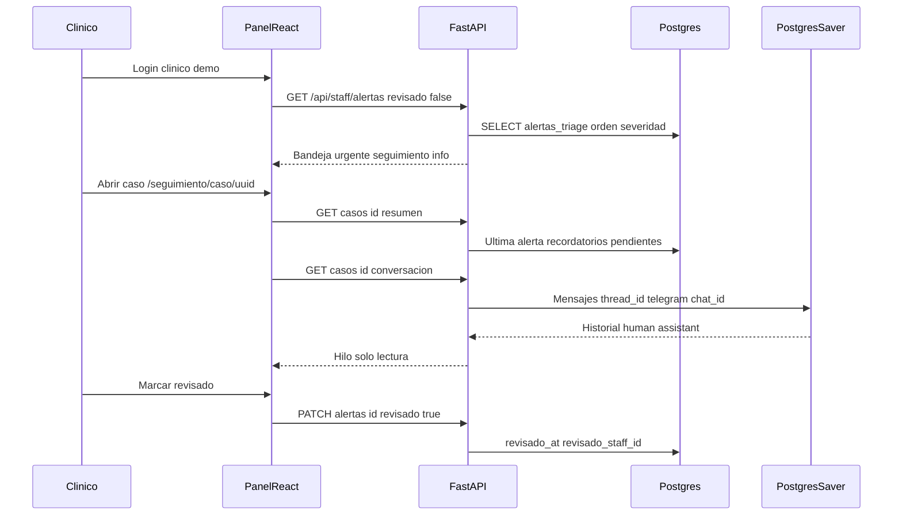

### 10.3 Admin: catálogo de protocolo e ingesta Qdrant

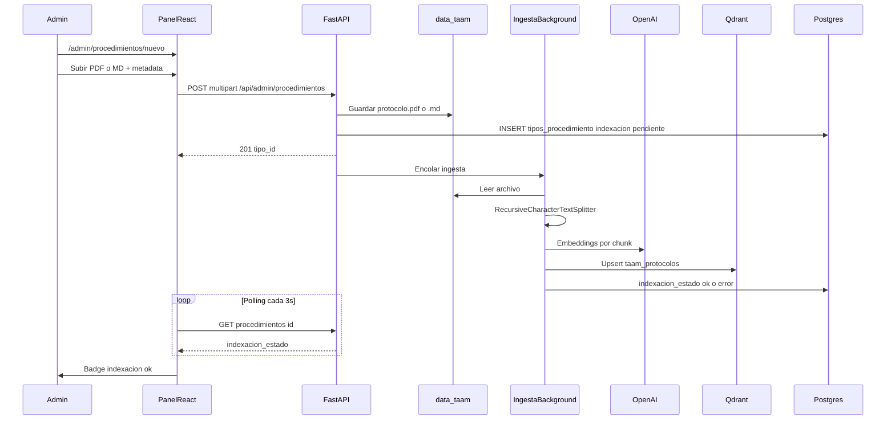

### 10.4 Admin: registro de webhook Telegram

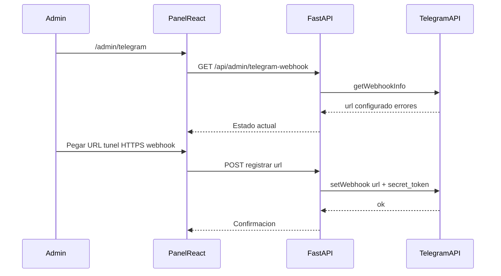

Requisito: URL pública **HTTPS** (ngrok, Cloudflare Tunnel, etc.). Sin túnel solo pruebas con `httpx` contra el webhook.

---

## 11. Despliegue local

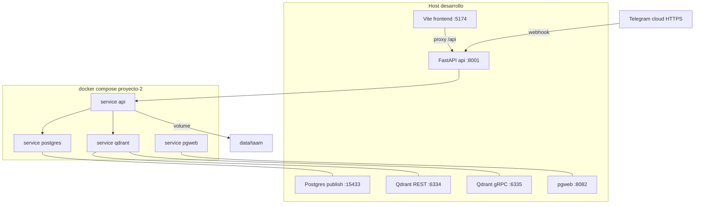

| Servicio | URL host (defecto) |
| --- | --- |
| API salud | http://127.0.0.1:8001/api/salud |
| Panel React (dev) | http://127.0.0.1:5174 |
| pgweb | http://127.0.0.1:8082 |
| Qdrant dashboard | http://127.0.0.1:6334/dashboard |

Coexistencia con M2 en la misma máquina: ver tabla de puertos en [README.md § Docker Compose](README.md#docker-compose).

---

## 12. Casos de uso MVP (trazabilidad)

Resumen alineado al [Caso de Uso TAAM](../backlog/docs/usecases/Caso%20de%20Uso%20TAAM%20-%20Bot%20Posoperatorio.md):

| UC | Objetivo | Rutas / módulos principales |
| --- | --- | --- |
| **UC-MVP-01** | Catálogo procedimiento + ingesta | `POST /api/admin/procedimientos`, `src/ingesta/`, `scripts/ingestar_protocolo_pdf.py` |
| **UC-MVP-02** | Alta caso + emparejamiento Telegram | `POST /api/staff/casos`, `POST .../codigo-emparejamiento`, webhook `/start` |
| **UC-MVP-03** | Chat bot + triage + HITL | Webhook → `POST /chat`, tools triage/escalar, `alertas_triage` |
| **UC-MVP-04** | Recordatorios proactivos | `src/integracion/recordatorios/`, job lifespan |
| **UC-MVP-05** | Panel seguimiento | `GET /api/staff/alertas`, `GET .../conversacion`, `frontend/features/seguimiento/` |

Demo en vivo: [GUION-DEMO-TAAM.md](../backlog/docs/usecases/GUION-DEMO-TAAM.md).

---

## 13. Limitaciones MVP y trabajo futuro

| Fuera del MVP | Estado en repo |
| --- | --- |
| N8N, WhatsApp, polling Telegram | No implementado (decision-7) |
| RBAC granular por rol clínico | Tres roles básicos; sin matriz completa |
| Recordatorios por email / agenda hospitalaria | No hay SMTP ni integración HIS |
| Evidencias multimedia en Telegram | Solo texto |
| Intervención del cirujano en el hilo | No |
| OCR en PDF escaneado | `indexacion_estado=error` sin texto extraíble |
| Rate limit en login staff | Mejora documentada para proxy reverso |

Detalle ampliado: [doc-004 §7](../backlog/docs/doc-004%20-%20Arquitectura-M3-Bot-Posoperatorio-TAAM.md).

---

## 14. Referencias

- [decision-7 — Arquitectura M3 TAAM](../backlog/decisions/decision-7%20-%20Arquitectura-M3-TAAM-Proyecto-2-Telegram-Ruta-A.md)
- [doc-004 — Arquitectura operativa TAAM](../backlog/docs/doc-004%20-%20Arquitectura-M3-Bot-Posoperatorio-TAAM.md)
- [README.md](README.md) — guía operativa
- [frontend/README.md](frontend/README.md) — panel React
- [src/agentes/README.md](src/agentes/README.md) — agente, HITL, guardrails
- [GUION-DEMO-TAAM.md](../backlog/docs/usecases/GUION-DEMO-TAAM.md)
- [m-0 — Agentic Final Project](../backlog/milestones/m-0%20-%20agentic-final-project.md)

---

*Última revisión alineada al stack TAAM en `proyecto-2/` (FastAPI :8001, Postgres `taam`, Qdrant `taam_protocolos`, React :5174).*
