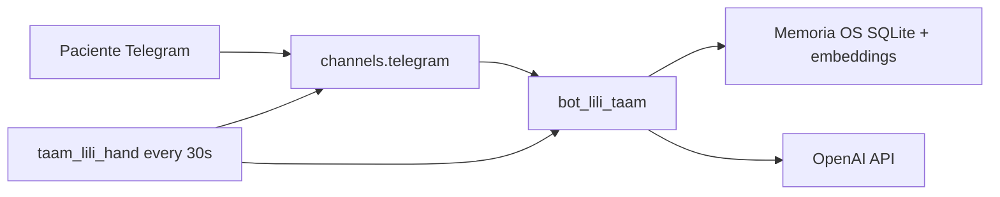

# proyecto-3 — TAAM Bot Lili (Modulo 3, Ruta B)

Implementacion **paralela** del Bot posoperatorio TAAM usando **[OpenFang](https://www.openfang.sh/)** como Agent OS, canal **Telegram** y Hand autonomo **`taam_lili_hand`**, mas analitica opcional **t-SNE** (Ruta Transversal B).

> **No sustituye** a `proyecto-2/` (Ruta A LangChain + FastAPI, [decision-7](../backlog/decisions/decision-7%20-%20Arquitectura-M3-TAAM-Proyecto-2-Telegram-Ruta-A.md)) ni a `proyecto-1/` (M2). Ver [decision-8](../backlog/decisions/decision-8%20-%20Arquitectura-M3-TAAM-Proyecto-3-Ruta-B-OpenFang-Telegram-tSNE.md).

## Alcance MVP (OpenFang puro)

| Incluido | Excluido |
| --- | --- |
| Chat paciente con RAG sobre memoria del OS | PostgreSQL OLTP, panel React staff |
| Hand cron: recordatorios postoperatorio | Emparejamiento codigo paciente ↔ caso |
| Solicitud de evidencias en **texto** por Telegram | Evidencias foto/audio/video |
| Ingesta de corpus `data/markdown/` y PDFs TAAM | Recordatorios de citas por email |
| Notebook t-SNE sobre historial JSONL del OS | WhatsApp, N8N, webhook FastAPI via 2 |

## Requisitos

- **OpenFang** **0.6.9** (binario pinneado; ver [release v0.6.9](https://github.com/RightNow-AI/openfang/releases/tag/v0.6.9) y `.openfang-version`).
- **SO:** macOS o Linux (x86_64 o arm64). Windows: usar el instalador oficial (`install.ps1` en [openfang.sh](https://openfang.sh/)); fuera del alcance de los scripts de este repo.
- **Python 3.12.12** + **uv** (solo para ingesta y notebook t-SNE).
- **OpenAI API** (mismo proveedor que `proyecto-2/` para comparacion entre rutas).
- **Bot Telegram** dedicado (token distinto al de `proyecto-2/`). Guia: [`docs/telegram-bot-setup.md`](docs/telegram-bot-setup.md).

## OpenFang (Agent OS)

Version fijada en el repo: **0.6.9** (archivo [`.openfang-version`](.openfang-version)).

### Instalacion y verificacion

```bash
cd proyecto-3
chmod +x scripts/instalar_openfang.sh
./scripts/instalar_openfang.sh

# Si openfang no esta en PATH en esta sesion:
export PATH="$HOME/.openfang/bin:$PATH"

# Solo smoke (sin reinstalar):
./scripts/instalar_openfang.sh --verificar-only
openfang --version    # debe contener 0.6.9
openfang start --help
```

El script instala en `~/.openfang/bin/openfang`. Variables utiles:

| Variable | Uso |
| --- | --- |
| `OPENFANG_VERSION` | Override del pin (por defecto lee `.openfang-version`) |
| `OPENFANG_BIN` | Ruta absoluta al binario para verificacion o ejecucion |
| `OPENFANG_DOWNLOAD_URL` | Solo pruebas o espejo interno; no usar en produccion |

Dashboard local tras `openfang start`: `http://127.0.0.1:4200`

### Instalacion manual (si falla `curl`)

1. Identificar el target Rust de tu maquina (ej. `aarch64-apple-darwin` en Mac Apple Silicon).
2. Descargar el tarball del release pinneado, por ejemplo:
   `https://github.com/RightNow-AI/openfang/releases/download/v0.6.9/openfang-aarch64-apple-darwin.tar.gz`
3. Extraer y copiar el binario `openfang` a `~/.openfang/bin/` (o cualquier ruta en tu `PATH`).
4. Verificar: `export OPENFANG_BIN=/ruta/a/openfang` y `./scripts/instalar_openfang.sh --verificar-only`

Otros artefactos del mismo release: [v0.6.9 — assets](https://github.com/RightNow-AI/openfang/releases/tag/v0.6.9).

### Configuracion OpenFang (`openfang.toml`)

El archivo versionado [`openfang/openfang.toml`](openfang/openfang.toml) sigue el esquema **OpenFang 0.6.9**: `[default_model]`, `[memory]`, `[channels.telegram]`. Los secretos van en `.env` (`OPENAI_API_KEY`, `TELEGRAM_BOT_TOKEN`); nunca en el TOML.

| Variable | Rol |
| --- | --- |
| `OPENFANG_HOME` | Directorio runtime (SQLite, JSONL). Por defecto `./openfang/data` relativo a `proyecto-3/`. |
| `OPENAI_API_KEY` | Clave para `[default_model]` (`api_key_env = "OPENAI_API_KEY"`) y embeddings de memoria. |
| `TELEGRAM_BOT_TOKEN` | Token del bot dedicado Ruta B (`bot_token_env` en `[channels.telegram]`). |

Al arrancar, los scripts copian `openfang/openfang.toml` → `{OPENFANG_HOME}/config.toml` y enlazan `openfang/agents/*` → `{OPENFANG_HOME}/agents/` (el bridge Telegram resuelve `default_agent` desde ahi).

```bash
cd proyecto-3
cp .env.example .env
export PATH="$HOME/.openfang/bin:$PATH"
set -a && source .env && set +a
export OPENFANG_HOME="$(pwd)/openfang/data"
./scripts/validar_openfang_config.sh   # openfang doctor + TOML valido
./scripts/arrancar_dev.sh              # start + agent spawn + hand install
```

**Agente y Hand (no van en `openfang.toml`):**

- Agente corporativo: manifest [`openfang/agents/bot_lili_taam/agent.toml`](openfang/agents/bot_lili_taam/agent.toml) → `openfang agent spawn ...`
- Hand autonomo: [`openfang/hands/taam_lili_hand/`](openfang/hands/taam_lili_hand/) → `openfang hand install` / `openfang hand activate taam_lili_hand` (schedule demo: **`every_secs = 30`** en `HAND.toml`; desactivar fuera de pruebas para no consumir API)



**Sesiones:** convencion alineada con Ruta A: `session_id` = `telegram:{chat_id}` (entero del chat de Telegram). OpenFang la asigna en runtime; verificar con `openfang sessions --json` tras un mensaje de prueba. Ver [`docs/telegram-bot-setup.md`](docs/telegram-bot-setup.md) y seguimiento UC4 en [`docs/dashboard-openfang.md`](docs/dashboard-openfang.md).

**Telegram (BotFather, comandos, prueba en vivo):**

```bash
./scripts/verificar_telegram_bot.sh   # getMe sin arrancar daemon
./scripts/arrancar_dev.sh             # bridge polling + agente bot_lili_taam
```

### Fallback Ollama (si falla OpenAI nativo en demo)

La **Ruta B** prioriza **OpenAI** segun [decision-8](../backlog/decisions/decision-8%20-%20Arquitectura-M3-TAAM-Proyecto-3-Ruta-B-OpenFang-Telegram-tSNE.md). Si `openfang start` no conecta con OpenAI, sustituir temporalmente `[default_model]` en `openfang/openfang.toml`:

```toml
[default_model]
provider = "ollama"
model = "llama3.2:latest"
base_url = "http://127.0.0.1:11434"
api_key_env = ""
```

Asegurar `ollama serve` y el modelo descargado. Variable auxiliar en `.env.example`: `OLLAMA_BASE_URL`.

## Configuracion rapida

```bash
cd proyecto-3
cp .env.example .env
# Editar OPENAI_API_KEY, TELEGRAM_BOT_TOKEN, OPENFANG_HOME
# Variables centralizadas en src/configuracion.py (pydantic-settings)

# Instalar OpenFang (una vez)
./scripts/instalar_openfang.sh
export PATH="$HOME/.openfang/bin:$PATH"

# Entorno Python auxiliar
uv sync

# Vista previa de ingesta (sin escribir en SQLite)
uv run python ingesta/indexar_corpus_openfang.py --dry-run --limite 5

# Ingesta real (OPENAI_API_KEY; preferible openfang stop o --permitir-db-en-vivo)
uv run python ingesta/indexar_corpus_openfang.py --solo-markdown --limite 20

# Sincronizar prompt Bot Lili (system.md -> agent.toml)
uv run python scripts/sincronizar_prompt_agente.py

# Verificar memoria semantica tras ingesta
uv run python scripts/contar_memorias_semanticas.py --exigir-ingesta

# Arranque desarrollo (incluye sincronizacion de prompt)
./scripts/arrancar_dev.sh
```

Detalle de flags y memoria SQLite: [`ingesta/README.md`](ingesta/README.md).

**Pruebas chat RAG (TASK-122):** checklist manual [`docs/checklist-pruebas-chat-fvl.md`](docs/checklist-pruebas-chat-fvl.md); tests estaticos `uv run pytest tests/test_prompt_bot_lili.py tests/test_checklist_chat_fvl.py tests/test_sincronizar_prompt_agente.py`.

**Seguimiento UC4 (TASK-127):** guia [`docs/dashboard-openfang.md`](docs/dashboard-openfang.md); `uv run python scripts/consultar_historial_sesion.py --session-id telegram:900001`; tests `uv run pytest tests/test_dashboard_openfang_doc.py tests/openfang/test_historial_jsonl.py -q`.

**Pruebas Hand (TASK-123 / TASK-124 / TASK-125):** manifesto + UC6 recordatorio + UC7 evidencia texto; `uv run pytest tests/test_hand_taam_lili.py tests/hand/test_recordatorio_postop.py tests/hand/test_requerir_evidencia.py -q`. Disparo manual: `uv run python scripts/disparar_recordatorio_hand.py --solo-simular`; evidencia: `uv run python scripts/disparar_evidencia_hand.py --marcar-pendiente CHAT_ID --solo-simular`.

## Estructura

```text
proyecto-3/
  openfang/           # Config OS, Hands, datos runtime (gitignore)
  ingesta/            # Corpus workspace → memoria OpenFang
  analisis_tsne/      # Extraccion JSONL, embeddings, notebook t-SNE
  scripts/            # install y arranque
  docs/               # guion demo, telegram-bot-setup, dashboard-openfang, checklist FVL
  src/openfang/       # lectura JSONL historial (UC4, TASK-128)
  src/prompts/        # validacion estatica system prompt y HAND.toml
  src/hand/           # adaptadores testeables UC6 recordatorio y UC7 evidencia (TASK-124, TASK-125)
```

## Rubrica Modulo 3 (Ruta B)

| Entregable | Ubicacion |
| --- | --- |
| Conocimiento corporativo ingerido | `ingesta/` + logs |
| `HAND.toml` activo | `openfang/hands/taam_lili_hand/` |
| Telegram en vivo | `[channels.telegram]` en `openfang/openfang.toml` |
| Bonus t-SNE | `analisis_tsne/notebooks/` |

## Referencias

- [decision-8](../backlog/decisions/decision-8%20-%20Arquitectura-M3-TAAM-Proyecto-3-Ruta-B-OpenFang-Telegram-tSNE.md)
- [doc-007 — Evaluacion OpenFang](../backlog/docs/doc-007%20-%20Evaluacion-OpenFang-Proyecto-2-TAAM.md)
- [Caso de Uso TAAM](../backlog/docs/usecases/Caso%20de%20Uso%20TAAM%20-%20Bot%20Posoperatorio.md)
