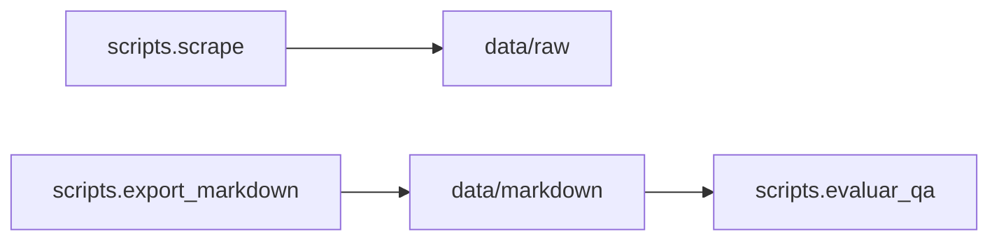

# Scripts de línea de comandos

Utilidades para descargar el sitio, generar el corpus Markdown y evaluar el pipeline de Q&A. Todos los comandos asumen que estás en la **raíz del repositorio** (donde están `pyproject.toml`, `src/` y `scripts/`).

## Requisitos comunes

- Python **3.12.12** y [uv](https://docs.astral.sh/uv/).
- Dependencias instaladas: `uv sync`.
- Forma canónica de invocación: `uv run python -m scripts.<modulo>`.

Para la lista completa de argumentos de cada programa, usa siempre:

```bash
uv run python -m scripts.scrape --help
uv run python -m scripts.export_markdown --help
uv run python -m scripts.evaluar_qa --help
```

## Flujo sugerido



1. **`scrape`** — llena `data/raw/` con HTML y metadatos.
2. **`export_markdown`** — convierte ese crudo en `data/markdown/` (base BM25 de la app).
3. **`evaluar_qa`** (opcional) — ejecuta el dataset de prueba contra el mismo pipeline que la app y escribe informes en `data/processed/evaluaciones/`.

## Paquete `scripts/`

El archivo `__init__.py` solo declara el directorio como paquete de Python para poder usar `python -m scripts.<modulo>`. No tiene entrada propia.

---

## `scripts.scrape`

**Qué hace.** Orquesta el rastreo BFS del dominio configurado (por defecto `valledellili.org`), respeta `robots.txt` y el *Crawl-delay*, guarda cada página como `.html` con un sidecar `.json` y anota cada resultado en `data/raw/_log.jsonl`.

**Salida típica.**

- HTML y JSON: `data/raw/valledellili-org/` (o el directorio que indiques).
- Registro: `data/raw/_log.jsonl`.

**Variables de entorno** (opcional; plantilla en `.env.example`):

- `URL_BASE_SITIO` — URL semilla si no pasas `--url-inicio`.
- `USER_AGENT` — cabecera del crawler si no pasas `--user-agent`.

Al arrancar se carga `.env` vía `python-dotenv`.

**Ejecución.**

```bash
uv run python -m scripts.scrape
uv run python -m scripts.scrape --max-paginas 200 --delay 1.5
```

**Opciones destacadas** (ver `--help` para el resto):

| Opción | Rol breve |
| --- | --- |
| `--url-inicio` | URL semilla (alternativa a `.env` / defecto del proyecto). |
| `--max-paginas` | Tope de respuestas 200 consideradas en la corrida (defecto: 200). |
| `--delay` | Pausa mínima entre solicitudes en segundos (defecto: 1.5). |
| `--profundidad-maxima` | Profundidad BFS de enlaces internos (defecto: 5). |
| `--dominio-permitido` | Host permitido para seguir enlaces (defecto: `valledellili.org`). |
| `--directorio-salida` | Carpeta de salida (defecto alineada al crawler en `src.scraping`). |
| `--timeout`, `--reintentos` | Comportamiento HTTP. |
| `--archivo-log` | Ruta del JSONL de registro (defecto: `data/raw/_log.jsonl`). |

**Códigos de salida.** `0` si termina bien; `130` si se interrumpe con Ctrl+C (resumen parcial impreso).

---

## `scripts.export_markdown`

**Qué hace.** Lee `data/raw/valledellili-org/*.html` y sus `.json` asociados, convierte a HTML → Markdown con front matter YAML y escribe `data/markdown/valledellili-org/<slug>.md`. Si el hash del contenido coincide con el ya guardado en el `.md`, omite la escritura (idempotencia) salvo que uses `--forzar`.

**Entrada / salida.**

- Entrada: `data/raw/valledellili-org/*.html` + sidecars `.json`.
- Salida: `data/markdown/valledellili-org/*.md`.

Si no hay HTML descargado, el script termina con código `1` y el mensaje: *«No hay HTML descargado; corre scripts.scrape primero»* — ejecuta `scripts.scrape` antes.

**Ejecución.**

```bash
uv run python -m scripts.export_markdown
uv run python -m scripts.export_markdown --forzar
uv run python -m scripts.export_markdown --solo-uno nombre-del-archivo-sin-extension
```

**Opciones destacadas:**

| Opción | Rol breve |
| --- | --- |
| `--forzar` | Regenera todos los `.md` aunque el hash coincida. |
| `--solo-uno SLUG` | Solo el `.html` cuyo nombre base es `SLUG` (depuración). |

---

## `scripts.evaluar_qa`

**Qué hace.** Carga el dataset de preguntas en YAML, ejecuta cada ítem con `PipelineQa` (recuperación BM25 + llamada a **Ollama**) y escribe un informe Markdown por modelo.

**Requisitos.** Ollama en ejecución y los nombres de modelo que pases deben existir en tu instalación (por ejemplo tras `ollama pull <nombre>`). Variables útiles en `.env`: `OLLAMA_BASE_URL`, `MODELO_LLM_DEFECTO` (la app y el pipeline pueden leerlas según la configuración del proyecto).

**Dataset por defecto:** `tests/qa/preguntas_evaluacion.yml` (mínimo 20 preguntas; el repo incluye 23 con `archivo_esperado` cuando aplica).

**Salida por defecto:** `data/processed/evaluaciones/` con archivos nombrados `<slug-modelo>__YYYY-MM-DD.md` (slug derivado del nombre del modelo).

**Ejecución.**

```bash
uv run python -m scripts.evaluar_qa --modelos llama3.1:8b
uv run python -m scripts.evaluar_qa --modelos llama3.1:8b otro-modelo:tag
uv run python -m scripts.evaluar_qa --modelos llama3.1:8b --dataset ruta/al/dataset.yml --salida data/processed/evaluaciones
uv run python -m scripts.evaluar_qa --modelos llama3.1:8b --solo-pregunta 5 --fecha 2026-04-27
```

**Opciones destacadas:**

| Opción | Rol breve |
| --- | --- |
| `--modelos` | **Obligatorio.** Uno o más nombres de modelo Ollama. |
| `--dataset` | Ruta al YAML (defecto: `tests/qa/preguntas_evaluacion.yml`). |
| `--salida` | Directorio base de los informes `.md`. |
| `--solo-pregunta ID` | Solo la pregunta con ese `id` en el YAML. |
| `--fecha` | Fecha del informe `YYYY-MM-DD` (defecto: hoy). |

Si un modelo no está disponible, el script sigue con los demás y deja constancia en el informe o en consola según el caso; revisa los `.md` generados y la salida estándar.

---

Para la visión general del proyecto y la app Gradio, consulta el [README principal](../README.md) en la raíz del repositorio.
