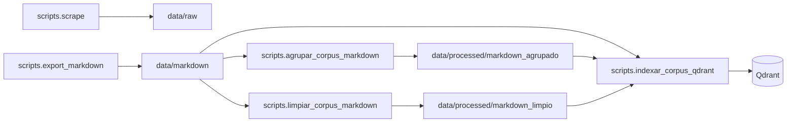

# Scripts de línea de comandos

Utilidades para descargar el sitio, generar el corpus Markdown e indexar en Qdrant. Todos los comandos asumen que estás en la **raíz del repositorio** (donde están `pyproject.toml`, `src/` y `scripts/`).

## Requisitos comunes

- Python **3.12.12** y [uv](https://docs.astral.sh/uv/).
- Dependencias instaladas: `uv sync`.
- Forma canónica de invocación: `uv run python -m scripts.<modulo>`.

Para la lista completa de argumentos de cada programa, usa siempre:

```bash
uv run python -m scripts.scrape --help
uv run python -m scripts.export_markdown --help
uv run python -m scripts.agrupar_corpus_markdown --help
uv run python -m scripts.limpiar_corpus_markdown --help
uv run python -m scripts.indexar_corpus_qdrant --help
uv run python -m scripts.eval_recuperacion_consultas --help
uv run python -m scripts.eval_metricas_rag --help
```

## Flujo sugerido



1. **`scrape`** — llena `data/raw/` con HTML y metadatos.
2. **`export_markdown`** — convierte ese crudo en `data/markdown/` (fuente de verdad textual e ingesta hacia Qdrant).
3. **`agrupar_corpus_markdown`** (opcional, legado de experimentación) — fusiona familias de `.md` por patrones (`config/agrupacion_corpus_valledellili.yaml`) en `data/processed/markdown_agrupado/`; el corpus canónico en `data/markdown/` no se modifica.
4. **`limpiar_corpus_markdown`** (recomendado antes de ingesta RAG) — aplica reglas declarativas (`config/limpieza_corpus_valledellili.yaml`) y escribe `data/processed/markdown_limpio/valledellili-org/` con el mismo front matter literal y cuerpo sin plantillas repetidas (ver sección siguiente).
5. **`indexar_corpus_qdrant`** — fragmenta y vuelca embeddings en **Qdrant** para el agente M2 (entrada: `data/markdown/...`, `markdown_limpio/...` o `markdown_agrupado/...` vía `--markdown-dir`).

## Paquete `scripts/`

El archivo `__init__.py` solo declara el directorio como paquete de Python para poder usar `python -m scripts.<modulo>`. No tiene entrada propia.

---

## `scripts.limpiar_corpus_markdown`

**Qué hace.** Lee un árbol de Markdown con front matter (por defecto `data/markdown/valledellili-org/`), aplica exclusiones `fnmatch`, elimina bloques y líneas según regex en YAML, descarta ficheros con poco texto útil tras la limpieza y escribe un **corpus derivado** en `data/processed/markdown_limpio/valledellili-org/` sin tocar `data/markdown/`. El front matter del archivo fuente se conserva **literal**; solo cambia el cuerpo. Genera `_manifest_limpieza.json` con contadores y `bytes_removidos_por_regla`. Si el `.md` de salida ya existe y el hash SHA-256 del contenido nuevo coincide con el existente, **no** reescribe (idempotencia).

**Configuración.** `config/limpieza_corpus_valledellili.yaml` — claves `excluir_archivos`, `remover_bloques` (cada regla: `nombre`, `regex_inicio` y exactamente uno de `regex_fin`, `hasta_proximo_h2: true` o `hasta_eof: true`), `remover_lineas`, `minimo_caracteres_utiles`.

**Ejecución.**

```bash
uv run python -m scripts.limpiar_corpus_markdown
uv run python -m scripts.limpiar_corpus_markdown --config config/limpieza_corpus_valledellili.yaml
uv run python -m scripts.limpiar_corpus_markdown --limpiar-salida
uv run python -m scripts.limpiar_corpus_markdown --limit 50 -v
```

**Ingesta y evaluación encadenadas** (colección nueva para no mezclar con el índice anterior):

```bash
uv run python -m scripts.limpiar_corpus_markdown --limpiar-salida

uv run python -m scripts.indexar_corpus_qdrant \
  --markdown-dir data/processed/markdown_limpio/valledellili-org \
  --glob "**/*.md" \
  --collection corpus_fvl_v2

# Opcional: métricas sobre la colección indexada (TASK-72)
uv run python -m scripts.eval_metricas_rag --collection corpus_fvl_v2 --reporte-out data/eval/reportes/eval-limpio.md
```

**Opciones destacadas.**

| Opción | Rol breve |
| --- | --- |
| `--config` | YAML de reglas (defecto: `config/limpieza_corpus_valledellili.yaml`). |
| `--entrada` / `--salida` | Directorios de entrada y de salida derivada. |
| `--limpiar-salida` | Borra `--salida` antes de escribir; solo si la ruta resuelta contiene el segmento `markdown_limpio`. |
| `--limit` | Tope de archivos `.md` procesados (orden por ruta). |
| `-v` / `--verbose` | Logs de depuración. |

---

## `scripts.scrape`

**Qué hace.** Orquesta el rastreo BFS del dominio configurado (por defecto `valledellili.org`), respeta `robots.txt` y el *Crawl-delay*, guarda cada página como `.html` con un sidecar `.json` y anota cada resultado en `data/raw/_log.jsonl`.

**Salida típica.**

- HTML y JSON: `data/raw/valledellili-org/` (o el directorio que indiques).
- Registro: `data/raw/_log.jsonl`.

**Variables de entorno** (opcional; plantilla en `.env.example`):

- `URL_BASE_SITIO` — URL semilla si no pasas `--url-inicio`.
- `USER_AGENT` — cabecera del crawler si no pasas `--user-agent`.

Al arrancar se carga `.env` vía `python-dotenv`.

**Ejecución.**

```bash
uv run python -m scripts.scrape
uv run python -m scripts.scrape --max-paginas 200 --delay 1.5
```

**Opciones destacadas** (ver `--help` para el resto):

| Opción | Rol breve |
| --- | --- |
| `--url-inicio` | URL semilla (alternativa a `.env` / defecto del proyecto). |
| `--max-paginas` | Tope de respuestas 200 consideradas en la corrida (defecto: 200). |
| `--delay` | Pausa mínima entre solicitudes en segundos (defecto: 1.5). |
| `--profundidad-maxima` | Profundidad BFS de enlaces internos (defecto: 5). |
| `--dominio-permitido` | Host permitido para seguir enlaces (defecto: `valledellili.org`). |
| `--directorio-salida` | Carpeta de salida (defecto alineada al crawler en `src.scraping`). |
| `--timeout`, `--reintentos` | Comportamiento HTTP. |
| `--archivo-log` | Ruta del JSONL de registro (defecto: `data/raw/_log.jsonl`). |

**Códigos de salida.** `0` si termina bien; `130` si se interrumpe con Ctrl+C (resumen parcial impreso).

---

## `scripts.export_markdown`

**Qué hace.** Lee `data/raw/valledellili-org/*.html` y sus `.json` asociados, convierte a HTML → Markdown con front matter YAML y escribe `data/markdown/valledellili-org/<slug>.md`. Si el hash del contenido coincide con el ya guardado en el `.md`, omite la escritura (idempotencia) salvo que uses `--forzar`.

**Entrada / salida.**

- Entrada: `data/raw/valledellili-org/*.html` + sidecars `.json`.
- Salida: `data/markdown/valledellili-org/*.md`.

Si no hay HTML descargado, el script termina con código `1` y el mensaje: *«No hay HTML descargado; corre scripts.scrape primero»* — ejecuta `scripts.scrape` antes.

**Ejecución.**

```bash
uv run python -m scripts.export_markdown
uv run python -m scripts.export_markdown --forzar
uv run python -m scripts.export_markdown --solo-uno nombre-del-archivo-sin-extension
```

**Opciones destacadas:**

| Opción | Rol breve |
| --- | --- |
| `--forzar` | Regenera todos los `.md` aunque el hash coincida. |
| `--solo-uno SLUG` | Solo el `.html` cuyo nombre base es `SLUG` (depuración). |

---

## `scripts.agrupar_corpus_markdown`

**Qué hace.** Lee el corpus Markdown bajo un directorio (por defecto `data/markdown/valledellili-org/`), aplica reglas de agrupación por nombre de archivo (`fnmatch`, orden de grupos en el YAML) y escribe un **árbol derivado** bajo `data/processed/markdown_agrupado/valledellili-org/` (gitignored como el resto de `data/processed/**`). Los archivos que no coinciden con ningún grupo se **copian** tal cual a la salida, salvo que uses `--solo-grupos`. Genera `_manifest_agrupacion.json` con la trazabilidad `grupo -> archivos_origen`.

**Requisitos.** `pyyaml` (ya en el proyecto). No requiere Qdrant ni claves de embedding.

**Ejecución.**

```bash
uv run python -m scripts.agrupar_corpus_markdown
uv run python -m scripts.agrupar_corpus_markdown --config config/agrupacion_corpus_valledellili.yaml
uv run python -m scripts.agrupar_corpus_markdown --solo-grupos
uv run python -m scripts.agrupar_corpus_markdown --limpiar-salida
```

**Opciones destacadas:**

| Opción | Rol breve |
| --- | --- |
| `--config` | YAML con la lista `grupos` (`patron_nombre` como texto o lista de patrones `fnmatch`, `archivo_salida`, `titulo`, `seccion`, `source_url_canonica` opcional). |
| `--entrada` / `--salida` | Directorios de corpus de entrada y de salida derivada. |
| `--solo-grupos` | No copia los `.md` que no matchean ningún grupo (solo salidas fusionadas + manifiesto). |
| `--limpiar-salida` | Borra todo el contenido de `--salida` antes de escribir. Solo se permite si la ruta resuelta contiene el segmento `markdown_agrupado` (protección anti borrados accidentales). |

**Ingesta posterior.** Usa el mismo indexador apuntando al derivado:

```bash
uv run python -m scripts.indexar_corpus_qdrant \
  --markdown-dir data/processed/markdown_agrupado/valledellili-org \
  --glob "**/*.md"
```

**Migración en Qdrant.** Los ids de chunk dependen de la ruta del archivo respecto a la raíz del repo. Si pasas de indexar `data/markdown/...` a `data/processed/markdown_agrupado/...`, los payloads antiguos **siguen** en la colección hasta que los purges o uses otra colección. Estrategias típicas:

- **A/B:** `uv run python -m scripts.indexar_corpus_qdrant --collection corpus_agrupado_prueba ...` y comparar con `scripts.eval_recuperacion_consultas`.
- **Sustitución controlada:** reindexar el nuevo árbol y luego `--purgar` **por prefijo** solo si el prefijo de `payload.archivo` en Qdrant coincide con el directorio que acabas de indexar (ver ayuda de `--purgar` en el indexador). Para eliminar vectores del corpus antiguo con otro prefijo hace falta purga manual o herramientas de Qdrant.

---

## `scripts.eval_recuperacion_consultas`

**Qué hace.** Carga [`config/evaluacion_rag_consultas_ejemplo.json`](config/evaluacion_rag_consultas_ejemplo.json) (o un JSON propio con clave `consultas`) y, salvo `--solo-validar-json`, ejecuta [`RecuperadorDenso`](../src/rag/recuperador_denso.py) contra la colección Qdrant configurada, imprimiendo `score`, `archivo` y `source_url` por consulta. Sirve para comparar **antes / después** de la agrupación si indexaste en colecciones distintas (`--collection` en el indexador y aquí con el mismo nombre).

**Ejecución.**

```bash
# Sin Qdrant (CI o revisión rápida del JSON)
uv run python -m scripts.eval_recuperacion_consultas --solo-validar-json

# Con Qdrant y embeddings reales (variables en .env)
uv run python -m scripts.eval_recuperacion_consultas
uv run python -m scripts.eval_recuperacion_consultas --collection corpus_agrupado_prueba
```

**Checklist manual A/B sugerido**

1. Indexar corpus canónico (o usar la colección ya desplegada) y anotar cuántas consultas del JSON devuelven fuentes.
2. Ejecutar `agrupar_corpus_markdown`, indexar el derivado en **otra** colección (`--collection`).
3. Ejecutar este script dos veces (sin `--collection` vs `--collection ...`) o alternando `QDRANT_COLLECTION` en `.env` y comparar salidas.

---

## `scripts.eval_metricas_rag` (TASK-72)

**Qué hace.** Valida [`data/eval/golden_set_rag.jsonl`](data/eval/golden_set_rag.jsonl) contra [`data/eval/golden_set.schema.json`](data/eval/golden_set.schema.json), ejecuta el **RecuperadorDenso** por cada pregunta factual y calcula métricas estándar (`hit@k`, `precision@k`, `recall@k`, `MRR`, `nDCG@k`). Las filas `listado` / `conteo` quedan como **no aplicables** hasta integrar la tool `listar_estructurado` (TASK-70). Escribe un Markdown en `--reporte-out` y un JSONL paralelo `*.results.jsonl` para el comparador.

**Validación sin Qdrant ni red (CI):**

```bash
uv run python -m scripts.eval_metricas_rag --solo-validar-golden
```

**Línea base reproducible (ejemplo con Qdrant local + HuggingFace, sin OpenAI):**

```bash
docker compose up -d qdrant

QDRANT_URL=http://127.0.0.1:6333 QDRANT_COLLECTION=corpus_fvl_eval_hf_baseline \
  EMBEDDING_PROVIDER=huggingface EMBEDDING_MODEL=sentence-transformers/all-MiniLM-L6-v2 EMBEDDING_DIMS=384 \
  uv run python -m scripts.indexar_corpus_qdrant --collection corpus_fvl_eval_hf_baseline

QDRANT_URL=http://127.0.0.1:6333 QDRANT_COLLECTION=corpus_fvl_eval_hf_baseline \
  EMBEDDING_PROVIDER=huggingface EMBEDDING_MODEL=sentence-transformers/all-MiniLM-L6-v2 EMBEDDING_DIMS=384 \
  RAG_SCORE_MINIMO=0.0 \
  uv run python -m scripts.eval_metricas_rag --config baseline --collection corpus_fvl_eval_hf_baseline \
  --reporte-out data/eval/reportes/eval-baseline-2026-05-14.md
```

> En evaluación suele fijarse `RAG_SCORE_MINIMO=0.0` para no descartar candidatos por umbral; el producto puede seguir usando el default (0.25).

**Comparar dos corridas (delta de métricas agregadas y por consulta):**

```bash
uv run python -m scripts.eval_metricas_rag \
  --comparar data/eval/reportes/eval-baseline-2026-05-14.results.jsonl \
            data/eval/reportes/eval-limpio-2026-05-20.results.jsonl \
  --umbral-regresion-mrr 0.05
```

Código de salida `1` si el **MRR medio** de B cae más de `--umbral-regresion-mrr` respecto a A.

**Flags útiles:** `--golden`, `--config baseline|limpio|markdown|mmr|reranker|adaptativo`, `--collection`, `--reporte-out`, `--comparar`, `--solo-validar-golden`.

**Métricas en código:** [`src/rag/metricas_eval.py`](../src/rag/metricas_eval.py) y pruebas en `tests/rag/test_metricas_eval.py`.

---

## `scripts.indexar_corpus_qdrant` (Módulo 2)

**Qué hace.** Lee Markdown con front matter YAML (por defecto `data/markdown/valledellili-org/`), aplica chunking con LlamaIndex según `CHUNK_STRATEGY` en configuración (`sentence`: `SentenceSplitter` sobre el cuerpo; `markdown`: `MarkdownNodeParser` con post-fractura) usando `CHUNK_SIZE` / `CHUNK_OVERLAP`, enriquece el **payload** en Qdrant con metadata estructurada (`tipo_pagina`, `especialidad`, `sedes`, `headings_path`, etc.; ver [decision-4](../backlog/decisions/decision-4%20-%20Payload-Qdrant-enriquecido-y-chunking-Markdown.md)) y hace **upsert** con ids deterministas. Si un chunk ya existe con el mismo `content_hash`, **no** vuelve a llamar a embeddings ni a Qdrant (corrida idempotente).

**Requisitos.** Servidor Qdrant accesible (`QDRANT_URL`; en pruebas puede usarse `:memory:`). Para `EMBEDDING_PROVIDER=openai` hace falta `OPENAI_API_KEY` válida antes de embedir. Las dimensiones (`EMBEDDING_DIMS`) y la colección (`QDRANT_COLLECTION`) deben ser coherentes con el despliegue. Los índices de payload (`tipo_pagina`, `especialidad`, `sedes`, `seccion`) se intentan al crear/validar la colección; en Qdrant local `:memory:` el cliente puede advertir que no tienen efecto.

**Ejecución.**

```bash
uv run python scripts/indexar_corpus_qdrant.py
uv run python -m scripts.indexar_corpus_qdrant
uv run python -m scripts.indexar_corpus_qdrant --markdown-dir data/markdown/valledellili-org --glob "**/*.md"

# Chunking estructural + coleccion nueva (recomendado en migracion TASK-69)
export CHUNK_STRATEGY=markdown
export QDRANT_COLLECTION=corpus_fvl_v2
uv run python -m scripts.indexar_corpus_qdrant \
  --markdown-dir data/processed/markdown_limpio/valledellili-org \
  --glob "**/*.md" \
  --limit 50
```

**Variables relevantes:** `CHUNK_STRATEGY` (`sentence`|`markdown`), `CHUNK_SIZE`, `CHUNK_OVERLAP`, `QDRANT_COLLECTION`, `EMBEDDING_*`.

**Opciones destacadas:**

| Opción | Rol breve |
| --- | --- |
| `--markdown-dir` | Directorio base del corpus (defecto: `data/markdown/valledellili-org`). |
| `--glob` | Patrón glob relativo a ese directorio (defecto: `**/*.md`). |
| `--purgar` | Borra puntos del prefijo del corpus en Qdrant que ya no corresponden a la indexación actual. Se ignora si usas `--limit`. |
| `--limit` | Máximo de archivos `.md` a procesar (orden por ruta). |
| `--collection` | Sobrescribe el nombre de la colección Qdrant. |
| `--batch-size` | Lote para embeddings y upsert. |
| `--reintentos` | Intentos máximos por llamada a embeddings y a `upsert` ante fallos transitorios (defecto: 3). No reintenta HTTP 400/401/403. |
| `--backoff-max` | Segundos máximos de espera entre reintentos; backoff exponencial en base 2 (defecto: 30). |

Ante cortes de red, timeouts o errores 5xx, cada lote puede reintentarse sin reiniciar toda la ingesta. Ejemplo:

```bash
uv run python -m scripts.indexar_corpus_qdrant --reintentos 5 --backoff-max 30
```

**Salida.** Resumen en consola: estrategia activa, archivos considerados, chunks totales, cuántos se omitieron por hash, upserts, tiempos y **conteo por `tipo_pagina`**.

---

## E2E del Módulo 2 (docker-compose + pytest + Playwright)

Flujo reproducible para los **cuatro escenarios** del PDF (RAG, memoria, FAQ estructurada y mixto).

### 1. Levantar dependencias

En la raíz del repositorio:

```bash
docker compose up -d --build
```

Exportar claves según el modo:

- **Modo estable (recomendado para CI local):** `MOCK_LLM=1` en el servicio `api` (ya soportado en `docker-compose.yml`). No requiere `OPENAI_API_KEY` para el router ni el compositor; sí puede hacer falta para **ingesta** si `EMBEDDING_PROVIDER=openai`.

```bash
export MOCK_LLM=1
docker compose up -d --build
```

- **Modo LLM real:** definir `OPENAI_API_KEY` en el entorno (o en `.env` que lea compose) y **no** fijar `MOCK_LLM=1`.

### 2. Poblar Qdrant (RAG denso)

Con el contenedor `qdrant` arriba y `QDRANT_URL` coherente (desde el host suele ser `http://127.0.0.1:6333` si el puerto publicado es el defecto):

```bash
export QDRANT_URL=http://127.0.0.1:6333
export OPENAI_API_KEY=sk-...   # solo si embeddings OpenAI
uv run python -m scripts.indexar_corpus_qdrant --markdown-dir data/markdown/valledellili-org --glob "**/*.md"
```

### 3. Pytest E2E (`httpx` contra la API)

Variables:

| Variable | Rol |
| --- | --- |
| `EJECUTAR_E2E_MODULO2=1` | Obligatoria para **no omitir** los tests marcados `e2e_modulo2`. |
| `BASE_URL` o `E2E_BASE_URL` | Origen de la API (defecto `http://127.0.0.1:8000`). |
| `MOCK_LLM=1` | **En el servidor** (compose): router/compositor deterministicos; las preguntas de prueba incluyen tokens `e2e7001` / `e2e7002` / `e2e7003` documentados en el código. |
| `E2E_LLM_REAL=1` | En el **cliente de prueba**: relaja aserciones de herramienta si el servidor usa OpenAI real (flujo SSE menos estricto). |
| `E2E_TIMEOUT_READ` | Segundos máximos de lectura del stream (defecto 120). |

Ejecución:

```bash
export EJECUTAR_E2E_MODULO2=1
export BASE_URL=http://127.0.0.1:8000
uv run pytest tests/e2e/test_escenarios_modulo2.py -v
```

Comprobar que `GET $BASE_URL/api/salud` devuelve `"agente_mock_llm": true` cuando el backend arrancó con `MOCK_LLM=1`.

### 4. Playwright (frontend)

Los specs en `frontend/tests/e2e/` pueden **interceptar** `/api/sesiones` y `/api/agente/stream` para no depender del backend. El flujo crítico login + FAQ + pregunta abierta está en `chat-modulo2.spec.ts`.

```bash
pnpm --dir frontend install
pnpm --dir frontend exec playwright install chromium
pnpm --dir frontend exec playwright test
```

### 5. Omisiones y secretos

- Sin `EJECUTAR_E2E_MODULO2=1`, los tests `e2e_modulo2` se **saltan** con mensaje explícito.
- Sin API alcanzable, el fixture `cliente_http_e2e` emite skip.
- No commitear `.env` con claves reales.

## API administrativa M2 (panel backend)

Migración: `uv run alembic upgrade head` (tabla `config_admin_m2`).

- Definir **`ADMIN_API_KEY`** en `.env` en la raíz del repositorio (si falta, las rutas admin responden **503**). Cada línea del archivo debe empezar con `NOMBRE=valor` **sin espacios** antes del nombre (p. ej. no usar ` ADMIN_API_KEY=...`).
- Con **`docker compose`**, Compose lee el `.env` junto a `docker-compose.yml` para interpolar variables; el servicio `api` recibe `ADMIN_API_KEY` en el contenedor. Tras cambiar la clave en `.env`, ejecutar `docker compose up -d --force-recreate api` (o reiniciar el stack) para que el proceso vuelva a leer el entorno.
- En desarrollo **sin Docker**, arrancar Uvicorn desde la raíz del repo (`uv run uvicorn ...`); la app carga el `.env` de la raíz por ruta fija. Si solo editas `.env`, reinicia el proceso (el ajuste no siempre recarga con `--reload`).
- Enviar cabecera **`X-Admin-Key`** en cada petición (no volcar el valor en logs).

Rutas bajo **`/api/admin`**:

| Método | Ruta | Uso breve |
| --- | --- | --- |
| `GET` | `/api/admin/config` | Estado fusionado (PostgreSQL > JSON router > `.env` > constantes de temperatura). |
| `PATCH` | `/api/admin/config` | Parche parcial con `version` optimista; respuesta incluye `version` y `updated_at`. |
| `GET` | `/api/admin/usuarios` | Listado paginado (`limit`, `offset`). |
| `GET` | `/api/admin/metricas/resumen` | Conteos para dashboard. |

Ejemplos **curl** (API en `127.0.0.1:8000`):

```bash
export ADMIN_API_KEY='cambiar-por-clave-segura'

curl -sS -H "X-Admin-Key: $ADMIN_API_KEY" http://127.0.0.1:8000/api/admin/config | jq .

curl -sS -H "X-Admin-Key: $ADMIN_API_KEY" -H 'Content-Type: application/json' \
  -X PATCH http://127.0.0.1:8000/api/admin/config \
  -d '{"version":0,"temperatura_router":0.1}' | jq .

curl -sS -H "X-Admin-Key: $ADMIN_API_KEY" 'http://127.0.0.1:8000/api/admin/usuarios?limit=10&offset=0' | jq .
```

Un `PATCH` exitoso aplica en el **siguiente** `POST /api/agente/stream` **sin reiniciar** el proceso del servidor.

### Panel administrativo M2 (frontend)

1. Arranque del backend con **`ADMIN_API_KEY`** definido (en el entorno del proceso o en `.env` de la raíz; con Docker, vía `docker-compose.yml` y el `.env` del host). Sin esto las rutas `/api/admin/*` responden **503**.
2. En el navegador, abrir la ruta dedicada **`/admin`** (misma base que el chat; en desarrollo suele ser `http://127.0.0.1:5173/admin` con Vite y proxy `/api` hacia FastAPI).
3. En la pantalla de acceso, pegar la misma clave que `ADMIN_API_KEY`: se verifica con `GET /api/admin/config` y **no** se guarda en `localStorage` (solo memoria de la pestaña).
4. Desde el panel se consultan métricas, se editan modelo/sampling y prompts, y se listan usuarios; los cambios persistidos se reflejan tras invalidar datos (react-query) y aplican al agente en la **siguiente** conversación SSE.

---

Para la visión general del proyecto y la app Gradio, consulta el [README principal](../README.md) en la raíz del repositorio.
